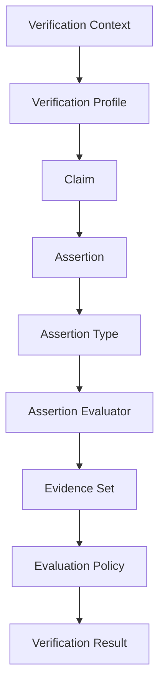

# Verity Platform Overview

**Audience:** New contributors, maintainers, grant reviewers, future implementers, and ecosystem partners.

**Purpose:** Provide a factual snapshot of the Verity ecosystem as it exists today — what has been built, what is in progress, and what remains planned. This document does not define protocol behavior. Normative semantics remain in accepted RFCs and [VERITY_CORE.md](VERITY_CORE.md).

**Last updated:** 2026-07-03 · **Current platform release:** [Platform 1.2](PLATFORM_RELEASES.md)

---

## Executive Summary

Verity began as a single VerityPay protocol effort. It has evolved into a **verification protocol platform** — a coordinated set of repositories that define, validate, execute, and compare protocol semantics independently of any one product or vendor.

The platform operates on a simple division of responsibility:

| Layer | Role |
|-------|------|
| **The specification** | Defines meaning |
| **Tooling** | Validates the corpus |
| **The reference interpreter** | Executes semantics |
| **The conformance suite** | Compares implementations |
| **Future products and SDKs** | Implement the protocol |

**VerityPay** is the first protocol built on this platform. The **Verity Core** verification model — claims, assertions, evidence, evaluation context, and conformance vocabulary — is designed to be reused by future protocols in identity, credentials, compliance, and other domains.

Today the engineering platform is complete (Phase II). Protocol expansion is underway (Phase III). Independent implementations and ecosystem adoption remain planned.

For protocol detail, start with [VERITY_CORE.md](VERITY_CORE.md). For repository roles, see [ECOSYSTEM.md](ECOSYSTEM.md). For maturity metrics, see [SPECIFICATION_STATUS.md](SPECIFICATION_STATUS.md).

---

## Repository Map

| Repository | Role | Current status | Primary artifacts | What it owns | What it does not own |
|------------|------|----------------|-------------------|--------------|----------------------|
| [**veritypay-spec**](https://github.com/VerityPay-Inc/veritypay-spec) | Specification foundation | Specification foundation complete; protocol evolution ongoing (Phase III) | RFCs, architecture docs, VP-CS scenario authorship, registries, [VERITY_CORE.md](VERITY_CORE.md), [PLATFORM_RELEASES.md](PLATFORM_RELEASES.md) | Protocol meaning, governance, normative scenario definitions | Implementation code, validation engines, oracle execution, conformance harness code |
| [**veritypay-tooling**](https://github.com/VerityPay-Inc/veritypay-tooling) | Validation platform | **Validation Platform Ready** | `vp validate`, `vp-spec-model`, registry validators, cross-reference validation, Edition Manifest validation, `.vp.toml` configuration | Corpus validation, diagnostic policy, typed specification load | Protocol semantics, verification rules, conformance verdicts |
| [**veritypay-reference**](https://github.com/VerityPay-Inc/veritypay-reference) | Reference interpreter | **Reference Interpreter Ready** | `Interpreter::evaluate`, `Interpreter::evaluate_input`, `EvaluationContext`, `EvaluationInput`, `EvidenceSet`, `EvaluationPolicy`, assertion evaluator dispatch | Executable reference semantics, oracle outcomes, evaluation trace | Normative requirements, implementation adapters, pass/fail certification |
| [**veritypay-conformance**](https://github.com/VerityPay-Inc/veritypay-conformance) | Conformance suite | **Conformance Platform Ready** | `ScenarioLoader`, `ReferenceOracle`, `ConformanceRunner`, `ComparisonEngine`, `ConformanceReport`, `vp-conformance run` | VP-CS execution harness, adapter contract, implementation comparison | Protocol meaning, verification rule invention, legal certification |
| [**VerityPay-Inc/.github**](https://github.com/VerityPay-Inc/.github) | Organization profile | Updated for platform positioning | Organization README, phase overview, platform architecture diagram | Public orientation for the Verity organization | Protocol semantics, engineering artifacts |

Each repository has **one primary job**. When harness behavior and normative text disagree, the specification wins.

---

## Platform Architecture

```text
veritypay-spec
    ↓
veritypay-tooling
    ↓
vp-spec-model
    ↓
veritypay-reference
    ↓
veritypay-conformance
    ↓
independent implementations
```

**veritypay-spec** is the source of truth. It holds normative protocol text, accepted and draft RFCs, architecture documents, governance process, and VP-CS scenario definitions. All protocol meaning originates here.

**veritypay-tooling** validates the specification corpus. It runs registry checks, cross-reference validation, and Edition Manifest validation against the Markdown and YAML in `veritypay-spec`. The `vp validate` command is the primary CI entry point for specification hygiene.

**vp-spec-model** (in `veritypay-tooling`) is the shared typed representation of the specification — registries, document corpus, and reference graph. Validators, the reference interpreter, and downstream consumers load specification data through this layer rather than parsing Markdown ad hoc.

**veritypay-reference** executes accepted protocol semantics. It implements verification rules (**VP-RULE-0001**, **VP-RULE-0002**), evaluation policies, and assertion evaluator dispatch. Its outcomes serve as the oracle for conformance comparison and educational review.

**veritypay-conformance** compares independent implementations against that oracle. It loads spec-published VP-CS scenarios, runs them through the reference interpreter and an implementation adapter in parallel, and reports pass, fail, skip, or error verdicts.

**Independent implementations** — product codebases, SDKs, and integrator stacks — target accepted RFCs and compare against the reference oracle via conformance adapters. They must not redefine protocol behavior locally.

---

## What Has Been Built

### Specification

| Area | Status | Detail |
|------|--------|--------|
| **Core protocol docs** | Architecture Alpha complete | Constitutional layer, five architecture models, development and governance canon |
| **RFC process** | Accepted | [VP-RFC-0000](rfcs/0000-rfc-process.md) — governed change mechanism |
| **Accepted RFCs** | 5 protocol RFCs | [VP-RFC-0001](rfcs/0001-minimal-claim-evidence-semantics.md) through [VP-RFC-0004](rfcs/0004-evidence-evaluation-policies.md) |
| **Draft RFCs** | 6 protocol RFCs | [VP-RFC-0005](rfcs/0005-assertion-types.md) through [VP-RFC-0010](rfcs/0010-protocol-capability-negotiation.md) |
| **[VERITY_CORE.md](VERITY_CORE.md)** | Core Specification Draft | Consolidated implementation-oriented protocol specification (VP-RFC-0001 through VP-RFC-0010) |
| **[ECOSYSTEM.md](ECOSYSTEM.md)** | Complete | Platform map, repository responsibilities, reading order |
| **[PLATFORM_RELEASES.md](PLATFORM_RELEASES.md)** | Canonical | Platform 1.0, 1.1, and 1.2 compatibility index |
| **VP-CS fixtures** | 2 published | [VP-CS-0001](spec/conformance/scenarios/VP-CS-0001.toml), [VP-CS-0002](spec/conformance/scenarios/VP-CS-0002.toml) |
| **Registries** | Active | VP-TERM (40 terms), VP-RFC (11 RFCs), VP-CS scenarios (draft registry) |

### Tooling

| Component | Status |
|-----------|--------|
| Validation engine | ✓ Shared validator lifecycle and composition |
| Registry validation | ✓ VP-TERM and VP-RFC registry validators |
| Cross-reference validation | ✓ Citation, link, and anchor checks across corpus |
| Edition validation | ✓ Edition Manifest structure and document pins |
| Configuration | ✓ `.vp.toml` shared defaults for local and CI |
| **vp-spec-model** | ✓ Typed registries, document corpus, reference graph (stable v1 surface) |
| Reference graph | ✓ Dependency and citation graph for corpus navigation |
| CLI (`vp validate`) | ✓ Human, JSON, and quiet output modes |
| Readiness gate | ✓ `scripts/readiness-gate.sh` — fmt, clippy, test, validation smoke |

Repository: [veritypay-tooling](https://github.com/VerityPay-Inc/veritypay-tooling)

### Reference

| Component | Status |
|-----------|--------|
| Domain model | ✓ Claim, Evidence, Assertion, VerificationResult types |
| `EvaluationContext` | ✓ Platform 1.1 single-evidence entry point |
| `EvaluationInput` | ✓ Platform 1.2 multi-evidence entry point |
| `EvidenceSet` | ✓ Unordered evidence collection per claim |
| `EvaluationPolicy` | ✓ `ALL_REQUIRED` aggregation |
| Interpreter | ✓ `Interpreter::evaluate` and `Interpreter::evaluate_input` |
| Assertion evaluator dispatch | ✓ `BodyEqualityEvaluator` for `body_equality` / `minimal` (ADR-0009) |
| **VP-RULE-0001** | ✓ Assertion Body Evidence Match |
| **VP-RULE-0002** | ✓ Evidence Claim Binding |
| Multi-evidence execution | ✓ `ALL_REQUIRED` policy over evidence sets |
| Readiness gate | ✓ `scripts/readiness-gate.sh` — fmt, clippy, test, CLI smoke |

Repository: [veritypay-reference](https://github.com/VerityPay-Inc/veritypay-reference)

### Conformance

| Component | Status |
|-----------|--------|
| `ScenarioLoader` | ✓ Loads spec-published VP-CS TOML fixtures |
| `ScenarioContext` | ✓ Parsed scenario inputs and metadata |
| Adapter contract | ✓ `ImplementationAdapter` trait for independent implementations |
| `StubAdapter` | ✓ Reference-path adapter for harness testing |
| `ReferenceOracle` | ✓ Expected outcomes from reference interpreter |
| `ConformanceRunner` | ✓ Parallel oracle and adapter execution |
| `ComparisonEngine` | ✓ Outcome comparison and verdict assignment |
| `ConformanceReport` | ✓ Structured pass/fail/skip/error results |
| Human and JSON renderers | ✓ Report output for CI and local review |
| CLI `run` command | ✓ `vp-conformance run` |
| Readiness gate | ✓ Smoke runs against VP-CS-0001 and VP-CS-0002 |
| **VP-CS-0001 / VP-CS-0002 execution** | ✓ End-to-end against reference oracle |

Repository: [veritypay-conformance](https://github.com/VerityPay-Inc/veritypay-conformance)

### Organization

| Component | Status |
|-----------|--------|
| Updated [.github profile](https://github.com/VerityPay-Inc/.github) | ✓ Platform positioning, mission, repository table |
| Phase and status overview | ✓ Five-phase roadmap (I–V) with current phase marked |
| Platform architecture diagram | ✓ Four-repository pipeline with flow description |

---

## Current Platform Releases

Platform releases name compatible baselines across all engineering repositories. See [PLATFORM_RELEASES.md](PLATFORM_RELEASES.md) for the full compatibility table.

### Platform 1.0

| Component | Detail |
|-----------|--------|
| **RFC** | [VP-RFC-0001](rfcs/0001-minimal-claim-evidence-semantics.md) — Minimal Claim and Evidence Semantics |
| **Rule** | **VP-RULE-0001** — Assertion Body Evidence Match |
| **VP-CS** | [VP-CS-0001](spec/conformance/scenarios/VP-CS-0001.toml) — minimal claim satisfied by matching evidence |
| **Milestone** | First coordinated engineering platform: validation, reference oracle, conformance harness |

### Platform 1.1

| Component | Detail |
|-----------|--------|
| **RFC** | [VP-RFC-0002](rfcs/0002-claim-identity-binding.md) — Claim Identity Binding |
| **Rule** | **VP-RULE-0002** — Evidence Claim Binding |
| **VP-CS** | [VP-CS-0002](spec/conformance/scenarios/VP-CS-0002.toml) — mismatched claim id yields indeterminate |
| **Milestone** | Additive protocol expansion on Platform 1.0 baseline; multi-rule reference `RuleSet` |

### Platform 1.2 *(current)*

| Component | Detail |
|-----------|--------|
| **RFCs** | [VP-RFC-0003](rfcs/0003-multiple-evidence.md) — Multiple Evidence; [VP-RFC-0004](rfcs/0004-evidence-evaluation-policies.md) — Evidence Evaluation Policies |
| **Concepts** | **Evidence Set**, **Evaluation Policy** (`ALL_REQUIRED`) |
| **Engineering** | Multi-evidence model and execution groundwork in reference interpreter |
| **Deferred** | **VP-CS-0003** and **VP-CS-0004** machine-readable fixtures until multi-evidence conformance paths land |
| **VP-CS** | **VP-CS-0001** and **VP-CS-0002** oracle expectations unchanged |

### Core Specification status

[VERITY_CORE.md](VERITY_CORE.md) is at **Core Specification Draft** — sections populated from accepted and draft RFCs. The Core document follows its own maturity lifecycle: Draft → Candidate → 1.0.

---

## Current Protocol Model

The Verity Core execution model describes one evaluation from environment setup through verification outcome:



| Stage | Status | RFC |
|-------|--------|-----|
| **Verification Context** | Draft | [VP-RFC-0007](rfcs/0007-verification-context.md) |
| **Verification Profile** | Draft | [VP-RFC-0008](rfcs/0008-verification-profiles.md) |
| **Claim** | Accepted | [VP-RFC-0001](rfcs/0001-minimal-claim-evidence-semantics.md), [VP-RFC-0002](rfcs/0002-claim-identity-binding.md) |
| **Assertion** | Accepted | [VP-RFC-0001](rfcs/0001-minimal-claim-evidence-semantics.md) |
| **Assertion Type** | Draft | [VP-RFC-0005](rfcs/0005-assertion-types.md) |
| **Assertion Evaluator** | Draft (partial implementation in reference) | [VP-RFC-0006](rfcs/0006-assertion-evaluation-dispatch.md) |
| **Evidence Set** | Accepted | [VP-RFC-0003](rfcs/0003-multiple-evidence.md) |
| **Evaluation Policy** | Accepted | [VP-RFC-0004](rfcs/0004-evidence-evaluation-policies.md) |
| **Verification Result** | Accepted | [VP-RFC-0001](rfcs/0001-minimal-claim-evidence-semantics.md), [VP-RFC-0004](rfcs/0004-evidence-evaluation-policies.md) |

Optional **Context Extensions** *(draft — [VP-RFC-0009](rfcs/0009-verification-context-extensions.md))* and **Protocol Capabilities** *(draft — [VP-RFC-0010](rfcs/0010-protocol-capability-negotiation.md))* augment the model without redefining accepted semantics. No standardized extensions exist in the current platform.

For the full specification, see [VERITY_CORE.md](VERITY_CORE.md).

---

## Current Phase

| Phase | Name | Status |
|-------|------|--------|
| **I** | Specification Foundation | ✅ Complete |
| **II** | Engineering Platform | ✅ Complete |
| **III** | Protocol Expansion | 🚧 **Current** |
| **IV** | Independent Implementations | ⏳ Planned |
| **V** | Ecosystem & Adoption | ⏳ Planned |

**Phase I** established the specification corpus: constitutional layer, Architecture Alpha, governance process, terminology and RFC registries, and conformance model in prose.

**Phase II** delivered the engineering platform: validated specification input (`veritypay-tooling`), executable reference semantics (`veritypay-reference`), and a runnable conformance harness (`veritypay-conformance`) that consumes spec-published VP-CS scenarios.

**Phase III** expands protocol capabilities on top of the platform — additional RFCs, verification rules, VP-CS scenarios, and Core Specification maturity. The platform architecture is not being rebuilt; the work is growing what the protocol means.

**Phase IV** will begin when independent implementations target accepted RFCs and compare against the reference oracle through conformance adapters.

**Phase V** covers ecosystem adoption: SDKs, examples, certification programs, and partner integrations — deferred until protocol semantics stabilize.

---

## What Is Complete

The following platform capabilities are in place and operational:

- **Platform architecture** — four-repository pipeline with clear ownership boundaries
- **Governance** — RFC process ([VP-RFC-0000](rfcs/0000-rfc-process.md)), ADR guide, platform release policy ([ADR-0008](docs/adrs/0008-platform-release-policy.md)), versioning and release process
- **Validation** — `vp validate` against the full specification corpus; registry, cross-reference, and Edition Manifest checks
- **Reference oracle** — **VP-RULE-0001**, **VP-RULE-0002**, multi-evidence `ALL_REQUIRED` execution, assertion evaluator dispatch groundwork
- **Conformance harness** — VP-CS loading, reference oracle comparison, adapter contract, human and JSON reports
- **First protocol slices** — minimal claim/evidence semantics, claim identity binding, evidence sets, evaluation policies
- **Platform releases** — Platform 1.0, 1.1, and 1.2 declared with compatibility index
- **Core Specification Draft** — [VERITY_CORE.md](VERITY_CORE.md) populated from VP-RFC-0001 through VP-RFC-0010
- **Organization profile** — public platform positioning at [VerityPay-Inc/.github](https://github.com/VerityPay-Inc/.github)

---

## What Is Not Complete

The following remain out of scope or deferred:

| Area | Status |
|------|--------|
| Richer assertion types | Draft RFC only (`body_equality` is the sole standardized type) |
| Trust model | Not specified |
| Issuer model | Not specified |
| Credentials | Not specified |
| Signatures | Not specified |
| Stellar implementation | Not started |
| SDKs (`veritypay-sdk-*`) | Not started — deferred until Phase III semantics stabilize |
| Production products and wallets | Not started |
| Certification programs | Not started |
| Genesis Edition publication | In preparation — Edition Manifest not yet issued |
| VP-CS-0003 / VP-CS-0004 fixtures | Scenario profiles accepted; machine-readable fixtures deferred |
| VP-RFC-0005 through VP-RFC-0010 acceptance | Draft — semantics defined, not yet governed as accepted |
| Independent conforming implementations | Zero publicly declared |

Exploratory work belongs in [docs/04-research/](docs/04-research/) or product sandboxes until promoted through RFCs.

---

## Recommended Next Work

1. **Finish polishing [VERITY_CORE.md](VERITY_CORE.md)** toward **Core Specification Candidate** — resolve remaining placeholder sections (Introduction, Design Principles, Protocol Architecture); remove draft markers as RFCs are accepted.
2. **Decide when to accept VP-RFC-0005 through VP-RFC-0010** — each draft RFC defines semantics that reference and conformance can implement once accepted.
3. **Continue protocol expansion** with richer assertion semantics, additional VP-RULE definitions, and VP-CS scenario coverage grounded in accepted RFCs.
4. **Begin Platform 2.0 planning around trust** only after Core stabilizes — trust, issuer, and credential models require a stable verification foundation first.
5. **Defer Stellar and product implementation** until protocol semantics mature — products must target accepted specification, not exploratory drafts.

Work should flow **spec → validate → implement → compare**, not the reverse.

---

## One-Page Summary

**Verity is a verification protocol platform** with specification governance, validation tooling, executable reference semantics, conformance testing, platform release policy, and first accepted protocol capabilities.

| What exists today | Detail |
|-------------------|--------|
| **Specification governance** | RFC process, Architecture Alpha, 5 accepted protocol RFCs, 6 draft RFCs |
| **Validation tooling** | `vp validate`, `vp-spec-model`, registry and cross-reference validation |
| **Executable reference semantics** | **VP-RULE-0001**, **VP-RULE-0002**, multi-evidence `ALL_REQUIRED` |
| **Conformance testing** | VP-CS harness; **VP-CS-0001** and **VP-CS-0002** end-to-end |
| **Platform release policy** | Platform 1.0, 1.1, 1.2 with compatibility index |
| **First accepted protocol capabilities** | Minimal claims, claim binding, evidence sets, evaluation policies |
| **Core Specification** | [VERITY_CORE.md](VERITY_CORE.md) at Core Specification Draft |

**Current phase:** Protocol Expansion (Phase III) on a complete engineering platform (Phase II).

**What Verity is not yet:** a production payment system, a blockchain implementation, an SDK ecosystem, or a certification authority.

---

## Related documents and repositories

| Resource | URL |
|----------|-----|
| [WHY_VERITY.md](WHY_VERITY.md) | Vision and motivation |
| [README.md](README.md) | This repository entry point |
| [VERITY_CORE.md](VERITY_CORE.md) | Consolidated protocol specification |
| [ECOSYSTEM.md](ECOSYSTEM.md) | Repository roles and platform flow |
| [PLATFORM_RELEASES.md](PLATFORM_RELEASES.md) | Official compatibility index |
| [SPECIFICATION_STATUS.md](SPECIFICATION_STATUS.md) | Maturity dashboard |
| [veritypay-tooling](https://github.com/VerityPay-Inc/veritypay-tooling) | Validation platform |
| [veritypay-reference](https://github.com/VerityPay-Inc/veritypay-reference) | Reference interpreter |
| [veritypay-conformance](https://github.com/VerityPay-Inc/veritypay-conformance) | Conformance suite |
| [VerityPay-Inc/.github](https://github.com/VerityPay-Inc/.github) | Organization profile |

---

## Reading the Platform

Recommended order for new contributors, grant reviewers, and future implementers:

| Step | Document / resource | Why read it |
|------|---------------------|-------------|
| 1 | **[WHY_VERITY.md](WHY_VERITY.md)** | Understand the problem Verity addresses and the principles that guide the platform — before protocol detail |
| 2 | **[PLATFORM_OVERVIEW.md](PLATFORM_OVERVIEW.md)** *(this document)* | Orient to what has been built, current phase, and platform releases |
| 3 | **[ECOSYSTEM.md](ECOSYSTEM.md)** | Learn repository roles, ownership boundaries, and where work belongs |
| 4 | **[VERITY_CORE.md](VERITY_CORE.md)** | Read the consolidated protocol specification in implementation order |
| 5 | **Accepted RFCs** ([rfcs/](rfcs/)) | Consult normative change proposals for rationale, requirements, and acceptance history |
| 6 | **[veritypay-reference](https://github.com/VerityPay-Inc/veritypay-reference)** | Study executable semantics and the reference oracle — not as normative source, but as demonstration |
| 7 | **[veritypay-conformance](https://github.com/VerityPay-Inc/veritypay-conformance)** | Understand how implementations are compared against the oracle through VP-CS scenarios |

Start with *why*, then *what exists*, then *how it is organized*, then *how the protocol works*. RFCs supply normative detail when the Core document is not sufficient. Reference and conformance repositories show how the platform operates in practice.

---

*Specify meaning in `veritypay-spec`. Validate, execute, and compare in sibling repositories.*
