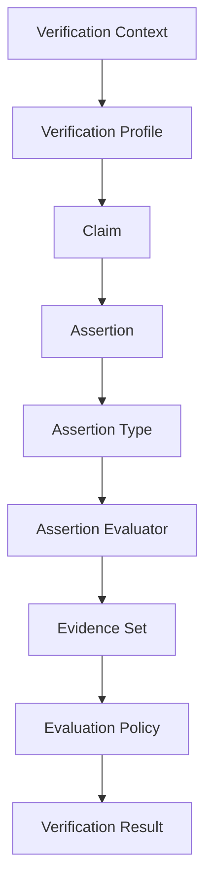
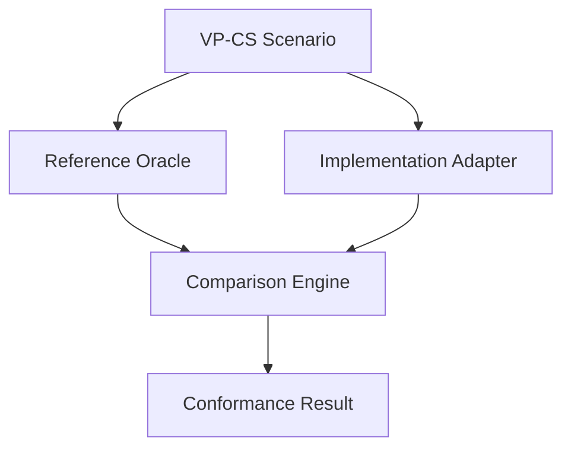

# Verity Core Protocol

**Version 1.2** · **Status:** Core Specification Draft

---

This document consolidates the Verity Core protocol RFCs into a single implementation-oriented specification. It is **not** a replacement for RFCs — [VP-RFC-0000](rfcs/0000-rfc-process.md) remains the normative change mechanism. RFCs document the evolution of the protocol; this document presents the current protocol as one coherent specification for implementers, reviewers, auditors, and educators.

**Goals:** present the protocol in implementation order; describe the complete protocol execution model; reference RFCs rather than duplicate rationale; remain synchronized with protocol RFCs; serve as the primary entry point for protocol implementers.

**Non-goals:** introduce new protocol semantics; replace RFC governance; define implementation-specific behavior.

Normative behavior is defined by accepted RFCs and, where cited, draft RFCs in progress. When this document and an RFC disagree, the RFC wins until this document is updated through governance.

---

## 1. Introduction

*Placeholder.* This section will summarize the Verity Core protocol, its scope, and its relationship to the VerityPay ecosystem. Content will be drawn from accepted protocol RFCs beginning with [VP-RFC-0001](rfcs/0001-minimal-claim-evidence-semantics.md) and aligned with [DOMAIN_MODEL.md](docs/01-architecture/DOMAIN_MODEL.md).

## 2. Normative Language

The key words **MUST**, **MUST NOT**, **SHOULD**, **SHOULD NOT**, and **MAY** in this document are to be interpreted as described in [RFC 2119](https://www.rfc-editor.org/rfc/rfc2119) unless otherwise stated.

Informative notes, draft RFC references, and placeholder sections do not introduce normative requirements beyond the RFCs they summarize.

## 3. Reading Guide

| Reader | Start here |
|--------|------------|
| **Implementers** | Sections **10–23** (Protocol Execution Model through Protocol Capabilities) |
| **Auditors** | Sections **10**, **21**, **23**, and **29** (References) |
| **Contributors** | [VP-RFC-0000](rfcs/0000-rfc-process.md) (RFC Process) first, then Sections **27–28** |
| **General readers** | Sections **1–5** (Introduction through Design Principles) |

For platform context, see [ECOSYSTEM.md](ECOSYSTEM.md). For maturity and release pins, see [SPECIFICATION_STATUS.md](SPECIFICATION_STATUS.md) and [PLATFORM_RELEASES.md](PLATFORM_RELEASES.md).

## 4. Canonical Terminology

The vocabulary below is inherited by every protocol built on Verity Core. Normative definitions remain in RFCs and [GLOSSARY.md](docs/00-overview/GLOSSARY.md); this table orients readers.

| Term | Meaning |
|------|---------|
| **Evaluation** | One execution of the protocol against a claim, evidence, and context |
| **Claim** | Structured statement under evaluation; envelope carrying identity and assertions |
| **Assertion** | Structured statement inside a claim — the verification target |
| **Evidence** | Supporting material presented for evaluation |
| **Evidence Set** | Unordered collection of evidence associated with one claim during evaluation |
| **Verification Context** | Immutable evaluation environment shared by all assertions and evidence in one evaluation |
| **Verification Result** | Protocol outcome (`satisfied`, `not_satisfied`, or `indeterminate`) |

## 5. Design Principles

*Placeholder.* This section will consolidate protocol design principles referenced across Verity Core RFCs and the constitutional layer — notably [PRINCIPLES.md](docs/00-overview/PRINCIPLES.md). It will not introduce principles beyond those established in accepted specification documents.

## 6. The Verity Philosophy

Verity is designed around one principle:

**Verification should depend on evidence, not implementation.**

Claims describe what is asserted.

Evidence supports or refutes those assertions.

Evaluation follows publicly documented rules.

Independent implementations should converge on identical outcomes.

Protocol evolution must preserve interoperability through explicit governance.

Verity separates **protocol meaning** from **implementation architecture**.

This separation allows multiple independent implementations to remain compatible over time.

## 7. Verity Core Execution Model

The diagram below is the **canonical execution model** for the Verity Core Protocol. It appears throughout this specification, sibling documentation, and conformance scenarios. Stages marked *(draft)* reference draft RFCs; accepted stages are normative via their defining RFCs.

| Stage | RFC basis |
|-------|-----------|
| Verification Context | [VP-RFC-0007](rfcs/0007-verification-context.md) *(draft)* |
| Verification Profile | [VP-RFC-0008](rfcs/0008-verification-profiles.md) *(draft)* |
| Claim | [VP-RFC-0001](rfcs/0001-minimal-claim-evidence-semantics.md) *(accepted)* |
| Assertion | [VP-RFC-0001](rfcs/0001-minimal-claim-evidence-semantics.md) *(accepted)* |
| Assertion Type | [VP-RFC-0005](rfcs/0005-assertion-types.md) *(draft)* |
| Assertion Evaluator | [VP-RFC-0006](rfcs/0006-assertion-evaluation-dispatch.md) *(draft)* |
| Evidence Set | [VP-RFC-0003](rfcs/0003-multiple-evidence.md) *(accepted)* |
| Evaluation Policy | [VP-RFC-0004](rfcs/0004-evidence-evaluation-policies.md) *(accepted)* |
| Verification Result | [VP-RFC-0001](rfcs/0001-minimal-claim-evidence-semantics.md), [VP-RFC-0004](rfcs/0004-evidence-evaluation-policies.md) *(accepted)* |

Optional **Context Extensions** *(draft — [VP-RFC-0009](rfcs/0009-verification-context-extensions.md))* augment **Verification Context** when future RFCs define them. No standardized extensions exist in the current platform.

## 8. Protocol Invariants

These invariants summarize constraints established across Verity Core RFCs. They are the fixed laws independent implementations share. Where an invariant depends on a draft RFC, acceptance of that RFC makes the invariant binding.

1. Every **evaluation** has exactly one **Verification Context** *(draft — [VP-RFC-0007](rfcs/0007-verification-context.md))*.
2. Every **Claim** contains one or more **Assertions** ([VP-RFC-0001](rfcs/0001-minimal-claim-evidence-semantics.md); minimal profile requires at least one).
3. Every **Assertion** has exactly one **Assertion Type** *(draft — [VP-RFC-0005](rfcs/0005-assertion-types.md))*.
4. Every **Evidence** envelope references at most one **Claim** via `claim_id` ([VP-RFC-0002](rfcs/0002-claim-identity-binding.md)).
5. **Verification Context** remains immutable during evaluation *(draft — [VP-RFC-0007](rfcs/0007-verification-context.md))*.
6. **Verification Results** are deterministic for identical protocol inputs — same claim, evidence set, context, and applicable rules yield the same outcome ([CONFORMANCE_MODEL.md](docs/03-development/CONFORMANCE_MODEL.md)).
7. Unknown **Context Extensions** and unknown **Protocol Capabilities** never redefine accepted semantics; they are ignored unless explicitly required *(draft — [VP-RFC-0009](rfcs/0009-verification-context-extensions.md), [VP-RFC-0010](rfcs/0010-protocol-capability-negotiation.md))*.
8. Protocol evolution is **additive** unless a Platform major release or accepted RFC explicitly declares otherwise ([PLATFORM_RELEASES.md](PLATFORM_RELEASES.md), [VP-RFC-0000](rfcs/0000-rfc-process.md)).

## 9. Protocol Architecture

*Placeholder.* This section will describe the structural architecture of the verification protocol — entities, relationships, and evaluation flow — as defined in [DATA_MODEL.md](docs/01-architecture/DATA_MODEL.md) and accepted RFCs **VP-RFC-0001** through **VP-RFC-0004**.

## 10. Protocol Execution Model

Protocol **execution** is the ordered process an evaluator follows from environment setup through verification outcome. This section describes each stage of the [Verity Core Execution Model](#7-verity-core-execution-model) in implementation order — not RFC publication order.

The execution model synthesizes accepted [VP-RFC-0001](rfcs/0001-minimal-claim-evidence-semantics.md), [VP-RFC-0002](rfcs/0002-claim-identity-binding.md), [VP-RFC-0003](rfcs/0003-multiple-evidence.md), and [VP-RFC-0004](rfcs/0004-evidence-evaluation-policies.md). Stages marked *(draft)* reference draft RFCs **VP-RFC-0005** through **VP-RFC-0009**; behavior described there is informative until those RFCs are accepted.

### Stages

**Verification Context** *(draft — [VP-RFC-0007](rfcs/0007-verification-context.md))* defines the **immutable evaluation environment** shared by every assertion and evidence envelope in one evaluation. Core fields include `edition`, `protocol_version`, and `evaluation_policy`. Context belongs to the evaluation — it is not embedded in claims or evidence.

**Verification Profile** *(draft — [VP-RFC-0008](rfcs/0008-verification-profiles.md))* is a named, reusable configuration of context fields. Selecting a profile (for example **`minimal_all_required`**) resolves evaluation-wide parameters such as **`ALL_REQUIRED`** policy without repeating individual context values. Profiles do not alter claim or evidence semantics.

**Claim** ([VP-RFC-0001](rfcs/0001-minimal-claim-evidence-semantics.md), accepted) is the protocol envelope that carries what is being asserted. It supplies stable **identity** (`claim_id`), subject linkage, and the nested **Assertion** under evaluation. The claim frames the evaluation target; it does not embed verification outcomes.

**Assertion** ([VP-RFC-0001](rfcs/0001-minimal-claim-evidence-semantics.md), accepted) is the structured content within a claim that verification rules evaluate. The interpreter evaluates the **assertion** — not the claim envelope alone. Under minimal semantics, comparison operates on assertion and evidence content when preconditions hold.

**Assertion Type** *(draft — [VP-RFC-0005](rfcs/0005-assertion-types.md))* is the protocol identifier (`assertion_type`) that names how an assertion body is **interpreted**. Every assertion declares exactly one type. The initial standardized type is **`body_equality`**. Types describe meaning; they do not execute evaluation by themselves.

**Assertion Evaluator** *(draft — [VP-RFC-0006](rfcs/0006-assertion-evaluation-dispatch.md))* is selected by **Evaluation Dispatch** from `assertion_type` alone. The evaluator performs semantic evaluation for that type — for example, routing **`body_equality`** to **VP-RULE-0001**. Dispatch must not inspect arbitrary claim or evidence bodies to infer semantics. Unknown types yield `indeterminate`.

**Evidence Set** ([VP-RFC-0003](rfcs/0003-multiple-evidence.md), accepted) is the **unordered** collection of **Evidence** envelopes associated with one claim during evaluation. Each envelope retains its own identity and content. Evidence ordering must not affect protocol meaning. Per-envelope binding to the claim is governed by [VP-RFC-0002](rfcs/0002-claim-identity-binding.md) (**VP-RULE-0002**) when binding rules are in scope.

**Evaluation Policy** ([VP-RFC-0004](rfcs/0004-evidence-evaluation-policies.md), accepted) aggregates per-envelope rule results from an evidence set into one verification outcome. The initial policy is **`ALL_REQUIRED`**: every applicable envelope must be `satisfied` for aggregate `satisfied`; any `not_satisfied` dominates; otherwise indeterminate conditions apply. Policies aggregate logical outcomes only — no trust or weighting.

**Verification Result** ([VP-RFC-0001](rfcs/0001-minimal-claim-evidence-semantics.md), [VP-RFC-0004](rfcs/0004-evidence-evaluation-policies.md), accepted) communicates the protocol outcome: `satisfied`, `not_satisfied`, or `indeterminate`. The result is explicit protocol truth — not transport status or worldly confirmation. Single-evidence evaluation may treat **`ALL_REQUIRED`** as implicit when one envelope is present.

### Responsibilities

| Stage | Responsibility |
|-------|----------------|
| **Verification Context** | Defines the evaluation environment |
| **Verification Profile** | Names a reusable context configuration *(draft)* |
| **Claim** | Defines what is asserted; supplies identity and assertion envelope |
| **Assertion** | Defines the verification target evaluated by rules |
| **Assertion Type** | Determines semantic interpretation of assertion data *(draft)* |
| **Assertion Evaluator** | Performs type-specific semantic evaluation *(draft)* |
| **Evidence Set** | Supplies supporting evidence for evaluation |
| **Evaluation Policy** | Aggregates multiple evidence results into one outcome |
| **Verification Result** | Communicates the protocol outcome |

## 11. Verification Context

**Verification Context** is the immutable protocol object that supplies evaluation-wide information shared by all **Assertions** and **Evidence** during one verification. It frames *how* evaluation proceeds — not *what* is asserted. Draft [VP-RFC-0007](rfcs/0007-verification-context.md) defines the context object; accepted [VP-RFC-0004](rfcs/0004-evidence-evaluation-policies.md) already defines **`evaluation_policy`** semantics that context carries.

Verification Context **belongs to the evaluation**. It is **not** part of a **Claim**. It is **not** part of **Evidence**. It does not define trust, issuers, or authorization.

### Core fields

| Field | Role |
|-------|------|
| **`edition`** | Specification edition under which evaluation interprets rules |
| **`protocol_version`** | Declared protocol version for the evaluation |
| **`evaluation_policy`** | **Evaluation Policy** identifier — for example **`ALL_REQUIRED`** per [VP-RFC-0004](rfcs/0004-evidence-evaluation-policies.md) |

Context **MUST** remain immutable during evaluation and **MUST** apply to every assertion in that evaluation. Context **MUST NOT** modify claim or evidence semantics.

Implementations **MAY** derive these values from specification metadata until explicit context objects are adopted. Wire encodings are deferred.

### Verification Profiles

Draft [VP-RFC-0008](rfcs/0008-verification-profiles.md) introduces **Verification Profile** — a named, reusable configuration of context fields identified by stable `profile_id`. The initial standardized profile is **`minimal_all_required`**, which implies **`ALL_REQUIRED`** evaluation policy and Platform 1.2 dispatch and evidence-set behavior. Profile selection resolves context; it does not replace core context fields.

### Context Extensions

Draft [VP-RFC-0009](rfcs/0009-verification-context-extensions.md) defines **Context Extension** — optional objects that augment context without replacing core fields. Informative future categories include time, trust, issuer, localization, audit, and regulatory context. **No standardized extensions exist** in the current platform. Unknown extensions **MUST** be ignored unless the active profile explicitly requires them.

## 12. Claims

A **Claim** is the central protocol envelope for a structured statement under verification. Accepted [VP-RFC-0001](rfcs/0001-minimal-claim-evidence-semantics.md) defines the minimal claim envelope; accepted [VP-RFC-0002](rfcs/0002-claim-identity-binding.md) defines how claim identity binds evidence.

Claims **contain Assertions**. The claim envelope binds identity, subject, and specification context around assertion content — the claim is not itself the assertion. Verification evaluates the nested assertion using evidence; the claim supplies the stable frame within which that evaluation occurs.

### Identity

`claim_id` is the **stable identity** of a claim envelope within an evaluation context. It **MUST** be non-empty and is compared using exact string equality per [VP-RFC-0002](rfcs/0002-claim-identity-binding.md). Identity enables **evidence binding**: evidence is applicable only when `evidence.claim_id` equals `claim.claim_id`. Binding checks linkage only — it does not inspect assertion or evidence bodies.

Claim identity is a precondition for correct evaluation; it does **not** determine verification outcomes by itself. Mismatched or empty binding yields `indeterminate` via **VP-RULE-0002** without proceeding to content rules. Matching identity allows subsequent rules (such as **VP-RULE-0001**) to evaluate assertion content.

### Evaluation target

The claim's role in verification is to present **what is asserted** — identity plus nested **Assertion** — as the evaluation target. Outcomes are recorded separately in **Verification Result**; claims **MUST NOT** embed verification outcomes.

## 13. Assertions

An **Assertion** is the structured content within a claim that verification rules evaluate. Accepted [VP-RFC-0001](rfcs/0001-minimal-claim-evidence-semantics.md) requires every minimal claim to carry a nested assertion with `assertion_type` and `body`. Draft [VP-RFC-0005](rfcs/0005-assertion-types.md) names **Assertion Type** as the protocol vocabulary for interpreting assertion data.

Assertions express **what is being evaluated**. The interpreter evaluates the assertion — not the claim envelope alone. Under **VP-RULE-0001**, when preconditions hold, evaluation compares assertion body to evidence content body; missing or mismatched content under rule preconditions yields `indeterminate` or `not_satisfied` per the rule tables in [VP-RFC-0001](rfcs/0001-minimal-claim-evidence-semantics.md).

### Fields

| Field | Role |
|-------|------|
| **`assertion_type`** | Declares exactly one **Assertion Type** — the protocol identifier describing semantic interpretation *(taxonomy in draft [VP-RFC-0005](rfcs/0005-assertion-types.md))* |
| **`body`** | Opaque protocol data whose meaning is defined by the declared type and applicable rules |

**Assertion Type** defines *interpretation* — what the body means in protocol terms. It does not define *evaluation procedure*; rule execution and evaluator dispatch are specified elsewhere ([VP-RFC-0006](rfcs/0006-assertion-evaluation-dispatch.md), draft). The **`body`** carries the data consumed by those rules — for **`body_equality`**, the comparable payload evaluated against evidence content when linkage and type preconditions hold.

Every assertion **MUST** declare exactly one type via `assertion_type`. Type identifiers **MUST** be stable protocol strings — not implementation class names or vendor-specific labels.

## 14. Assertion Types

An **Assertion Type** names the semantic interpretation of an assertion's body. It answers one question for the evaluator: *what does this assertion mean?*

Every assertion **MUST** declare exactly one type via the `assertion_type` field. Type identifiers **MUST** be stable protocol strings — never implementation class names, library paths, or vendor labels. The type does not execute evaluation by itself; it selects the evaluator that does (see [§15](#15-assertion-evaluators)).

### Content Equality family

The **Content Equality** family compares assertion and evidence content under defined equality models. See [CONTENT_EQUALITY_FAMILY.md](CONTENT_EQUALITY_FAMILY.md) for the family roadmap.

| Type | Status | Rule |
|------|--------|------|
| **`body_equality`** | Implemented via accepted [VP-RFC-0001](rfcs/0001-minimal-claim-evidence-semantics.md); type identifier in draft [VP-RFC-0005](rfcs/0005-assertion-types.md) | **VP-RULE-0001** — exact Unicode string equality |
| **`normalized_text`** | Draft [VP-RFC-0011](rfcs/0011-normalized-text-assertion.md) — first proposed Content Equality extension | **VP-RULE-0011** — normalized text equality after NFC, trim, and whitespace collapse |

Content Equality currently contains **one implemented type** (`body_equality`) and **one proposed extension** (`normalized_text`). Additional family members remain research-only until their RFCs are accepted. *(Taxonomy: draft [VP-RFC-0005](rfcs/0005-assertion-types.md).)*

### Other families

Additional types (for example `hash_match`, `signature`, or domain-specific types) **MAY** be standardized by future RFCs in other assertion families per [ASSERTION_TAXONOMY.md](ASSERTION_TAXONOMY.md). Each new type **MUST** define its own semantic interpretation and the evaluator or rules that apply. Existing type semantics **MUST NOT** change when new types are added.

## 15. Assertion Evaluators

An **Assertion Evaluator** performs the semantic evaluation for one **Assertion Type**. **Evaluation Dispatch** is the deterministic process that selects an evaluator from `assertion_type` alone — before any type-specific rules execute.

### Dispatch rules

1. The evaluator **MUST** be selected based solely on `assertion_type`. Dispatch **MUST NOT** inspect assertion body, evidence content, or claim envelope fields to infer which evaluator applies.
2. Each standardized `assertion_type` maps to exactly one evaluator. The initial mapping is **`body_equality`** → **Body Equality Evaluator** → **VP-RULE-0001**.
3. Unknown `assertion_type` values **MUST** yield `indeterminate` without executing type-specific rules.

Evaluator dispatch is a protocol behavior, not an implementation architecture requirement. Implementations may organize internal modules however they choose, provided the protocol mapping holds. *(Dispatch: draft [VP-RFC-0006](rfcs/0006-assertion-evaluation-dispatch.md).)*

## 16. Evidence

**Evidence** is an independent envelope containing material that evaluation rules consume. It is always separate from the claim it supports — evidence **MUST NOT** be embedded inside claims, and claims **MUST NOT** embed verification outcomes.

### Structure

A conforming **Evidence** envelope carries:

| Field | Requirement |
|-------|-------------|
| `evidence_id` | **MUST** be non-empty; uniquely identifies this envelope within the evaluation |
| `claim_id` | **MUST** match the `claim_id` of the claim under verification for the evidence to be applicable |
| `evidence_type` | **MUST** be non-empty; classifies the evidence for rule applicability |
| `content` | **MUST** be present; contains **EvidenceContent** with `content_type` and `body` |

### Binding

Evidence is **applicable** to a claim when `evidence.claim_id` equals `claim.claim_id` (exact string equality). This identity linkage is checked by **VP-RULE-0002** ([VP-RFC-0002](rfcs/0002-claim-identity-binding.md)) before content rules execute. Mismatched or empty `claim_id` yields `indeterminate` — the evaluator never reaches content comparison.

Binding checks **linkage only**. They do not inspect assertion body, evidence content body, or subject fields.

### EvidenceContent

**EvidenceContent** carries the verifiable payload that rules consume. Under **VP-RULE-0001**, `content.body` is compared to `assertion.body` when all preconditions hold. An empty `content.body` yields `indeterminate`. ([VP-RFC-0001](rfcs/0001-minimal-claim-evidence-semantics.md))

## 17. Evidence Sets

An **Evidence Set** is the **unordered** collection of **Evidence** envelopes associated with one claim during evaluation. It defines the input surface for multi-evidence verification.

### Properties

1. **Ordering independence** — evidence ordering **MUST NOT** affect protocol meaning. Two evidence sets containing the same envelopes (by `evidence_id` and content) are equivalent inputs regardless of list order.
2. **Structural independence** — each evidence envelope **MUST** remain distinct, with its own `evidence_id`, `claim_id` binding, and content. Envelopes are never merged.
3. **Cardinality** — an evidence set **MAY** be empty (zero envelopes), contain one envelope (equivalent to the single-evidence profile), or contain multiple envelopes.

An empty evidence set yields `indeterminate` under **`ALL_REQUIRED`** policy. Single-evidence evaluation **MAY** treat the policy as implicit when one envelope is present, preserving backward compatibility with **VP-CS-0001**. ([VP-RFC-0003](rfcs/0003-multiple-evidence.md))

## 18. Evaluation Policies

An **Evaluation Policy** aggregates per-envelope rule results from an **Evidence Set** into one verification outcome. It answers: *given individual evidence results, what is the overall verdict?*

### Initial policy: `ALL_REQUIRED`

Under **`ALL_REQUIRED`**:

| Condition | Aggregated outcome |
|-----------|--------------------|
| Every applicable envelope is `satisfied` | `satisfied` |
| Any envelope is `not_satisfied` | `not_satisfied` (dominates) |
| No `not_satisfied`, but any `indeterminate` | `indeterminate` |
| Empty evidence set | `indeterminate` |

Policies aggregate logical outcomes only — no trust, weighting, or signatures. Evidence ordering **MUST NOT** affect the aggregated outcome. ([VP-RFC-0004](rfcs/0004-evidence-evaluation-policies.md))

### Future policies

Additional policies **MAY** be standardized by future RFCs. Each new policy **MUST** define its own aggregation table and **MUST NOT** introduce outcome labels beyond `satisfied`, `not_satisfied`, and `indeterminate` unless a future RFC explicitly extends outcome vocabulary.

## 19. Verification Profiles

A **Verification Profile** is a named, reusable configuration of **Verification Context** fields. Profiles exist so that implementations and scenarios can declare an evaluation configuration by `profile_id` rather than repeating individual context values.

### Requirements

1. A profile **MUST** have a stable `profile_id`.
2. A profile **MUST** define or imply an `evaluation_policy`.
3. A profile **MUST NOT** alter claim or evidence semantics.
4. A profile **MUST NOT** bypass assertion evaluator dispatch.
5. Unknown `profile_id` values **MUST** produce `indeterminate` unless the scenario or implementation explicitly declares support.

### Initial profile: `minimal_all_required`

| Property | Value |
|----------|-------|
| `profile_id` | `minimal_all_required` |
| `evaluation_policy` | `ALL_REQUIRED` |
| Assertion dispatch | Per evaluator dispatch rules (§15) |
| Evidence set | Per evidence set semantics (§17) |

**VP-CS-0001** and **VP-CS-0002** implicitly execute under `minimal_all_required`. No additional profiles are standardized in this version. *(Profiles: draft [VP-RFC-0008](rfcs/0008-verification-profiles.md).)*

## 20. Context Extensions

**Context Extensions** are protocol-defined objects that augment **Verification Context** with additional evaluation information. They provide a forward-compatible expansion point so future capabilities do not pressure changes to core context fields.

### Rules

1. Extensions **MUST** have stable extension identifiers.
2. Extensions **MUST** remain immutable during evaluation.
3. Extensions **MUST NOT** alter claim or evidence semantics.
4. Extensions **MUST NOT** bypass evaluator dispatch.
5. Unknown extensions **MUST** be ignored unless the active **Verification Profile** explicitly requires them.

**No standardized extensions exist** in this version. Informative future categories include time, trust, issuer, localization, audit, and regulatory context — each to be defined by its own RFC. *(Extension model: draft [VP-RFC-0009](rfcs/0009-verification-context-extensions.md).)*

## 21. Verification Results

A **Verification Result** communicates the protocol outcome of one evaluation. It is the final output of the [execution model](#7-verity-core-execution-model).

### Outcome vocabulary

Every evaluation produces exactly one of three outcomes:

| Outcome | Meaning |
|---------|---------|
| `satisfied` | The assertion is supported by evidence under the applicable rules and policy |
| `not_satisfied` | The assertion is contradicted by evidence under the applicable rules |
| `indeterminate` | The evaluation could not reach a definitive conclusion — preconditions unmet, binding failed, empty evidence, or unknown assertion type |

Outcomes are **explicit protocol truth** — not transport status codes, HTTP responses, or worldly confirmation that a payment occurred. A `satisfied` result means the protocol rules were met; it does not certify legal or financial fact.

### Determinism

Identical protocol inputs — same claim, evidence set, verification context, and applicable rules — **MUST** yield the same outcome. This invariant is what makes conformance comparison possible across independent implementations. ([VP-RFC-0001](rfcs/0001-minimal-claim-evidence-semantics.md), [VP-RFC-0004](rfcs/0004-evidence-evaluation-policies.md))

### Single vs. aggregated results

For single-evidence evaluation, the per-envelope outcome is the verification result directly. For multi-evidence evaluation, the **Evaluation Policy** (§18) aggregates per-envelope outcomes into one result. The outcome vocabulary is the same in both cases.

## 22. Protocol Capabilities

A **Protocol Capability** is a stable identifier representing one protocol feature an implementation intentionally supports. Capabilities are an **implementation concept** — not part of claims, evidence, or verification context.

### Purpose

Platform releases and independent implementations evolve at different rates. Capabilities let conformance harnesses distinguish *"feature not implemented"* from *"implemented incorrectly"* — enabling **skip** instead of **fail** when a scenario requires a capability the implementation has not adopted.

### Rules

1. Capability identifiers **MUST** be stable and additive.
2. Unknown capabilities **MUST** be ignored.
3. Capabilities **MUST NOT** redefine existing protocol semantics.

### Initial capability catalog

| Capability | Protocol feature |
|------------|-----------------|
| `minimal_claims` | Minimal claim and evidence envelopes, **VP-RULE-0001** |
| `claim_binding` | Evidence claim identity binding, **VP-RULE-0002** |
| `multiple_evidence` | Evidence Set input model |
| `evaluation_policy` | Evaluation Policy aggregation |
| `assertion_types` | Assertion Type taxonomy |
| `assertion_dispatch` | Evaluation Dispatch |
| `verification_context` | Verification Context |
| `verification_profiles` | Verification Profiles |
| `context_extensions` | Context Extension model |

### Conformance eligibility

When a scenario declares required capabilities and an implementation does not advertise them, the harness **SHOULD** yield **skip** — not **fail**. Skip means the scenario was inapplicable to the declared implementation surface. Fail means the scenario executed and the outcome was incorrect. *(Capabilities: draft [VP-RFC-0010](rfcs/0010-protocol-capability-negotiation.md).)*

## 23. Conformance

Conformance determines whether an implementation **speaks Verity correctly** — whether it produces the same verification outcomes as another conforming implementation for the same protocol inputs.

### How conformance works

Conformance is tested through **VP-CS scenarios**. Each scenario specifies claim and evidence inputs, the rules under test, and the expected verification outcome. The expected outcome comes from the **reference interpreter** oracle — not from this document.

A **pass** means the implementation's outcome matches the oracle for that scenario. A **fail** means they diverge. A **skip** means the scenario required a capability the implementation does not advertise. An **error** means the harness itself encountered a problem.

### Verdicts vs. outcomes

Harness verdicts (`pass`, `fail`, `skip`, `error`) are **distinct** from verification outcomes (`satisfied`, `not_satisfied`, `indeterminate`). A scenario may expect `not_satisfied` — and a conforming implementation that returns `not_satisfied` receives a **pass** verdict.

### Scenario meaning is normative

Scenario fixtures are authored in this repository. The fixture and its defining RFC establish **what** is under test. The harness and adapter are execution machinery — they do not invent protocol meaning. When harness behavior and normative text disagree, the specification wins. ([CONFORMANCE_MODEL.md](docs/03-development/CONFORMANCE_MODEL.md))

## 24. Versioning

Verity Core uses three versioning concepts:

| Concept | Scope | Example |
|---------|-------|---------|
| **Edition** | A published snapshot of the specification (constitutional layer, RFCs, registries) | Genesis Edition |
| **Protocol Version** | Assigned at Edition publication; names a fixed rule interpretation set | `vp-protocol-1.0` |
| **Platform Release** | A compatible engineering baseline across specification, tooling, reference, and conformance repositories | Platform 1.2 |

This document tracks **Platform 1.2**, which includes accepted **VP-RFC-0001** through **VP-RFC-0004** and the current reference and conformance baselines. No Edition has been formally published yet; the Genesis Edition is in preparation.

Implementations **MUST** declare the Edition and Protocol Version they target. Platform Release names the engineering compatibility surface — it is not a substitute for specification version. ([SPECIFICATION_VERSIONING.md](docs/05-governance/SPECIFICATION_VERSIONING.md), [PLATFORM_RELEASES.md](PLATFORM_RELEASES.md))

### Core specification maturity

This document follows its own maturity lifecycle:

| Stage | Meaning |
|-------|---------|
| **Core Specification Draft** | Sections populating from accepted and draft RFCs *(current)* |
| **Core Specification Candidate** | All sections populated; under review for completeness |
| **Core Specification 1.0** | Stable, edition-pinned, citeable as the authoritative Core |

## 25. Relationship to Reference Implementation

The `veritypay-reference` repository implements Verity Core semantics as an educational and oracle reference. It executes **VP-RULE-0001**, **VP-RULE-0002**, and the evaluation policy and dispatch model described in this specification.

The reference interpreter is **not normative**. It demonstrates one correct implementation path. When the reference interpreter and this specification disagree, the specification wins. The interpreter's value is as an oracle for conformance comparison — not as a source of protocol truth.

Implementers may study reference code for clarity but **MUST** target this specification and its accepted RFCs, not internal reference architecture decisions such as module names, trait boundaries, or dispatch tables. ([ECOSYSTEM.md](ECOSYSTEM.md))

## 26. Relationship to Conformance Suite

The `veritypay-conformance` repository executes VP-CS scenarios against the reference oracle and compares implementation adapter results. Scenario **meaning** — what is under test and why — is authored in this repository. The conformance suite is execution machinery.

A conformance pass against the oracle demonstrates that an implementation produces the same outcomes for tested scenarios. It does not certify legal compliance, financial accuracy, or exhaustive correctness. Conformance scope grows as VP-CS scenarios are published.

Implementations targeting Verity Core **SHOULD** run the conformance suite as part of their CI pipeline to detect outcome divergence early. ([CONFORMANCE_MODEL.md](docs/03-development/CONFORMANCE_MODEL.md))

## 27. Governance

Protocol changes enter Verity Core through the **RFC process** ([VP-RFC-0000](rfcs/0000-rfc-process.md)). An RFC proposes a normative change, undergoes review, and is accepted or rejected through governance. Accepted RFCs become binding protocol semantics; this document is updated to reflect them.

No protocol behavior originates in this document. It aggregates and presents accepted RFC content. If a section here introduces apparent behavior not traceable to an accepted RFC, treat the RFC as authoritative and report the discrepancy.

Governance roles, review process, and authority model are documented in [GOVERNANCE.md](docs/05-governance/GOVERNANCE.md). Engineering decisions within implementation repositories are recorded as ADRs per [ADR_GUIDE.md](docs/05-governance/ADR_GUIDE.md); ADRs do not carry normative protocol weight.

## 28. Evolution

Verity Core evolves through three mechanisms:

1. **New RFCs** introduce new capabilities (assertion types, evaluators, policies, context extensions, capabilities). All new RFCs are additive by default.
2. **RFC acceptance** promotes draft sections of this document to normative status. Draft markers are removed and MUST/SHOULD language becomes binding.
3. **Platform releases** declare compatible engineering baselines. A new Platform release **MAY** incorporate newly accepted RFCs without breaking existing semantics.

**Breaking changes** — removal of an existing capability or redefinition of accepted semantics — require explicit governance action through the RFC process and a Platform major version increment.

This document is updated when RFC status changes materially. Maintainers synchronize section content with accepted RFCs; they do not introduce behavior outside the RFC process.

## 29. References

| RFC | Title | Status |
|-----|-------|--------|
| [VP-RFC-0000](rfcs/0000-rfc-process.md) | RFC Process | Accepted |
| [VP-RFC-0001](rfcs/0001-minimal-claim-evidence-semantics.md) | Minimal Claim and Evidence Semantics | Accepted |
| [VP-RFC-0002](rfcs/0002-claim-identity-binding.md) | Claim Identity Binding | Accepted |
| [VP-RFC-0003](rfcs/0003-multiple-evidence.md) | Multiple Evidence | Accepted |
| [VP-RFC-0004](rfcs/0004-evidence-evaluation-policies.md) | Evidence Evaluation Policies | Accepted |
| [VP-RFC-0005](rfcs/0005-assertion-types.md) | Assertion Types | Draft |
| [VP-RFC-0006](rfcs/0006-assertion-evaluation-dispatch.md) | Assertion Evaluation Dispatch | Draft |
| [VP-RFC-0007](rfcs/0007-verification-context.md) | Verification Context | Draft |
| [VP-RFC-0008](rfcs/0008-verification-profiles.md) | Verification Profiles | Draft |
| [VP-RFC-0009](rfcs/0009-verification-context-extensions.md) | Verification Context Extensions | Draft |
| [VP-RFC-0010](rfcs/0010-protocol-capability-negotiation.md) | Protocol Capability Negotiation | Draft |
| [VP-RFC-0011](rfcs/0011-normalized-text-assertion.md) | Normalized Text Assertion | Draft |

---

### Architecture documents

| Document | Purpose |
|----------|---------|
| [DATA_MODEL.md](docs/01-architecture/DATA_MODEL.md) | Protocol entities and relationships |
| [CONFORMANCE_MODEL.md](docs/03-development/CONFORMANCE_MODEL.md) | Conformance framework and harness architecture |
| [SPECIFICATION_VERSIONING.md](docs/05-governance/SPECIFICATION_VERSIONING.md) | Edition, protocol version, and platform release rules |
| [PLATFORM_RELEASES.md](PLATFORM_RELEASES.md) | Compatible engineering baselines |
| [ECOSYSTEM.md](ECOSYSTEM.md) | Repository structure and Verity Core relationship |
| [GOVERNANCE.md](docs/05-governance/GOVERNANCE.md) | Governance roles and change authority |
| [GLOSSARY.md](docs/00-overview/GLOSSARY.md) | Canonical terminology definitions |

---

*Core Specification Draft — sections populated from accepted and draft protocol RFCs. Maintainers update this document when RFC status or Platform releases change materially.*
