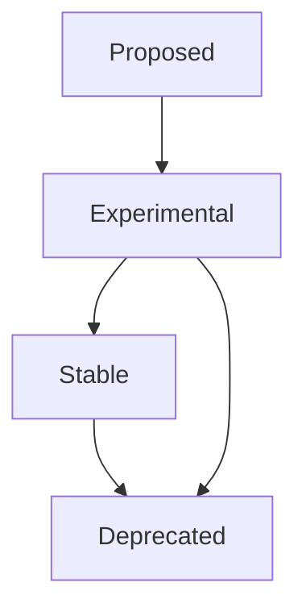
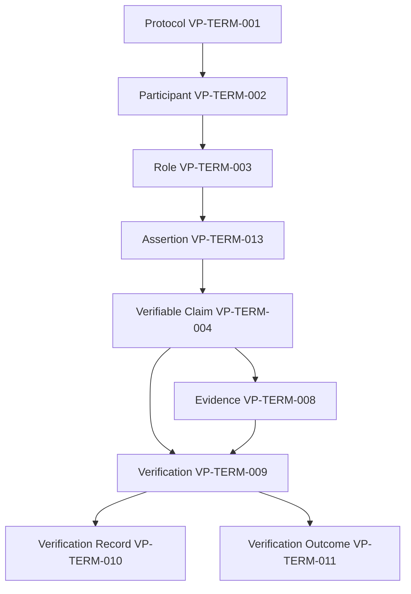
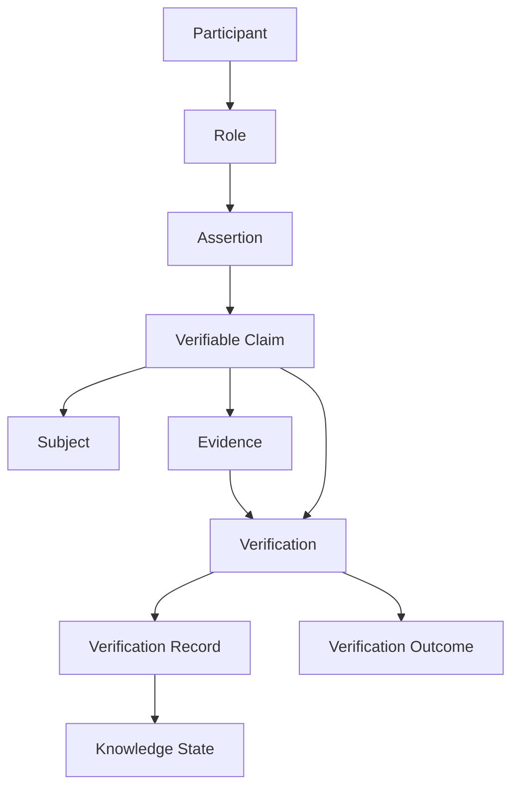
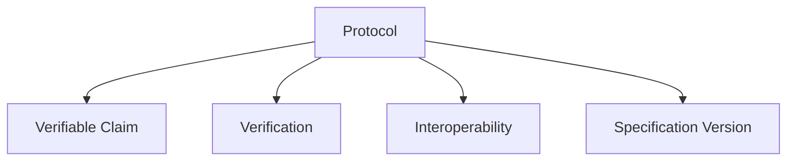
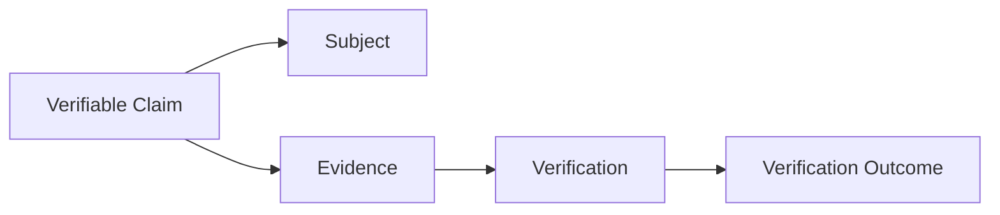
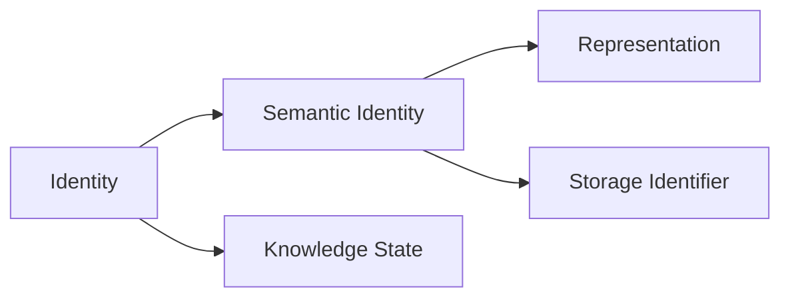
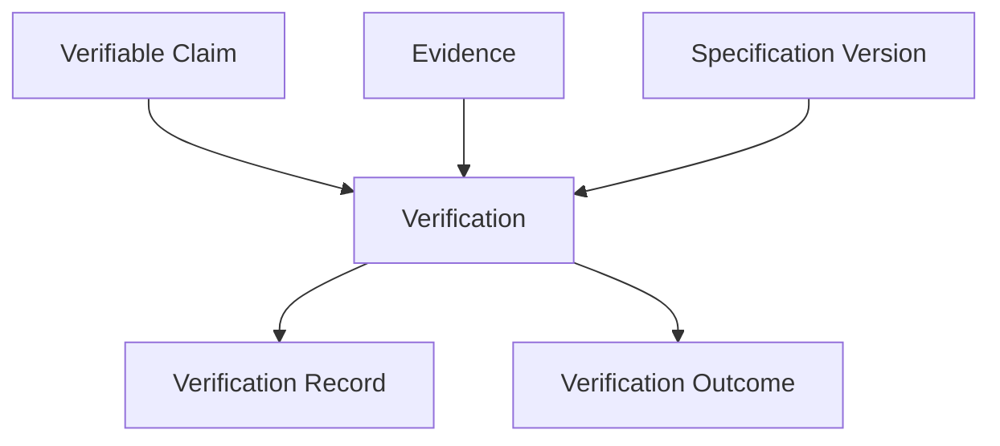
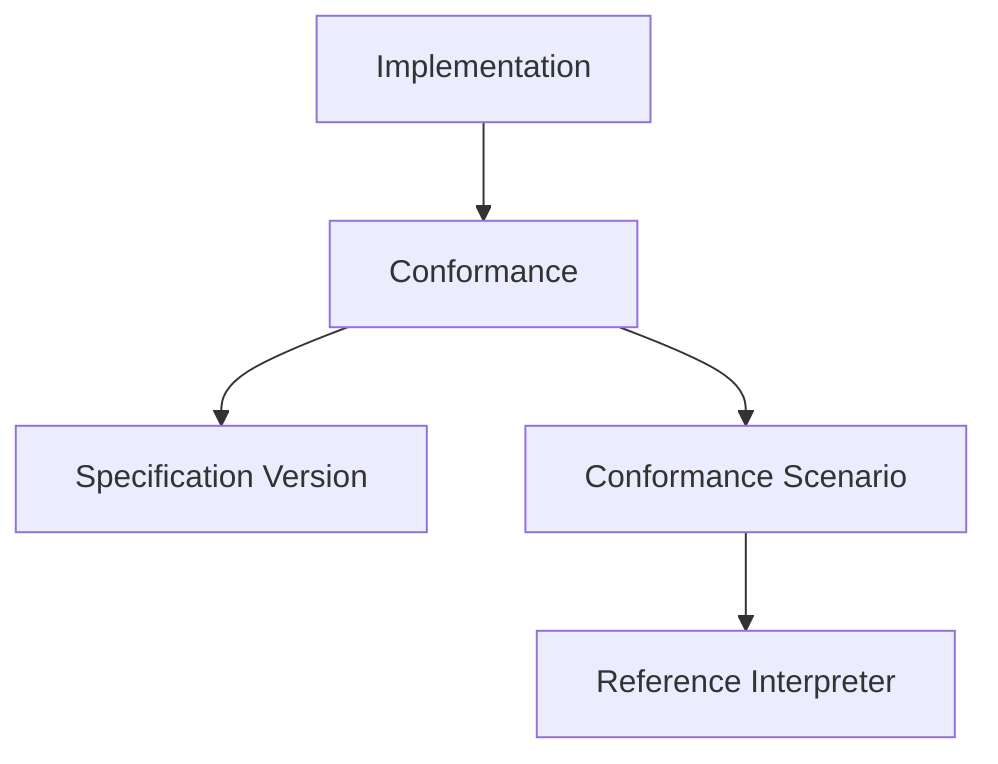

**Pyramid level:** constitutional · **Status:** draft · **Version:** 0.4.0

**Constitutional basis:** [MANIFESTO.md](MANIFESTO.md), [VISION.md](VISION.md), [PRINCIPLES.md](PRINCIPLES.md)

**Authoritative detail:** Architecture documents define concepts in depth; this glossary standardizes **vocabulary** and links to those sources.

---

# VerityPay Glossary

> *Shared language is the first form of interoperability.*

---

## Constitutional layer

Part of the VerityPay [documentation pyramid](../README.md#documentation-pyramid).

| Document | File | You are here |
|----------|------|:------------:|
| Manifesto | [MANIFESTO.md](MANIFESTO.md) | |
| Vision | [VISION.md](VISION.md) | |
| Principles | [PRINCIPLES.md](PRINCIPLES.md) | |
| Glossary | [GLOSSARY.md](GLOSSARY.md) | **●** |

**Suggested reading order:** Manifesto → Vision → Principles → Glossary (reference as needed).

---

<a id="gl-1-1"></a>

## Purpose

Protocols fail when people use the **same word differently**.

Integrators say *transaction*; auditors say *claim*; engineers say *record*—and everyone believes they agreed. VerityPay refuses that ambiguity by standardizing terminology **before** implementations harden dialects.

This document is the **authoritative language reference** for the public specification. It establishes a **language system**—not merely a word list—so that every RFC, architecture document, issue, SDK, and conformance scenario shares the same meaning.

Every canonical term names **one** authoritative definition, declares how stable its vocabulary is, and states which document owns its semantics.

When terminology conflicts arise, **this glossary is authoritative** unless superseded by an **accepted RFC** that explicitly amends a definition.

This glossary **summarizes** concepts defined in architecture documents—it does not replace them. For full semantics, follow each term's **Normative definition**.

---

## Language philosophy

Every protocol begins as language.

Before software can interoperate, people must agree on the meaning of words. VerityPay treats vocabulary as **protocol infrastructure**—not documentation garnish.

Changing a definition is therefore treated with the same care as changing protocol behavior: public review, explicit versioning, and traceable **Concept IDs** (**VP-TERM-***).

This glossary is designed to stand alone as a **Terminology Specification** within the larger VerityPay ecosystem—even while it lives in one repository today.

---

## Specification modularity

VerityPay is organized in layers that may eventually publish as separate specifications. Design every document to stand alone while linking to siblings:

| Future specification | Current home | This glossary's role |
|---------------------|--------------|----------------------|
| Core Specification | Architecture models | **VP-TERM-001**–**023** |
| Terminology Specification | This document (SPEC-0004) | Concept IDs + definitions |
| Conformance Specification | CONFORMANCE_MODEL | **VP-TERM-024**–**027** |
| Governance Specification | GOVERNANCE | **VP-TERM-028**–**034** |
| Payment Domain Specification | DOMAIN_MODEL (payment layering) | **VP-TERM-035**–**037** |
| Future domain specifications | Reserved terms | **VP-TERM-038**+ |

RFCs SHOULD cite **VP-TERM-*** identifiers when amending vocabulary. Example: *This RFC amends **VP-TERM-009** (Verification).*

---

## Normative status

- This document is **informative** until adopted through [GOVERNANCE.md](../05-governance/GOVERNANCE.md).
- **Accepted RFCs** may introduce new terms or amend definitions; amendments MUST be explicit.
- Existing definitions MUST NOT change silently—deprecate, document, and link forward.
- **Deprecated** terms remain documented for historical compatibility (see [Deprecated Terminology](#deprecated-terminology)).

---

## Vocabulary stability

Every canonical term carries a **vocabulary stability** level. This tells contributors what assumptions are safe to build on.

| Level | Meaning | Change process |
|-------|---------|----------------|
| **Proposed** | Introduced by a **draft RFC**; not safe for production assumptions | Promote to Experimental or Stable on RFC acceptance; demote or withdraw if RFC rejected |
| **Experimental** | Defined for exploration; semantics may shift | Early adopters SHOULD pin spec version |
| **Stable** | Normative vocabulary; safe for long-lived integrations | Accepted RFC + glossary amendment |
| **Reserved** | Name held for a future concept; no behavior yet | Definition requires domain RFC before use |
| **Deprecated** | Historical recognition only; not for new text | See [Deprecated terminology](#deprecated-terminology) |

**Term lifecycle** (normative vocabulary):



**Reserved** names sit outside this lifecycle until a domain RFC defines behavior.

**Vocabulary stability** is independent of [normative status](#normative) (Core, Domain-specific, Experimental, Deprecated) and of document adoption under [GOVERNANCE.md](../05-governance/GOVERNANCE.md).

---

## Term classification

Classification places each term in the **conceptual layer** of the specification—not its binding strength.

| Classification | Meaning |
|----------------|---------|
| **Fundamental** | Defines protocol philosophy and core nouns |
| **Domain** | Specific to a protocol domain (e.g., payments) |
| **Behavioral** | Defines actions, evaluation, and outcomes |
| **Structural** | Defines architecture shape, encoding, and lifecycle |
| **Governance** | Defines specification and change process |
| **Conformance** | Used for interoperability testing and assessment |

A term has exactly one primary classification. Cross-cutting terms are classified by their **authoritative definition**.
---

<a id="architecture-section-ids"></a>

## Architecture section IDs

Architecture documents use stable **section IDs** for cross-reference from RFCs, conformance artifacts, and tooling—alongside **VP-TERM-*** Concept IDs.

| Prefix | Document | Example |
|--------|----------|---------|
| **DM** | [DOMAIN_MODEL.md](../01-architecture/DOMAIN_MODEL.md) | [**DM-4.8**](../01-architecture/DOMAIN_MODEL.md#dm-4-8) — Verification |
| **IM** | [IDENTITY_MODEL.md](../01-architecture/IDENTITY_MODEL.md) | **IM-6.1** — Verification Record |
| **BM** | [BEHAVIOR_MODEL.md](../01-architecture/BEHAVIOR_MODEL.md) | **BM-5.1** — Protocol events |
| **DAT** | [DATA_MODEL.md](../01-architecture/DATA_MODEL.md) | **DAT-9.1** — Representation guarantees |
| **SM** | [STATE_MODEL.md](../01-architecture/STATE_MODEL.md) | **SM-2.1** — Knowledge states |
| **CM** | [CONFORMANCE_MODEL.md](../03-development/CONFORMANCE_MODEL.md) | **CM-6.1** — Conformance scenarios |
| **GV** | [GOVERNANCE.md](../05-governance/GOVERNANCE.md) | **GV-5.1** — RFC governance |
| **VI** | [VISION.md](VISION.md) | **VI-3.1** — Protocol responsibilities |
| **GL** | [GLOSSARY.md](GLOSSARY.md) | **GL-1.1** — Terminology registry |

RFC example: *This RFC amends **DM-4.8** and **VP-TERM-009** (Verification).*

The [machine-readable registry](../../spec/terminology/registry.yaml) includes `section_id` for each term.

---

## Concept dependency graph

Relationship graphs show how concepts connect. The **dependency graph** shows which concepts must exist before others—useful for reading order and RFC impact analysis.



Full `depends_on` edges are published in [`spec/terminology/registry.yaml`](../../spec/terminology/registry.yaml).

---

## Protocol concept graph

Core protocol flow at a glance (detail in architecture models and term-level graphs below):



---

## Language rules

These rules govern **how** specification prose is written—not which terms exist.

The specification **SHOULD**:

1. **Use nouns consistently** — one canonical term per concept; link to this glossary on first substantive use in a document.
2. **Avoid synonyms** — do not introduce parallel vocabulary for the same artifact (e.g., *transaction* and *claim* for the same protocol object).
3. **Avoid abbreviations unless defined** — spell out on first use or link to a glossary entry; acronyms (RFC, ADR, VP-CS) MUST be defined here or in the introducing document.
4. **Avoid implementation-specific names** — normative text names protocol concepts, not classes, tables, or vendor products.
5. **Avoid blockchain-specific terminology** when discussing protocol semantics — use [protocol event](#protocol-event), [semantic identity](#semantic-identity), and [verification record](#verification-record) unless an RFC maps a chain construct explicitly.
6. **Separate assertion from verification** — presenters assert; verifiers evaluate; outcomes live on [verification records](#verification-record).
7. **Bind behavior to specification version** — normative evaluation text MUST cite which [specification version](#specification-version) applies.
8. **Prefer MUST/SHOULD/MAY** (RFC 2119) in normative sections; reserve informal prose for informative sections.
9. **Cite Concept IDs in normative changes** — RFCs amending vocabulary SHOULD reference **VP-TERM-*** identifiers from the [Concept ID registry](#concept-id-registry).

See also [Naming guidelines](#naming-guidelines) for term-specific conventions.

---

## Concept ID registry

<a id="concept-id-registry"></a>

Stable identifiers for traceability across architecture, RFCs, conformance scenarios, and SDK documentation.

| ID | Term | Stability |
|----|------|-----------|
| VP-TERM-001 | [Protocol](#protocol) | Stable |
| VP-TERM-002 | [Participant](#participant) | Stable |
| VP-TERM-003 | [Role](#role) | Stable |
| VP-TERM-004 | [Verifiable Claim](#verifiable-claim) | Stable |
| VP-TERM-005 | [Subject](#subject) | Stable |
| VP-TERM-006 | [Identity](#identity) | Stable |
| VP-TERM-007 | [Semantic Identity](#semantic-identity) | Stable |
| VP-TERM-008 | [Evidence](#evidence) | Stable |
| VP-TERM-009 | [Verification](#verification) | Stable |
| VP-TERM-010 | [Verification Record](#verification-record) | Stable |
| VP-TERM-011 | [Verification Outcome](#verification-outcome) | Stable |
| VP-TERM-012 | [Knowledge State](#knowledge-state) | Stable |
| VP-TERM-013 | [Assertion](#assertion) | Stable |
| VP-TERM-014 | [Protocol Event](#protocol-event) | Stable |
| VP-TERM-015 | [Supersession](#supersession) | Stable |
| VP-TERM-016 | [Storage Identifier](#storage-identifier) | Stable |
| VP-TERM-017 | [Representation](#representation) | Stable |
| VP-TERM-018 | [Representation Guarantee](#representation-guarantee) | Stable |
| VP-TERM-019 | [Protocol Truth](#protocol-truth) | Stable |
| VP-TERM-020 | [Truth](#truth) | Stable |
| VP-TERM-021 | [Extension](#extension) | Stable |
| VP-TERM-022 | [Interoperability](#interoperability) | Stable |
| VP-TERM-023 | [Implementation](#implementation) | Stable |
| VP-TERM-024 | [Conformance](#conformance) | Stable |
| VP-TERM-025 | [Conformance Scenario](#conformance-scenario) | Experimental |
| VP-TERM-026 | [Reference Implementation](#reference-implementation) | Stable |
| VP-TERM-027 | [Reference Interpreter](#reference-interpreter) | Experimental |
| VP-TERM-028 | [Specification Version](#specification-version) | Stable |
| VP-TERM-029 | [RFC](#rfc) | Stable |
| VP-TERM-030 | [ADR](#adr) | Stable |
| VP-TERM-031 | [Architecture](#architecture) | Stable |
| VP-TERM-032 | [Canonical](#canonical) | Stable |
| VP-TERM-033 | [Normative](#normative) | Stable |
| VP-TERM-034 | [Informative](#informative) | Stable |
| VP-TERM-035 | [Payment Claim](#payment-claim) | Stable |
| VP-TERM-036 | [Payroll Claim](#payroll-claim) | Reserved |
| VP-TERM-037 | [Settlement Claim](#settlement-claim) | Reserved |
| VP-TERM-038 | [Grant Claim](#grant-claim) | Reserved |
| VP-TERM-039 | [Credential Claim](#credential-claim) | Reserved |
| VP-TERM-040 | [Compliance Claim](#compliance-claim) | Reserved |

---

## Protocol vocabulary map

Read this first. It shows how core terms nest—detail lives in domain sections below.

```
Protocol
├── Participant  (VP-TERM-002)
│   └── Role  (VP-TERM-003)
│
├── Claim  (VP-TERM-004 Verifiable Claim)
│   ├── Subject  (VP-TERM-005)
│   ├── Identity  (VP-TERM-006)
│   │   ├── Semantic Identity  (VP-TERM-007)
│   │   └── Storage Identifier  (VP-TERM-016)
│   └── Payment Claim  (VP-TERM-035)  → Payment domain
│
├── Evidence  (VP-TERM-008)
│
├── Verification  (VP-TERM-009)
│   ├── Verification Record  (VP-TERM-010)
│   └── Verification Outcome  (VP-TERM-011)
│
├── Knowledge State  (VP-TERM-012)
│
└── Conformance  (VP-TERM-024)
```

---

## Canonical example cast

Examples throughout this glossary use the same actors so readers build intuition:

| Actor | Role in examples |
|-------|------------------|
| **Alice** | Claimant; asserts claims on behalf of integrators |
| **Bob** | Verifier; evaluates claims and records outcomes |
| **Acme Payroll** | Example integrator / claimant organization |
| **Contoso Bank** | Example verifier / financial institution |

---

# Canonical terms

Each entry follows the same structure. Anchors use lowercase kebab-case; cite **Concept IDs** in RFCs and conformance artifacts.

| Section | Purpose |
|---------|---------|
| **Concept ID** | Stable **VP-TERM-*** identifier for cross-document citation |
| **Question answered** | The problem this concept exists to solve |
| **Definition** | What the term means in VerityPay |
| **Why this exists** | Motivation—why the protocol needed this distinction |
| **Is NOT** | Common misreadings that cause interoperability failures |
| **Common mistakes** | Frequently seen errors in issues, APIs, and integrations |
| **Related terms** | Conceptual neighbors in this glossary |
| **See also** | Documents and terms readers jump to next (RFC-style) |
| **Classification** | Layer in the specification (see [Term classification](#term-classification)) |
| **Vocabulary stability** | Whether the term is safe to build on (see [Vocabulary stability](#vocabulary-stability)) |
| **Normative definition** | Document + **section ID** that **defines** the concept in depth |
| **Referenced by** | Documents that **use** the term without owning its definition |
| **Normative status** | Scope within the protocol (Core, Domain-specific, Experimental) |
| **Aliases** | Acceptable alternate phrasing; **Historical** marks deprecated synonyms |
| **Evolution** | Versioned history of terminology changes |
| **Concept graph** | Local relationship sketch (hub terms only) |
| **Example** | Usage with the [canonical example cast](#canonical-example-cast) |


## Core protocol

Terms that define shared protocol semantics across all domains.

### Protocol

<a id="protocol"></a>

**Concept ID**

VP-TERM-001

**Question answered**

What shared rules bind independent implementations?

**Definition**

The shared rules, invariants, and vocabulary for expressing, verifying, and interoperating **verifiable claims**—defined in public specification, independent of any single product.

**Why this exists**

Without a protocol layer distinct from products, every integrator ships a dialect and interoperability becomes negotiation instead of engineering.

**Is NOT**

- One company's API
- A blockchain network
- A mobile application

**Common mistakes**

- ❌ Treating the reference repository as the protocol definition.
- ❌ Using *protocol* to mean a single deployment or tenant.

**Related terms**

[Implementation](#implementation) · [Specification Version](#specification-version) · [Interoperability](#interoperability)

**See also**

[Verifiable Claim](#verifiable-claim) · [Conformance](#conformance) · [MANIFESTO.md](MANIFESTO.md)

**Classification**

Fundamental

**Vocabulary stability**

Stable

**Normative definition**

[DOMAIN_MODEL.md](../01-architecture/DOMAIN_MODEL.md) · **DM-1.1**

**Referenced by**

[MANIFESTO.md](MANIFESTO.md)

**Normative status**

Core

**Aliases**

—

**Evolution**

| Version | Change |
|---------|--------|
| v0.1.0 (Glossary) | Introduced (Architecture Alpha) |
| v0.2.0 (Glossary) | Added classification, authority, concept graphs |
| v0.3.0 (Glossary) | Added Concept ID, question answered, domain sections |

**Concept graph**



**Example**

Acme Payroll and Contoso Bank each ship their own **implementation**, yet both interoperate because they share the VerityPay **protocol**—not because they licensed the same vendor binary.

---

### Participant

<a id="participant"></a>

**Concept ID**

VP-TERM-002

**Question answered**

Who acts in the protocol?

**Definition**

An entity that acts in the VerityPay protocol through one or more **roles**—presenting claims, verifying them, relaying artifacts, observing traces, or integrating external systems within defined boundaries.

**Why this exists**

Protocol traces must attribute assertion and verification to accountable actors without collapsing them into product user accounts or legal org charts.

**Is NOT**

- An organization chart node or HR record
- A user account in a product UI
- A blockchain address by itself (unless an RFC binds address to protocol identity)

**Common mistakes**

- ❌ Equating participant with a login session.
- ❌ Assuming one legal corporation maps to one participant identity forever.

**Related terms**

[Role](#role) · [Assertion](#assertion) · [Verification](#verification)

**See also**

[DOMAIN_MODEL.md](../01-architecture/DOMAIN_MODEL.md) · [Verifiable Claim](#verifiable-claim)

**Classification**

Fundamental

**Vocabulary stability**

Stable

**Normative definition**

[DOMAIN_MODEL.md](../01-architecture/DOMAIN_MODEL.md) · **DM-4.10**

**Referenced by**

[DATA_MODEL.md](../01-architecture/DATA_MODEL.md) · [STATE_MODEL.md](../01-architecture/STATE_MODEL.md)

**Normative status**

Core

**Aliases**

Actor (informal only; not normative)

**Evolution**

| Version | Change |
|---------|--------|
| v0.1.0 (Glossary) | Introduced (Architecture Alpha) |
| v0.2.0 (Glossary) | Added classification, authority, concept graphs |
| v0.3.0 (Glossary) | Added Concept ID, question answered, domain sections |

**Example**

**Acme Payroll** acts as participant `ptc_acme` when **Alice** asserts a payment claim and again when cited as claimant in audit history.

---

### Role

<a id="role"></a>

**Concept ID**

VP-TERM-003

**Question answered**

How does a participant act in this trace?

**Definition**

A named set of protocol responsibilities attached to a **participant** in a trace—claimant, verifier, relay, observer, or integrator—declaring *how* the participant acts, not *who* they are organizationally.

**Why this exists**

The same participant may assert in one trace and verify in another; roles make that distinction explicit for audit and conformance.

**Is NOT**

- A product persona (payer, payee, merchant) unless explicitly mapped in product documentation
- An implicit inference from API credentials alone
- A permission flag in an application database

**Common mistakes**

- ❌ Inferring verifier role from possession of an API key alone.
- ❌ Collapsing claimant and verifier into a single undifferentiated actor.

**Related terms**

[Participant](#participant) · [Assertion](#assertion) · [Verification](#verification)

**See also**

[BEHAVIOR_MODEL.md](../01-architecture/BEHAVIOR_MODEL.md) · [Verification Record](#verification-record)

**Classification**

Behavioral

**Vocabulary stability**

Stable

**Normative definition**

[DOMAIN_MODEL.md](../01-architecture/DOMAIN_MODEL.md) · **DM-4.11**

**Referenced by**

[BEHAVIOR_MODEL.md](../01-architecture/BEHAVIOR_MODEL.md) · [DATA_MODEL.md](../01-architecture/DATA_MODEL.md)

**Normative status**

Core

**Aliases**

—

**Evolution**

| Version | Change |
|---------|--------|
| v0.1.0 (Glossary) | Introduced (Architecture Alpha) |
| v0.2.0 (Glossary) | Added classification, authority, concept graphs |
| v0.3.0 (Glossary) | Added Concept ID, question answered, domain sections |

**Example**

**Bob** evaluates a claim **as verifier** for **Contoso Bank**; the verification record attributes the act to Bob in the verifier **role**, not merely to his participant identity.

---

### Verifiable Claim

<a id="verifiable-claim"></a>

**Concept ID**

VP-TERM-004

**Question answered**

What is the central artifact the protocol reasons about?

**Definition**

A structured statement about a **subject**, presented in a form governed by protocol rules, evaluable through **verification** against **evidence** at a **specification version**—the central artifact of the core protocol.

**Why this exists**

Payments and attestations need a durable, evaluable statement that is neither a database row nor a worldly event—claims are that unit of protocol meaning.

**Is NOT**

- Automatically true because it was asserted
- A blockchain transaction
- A database row or API response object
- A legal contract

**Common mistakes**

- ❌ Calling a claim a *transaction* in protocol text.
- ❌ Treating a claim as evidence for itself.
- ❌ Assuming a claim is true because it was submitted.

**Related terms**

[Assertion](#assertion) · [Evidence](#evidence) · [Verification](#verification) · [Payment Claim](#payment-claim)

**See also**

[Subject](#subject) · [Protocol Truth](#protocol-truth) · [Supersession](#supersession)

**Classification**

Fundamental

**Vocabulary stability**

Stable

**Normative definition**

[DOMAIN_MODEL.md](../01-architecture/DOMAIN_MODEL.md) · **DM-4.1**

**Referenced by**

[IDENTITY_MODEL.md](../01-architecture/IDENTITY_MODEL.md) · [DATA_MODEL.md](../01-architecture/DATA_MODEL.md) · [STATE_MODEL.md](../01-architecture/STATE_MODEL.md)

**Normative status**

Core

**Aliases**

Claim (when context is unambiguous) · Historical: Transaction (deprecated)

**Evolution**

| Version | Change |
|---------|--------|
| v0.1.0 (Glossary) | Introduced (Architecture Alpha) |
| v0.2.0 (Glossary) | Added classification, authority, concept graphs |
| v0.3.0 (Glossary) | Added Concept ID, question answered, domain sections |

**Concept graph**



**Example**

**Alice** at **Acme Payroll** asserts a claim that June funds were instructed per schedule. The claim exists as a protocol artifact with fixed identity after assertion—whether or not **Bob** has verified it yet.

---

### Subject

<a id="subject"></a>

**Concept ID**

VP-TERM-005

**Question answered**

What is this claim about?

**Definition**

**Claim subject**—the anchor for what a **verifiable claim** is *about*, enabling multiple claims to relate to the same matter without merging claim identities.

**Why this exists**

Many claims may reference the same payroll run or payment matter; subjects prevent accidental identity collapse while preserving relationships.

**Is NOT**

- The claim itself (many claims, one subject)
- A worldly payment event identity
- Full subject payload where privacy architecture requires commitment-only forms

**Common mistakes**

- ❌ Using subject ID as a substitute for claim ID.
- ❌ Assuming one subject implies one claim.

**Related terms**

[Verifiable Claim](#verifiable-claim) · [Payment Claim](#payment-claim) · [Identity](#identity)

**See also**

[IDENTITY_MODEL.md](../01-architecture/IDENTITY_MODEL.md) · [Semantic Identity](#semantic-identity)

**Classification**

Fundamental

**Vocabulary stability**

Stable

**Normative definition**

[DOMAIN_MODEL.md](../01-architecture/DOMAIN_MODEL.md) · **DM-4.5**

**Referenced by**

[IDENTITY_MODEL.md](../01-architecture/IDENTITY_MODEL.md) · [DATA_MODEL.md](../01-architecture/DATA_MODEL.md)

**Normative status**

Core

**Aliases**

Claim subject

**Evolution**

| Version | Change |
|---------|--------|
| v0.1.0 (Glossary) | Introduced (Architecture Alpha) |
| v0.2.0 (Glossary) | Added classification, authority, concept graphs |
| v0.3.0 (Glossary) | Added Concept ID, question answered, domain sections |

**Example**

Several payment claims from **Acme Payroll** about June contractor payroll reference the same **subject** anchor while retaining distinct **claim** identities.

---

### Identity

<a id="identity"></a>

**Concept ID**

VP-TERM-006

**Question answered**

What makes a protocol object itself over time?

**Definition**

What makes a protocol object **itself** over time—distinct from lifecycle **knowledge state**, behavior, and encoding.

**Why this exists**

Audit and supersession require that objects remain the same entity across state transitions and representation changes.

**Is NOT**

- A lifecycle phase ("pending", "approved")
- A product user ID unless mapped by RFC
- Synonymous with any single storage key

**Common mistakes**

- ❌ Changing identity when representation encoding changes.
- ❌ Treating knowledge state transitions as identity changes.

**Related terms**

[Semantic Identity](#semantic-identity) · [Representation](#representation) · [Knowledge State](#knowledge-state)

**See also**

[IDENTITY_MODEL.md](../01-architecture/IDENTITY_MODEL.md) · [Storage Identifier](#storage-identifier) · [PRINCIPLES.md](PRINCIPLES.md) Principle 6

**Classification**

Fundamental

**Vocabulary stability**

Stable

**Normative definition**

[IDENTITY_MODEL.md](../01-architecture/IDENTITY_MODEL.md) · **IM-2.1**

**Referenced by**

[PRINCIPLES.md](PRINCIPLES.md)

**Normative status**

Core

**Aliases**

—

**Evolution**

| Version | Change |
|---------|--------|
| v0.1.0 (Glossary) | Introduced (Architecture Alpha) |
| v0.2.0 (Glossary) | Added classification, authority, concept graphs |
| v0.3.0 (Glossary) | Added Concept ID, question answered, domain sections |

**Concept graph**



**Example**

Alice's claim **identity** persists from assertion through supersession; retirement changes activity, not which claim it is.

---

### Semantic Identity

<a id="semantic-identity"></a>

**Concept ID**

VP-TERM-007

**Question answered**

When are two representations the same protocol object?

**Definition**

Protocol-level sameness: *this is the same claim, participant, or verification record*—independent of database keys, transports, or representation format.

**Why this exists**

Interoperability requires independent systems to agree on sameness without sharing storage infrastructure.

**Is NOT**

- A UUID column name
- A content hash that overrides assertion-bound identity without RFC rules
- Merged identity because two rows look similar

**Common mistakes**

- ❌ Generating a new semantic identity on every database insert.
- ❌ Merging claims because payloads look alike.

**Related terms**

[Identity](#identity) · [Representation](#representation) · [Storage Identifier](#storage-identifier)

**See also**

[DATA_MODEL.md](../01-architecture/DATA_MODEL.md) · [Representation Guarantee](#representation-guarantee)

**Classification**

Fundamental

**Vocabulary stability**

Stable

**Normative definition**

[IDENTITY_MODEL.md](../01-architecture/IDENTITY_MODEL.md) · **IM-2.1**

**Referenced by**

[DATA_MODEL.md](../01-architecture/DATA_MODEL.md)

**Normative status**

Core

**Aliases**

—

**Evolution**

| Version | Change |
|---------|--------|
| v0.1.0 (Glossary) | Introduced (Architecture Alpha) |
| v0.2.0 (Glossary) | Added classification, authority, concept graphs |
| v0.3.0 (Glossary) | Added Concept ID, question answered, domain sections |

**Example**

Acme Payroll and Contoso Bank store the same claim under different storage IDs; both MUST resolve to one semantic claim after assertion.

---

### Evidence

<a id="evidence"></a>

**Concept ID**

VP-TERM-008

**Question answered**

What information supports evaluation?

**Definition**

Material that **verification** rules may consume—proofs, prior claims, attestations, or specified inputs—presented for evaluation, not synonymous with verification itself.

**Why this exists**

Verification must declare what was considered; evidence makes evaluation reproducible and auditable.

**Is NOT**

- Verification outcome
- A file path or cloud storage URL as normative identity
- Implicit trust in a brand or authority without rule evaluation

**Common mistakes**

- ❌ Treating the claim itself as sufficient evidence without rule support.
- ❌ Omitting evidence from the verification record.

**Related terms**

[Verification](#verification) · [Verification Record](#verification-record) · [Protocol Truth](#protocol-truth)

**See also**

[BEHAVIOR_MODEL.md](../01-architecture/BEHAVIOR_MODEL.md) · [Verification Outcome](#verification-outcome)

**Classification**

Behavioral

**Vocabulary stability**

Stable

**Normative definition**

[DOMAIN_MODEL.md](../01-architecture/DOMAIN_MODEL.md) · **DM-4.7**

**Referenced by**

[BEHAVIOR_MODEL.md](../01-architecture/BEHAVIOR_MODEL.md) · [DATA_MODEL.md](../01-architecture/DATA_MODEL.md)

**Normative status**

Core

**Aliases**

—

**Evolution**

| Version | Change |
|---------|--------|
| v0.1.0 (Glossary) | Introduced (Architecture Alpha) |
| v0.2.0 (Glossary) | Added classification, authority, concept graphs |
| v0.3.0 (Glossary) | Added Concept ID, question answered, domain sections |

**Example**

**Contoso Bank** batch confirmation and a prior instruction claim are provided as evidence; **Bob** declares both when recording an outcome.

---

### Verification

<a id="verification"></a>

**Concept ID**

VP-TERM-009

**Question answered**

Can this claim be accepted under this specification version?

**Definition**

The evaluation of a **verifiable claim** and applicable **evidence** against accepted protocol rules at a stated **specification version**, producing an explicit **verification outcome**.

**Why this exists**

Without separating **verification** from **assertion**, implementations would treat every submitted claim as true.

**Is NOT**

- Assertion or presentation of a claim
- Transport delivery success
- Settlement or funds movement
- An implicit "approved" flag on a claim

**Common mistakes**

- ❌ Assuming verification means payment happened in the world.
- ❌ Modifying claim content during verification.
- ❌ Treating verification as irreversible without referencing finalization rules.

**Related terms**

[Evidence](#evidence) · [Verification Record](#verification-record) · [Verification Outcome](#verification-outcome)

**See also**

[Protocol Truth](#protocol-truth) · [Conformance](#conformance) · [Specification Version](#specification-version)

**Classification**

Behavioral

**Vocabulary stability**

Stable

**Normative definition**

[DOMAIN_MODEL.md](../01-architecture/DOMAIN_MODEL.md) · **DM-4.8**

**Referenced by**

[BEHAVIOR_MODEL.md](../01-architecture/BEHAVIOR_MODEL.md) · [STATE_MODEL.md](../01-architecture/STATE_MODEL.md)

**Normative status**

Core

**Aliases**

—

**Evolution**

| Version | Change |
|---------|--------|
| v0.1.0 (Glossary) | Introduced (Architecture Alpha) |
| v0.2.0 (Glossary) | Added classification, authority, concept graphs |
| v0.3.0 (Glossary) | Added Concept ID, question answered, domain sections |

**Concept graph**



**Example**

**Bob** at **Contoso Bank** runs verification rules against **Alice**'s payment claim and declared evidence under `vp-spec-2026-06`—distinct from Alice's earlier assertion.

---

### Verification Record

<a id="verification-record"></a>

**Concept ID**

VP-TERM-010

**Question answered**

What durable artifact captures a verification event?

**Definition**

A durable artifact capturing a **verification** event: which claim was evaluated, which evidence was declared, which **specification version** applied, and which **verification outcome** resulted—immutable after finalization.

**Why this exists**

Outcomes must survive independently of the claim and be auditable without mutating the claim under evaluation.

**Is NOT**

- The claim being verified
- A mutable status field on the claim
- A worldly payment confirmation without structured outcome

**Common mistakes**

- ❌ Storing outcome only as a flag on the claim row.
- ❌ Rewriting a finalized verification record.

**Related terms**

[Verification](#verification) · [Verification Outcome](#verification-outcome) · [Knowledge State](#knowledge-state)

**See also**

[IDENTITY_MODEL.md](../01-architecture/IDENTITY_MODEL.md) · [Representation Guarantee](#representation-guarantee)

**Classification**

Structural

**Vocabulary stability**

Stable

**Normative definition**

[IDENTITY_MODEL.md](../01-architecture/IDENTITY_MODEL.md) · **IM-6.1**

**Referenced by**

[DATA_MODEL.md](../01-architecture/DATA_MODEL.md) · [STATE_MODEL.md](../01-architecture/STATE_MODEL.md)

**Normative status**

Core

**Aliases**

—

**Evolution**

| Version | Change |
|---------|--------|
| v0.1.0 (Glossary) | Introduced (Architecture Alpha) |
| v0.2.0 (Glossary) | Added classification, authority, concept graphs |
| v0.3.0 (Glossary) | Added Concept ID, question answered, domain sections |

**Example**

Verification record `ver_001` finalizes outcome `satisfied` with evidence IDs listed; **Alice**'s claim content remains unchanged.

---

### Verification Outcome

<a id="verification-outcome"></a>

**Concept ID**

VP-TERM-011

**Question answered**

What did verification conclude under the rules?

**Definition**

The explicit result of **verification**: **satisfied**, **not satisfied**, or **indeterminate**—protocol truth under rules and evidence, not worldly economic fact.

**Why this exists**

Vague labels like *approved* or *verified* collapse evaluation into assertion and break interoperability.

**Is NOT**

- "Verified" as a vague label on a claim
- HTTP 200 or message-bus ack
- Legal or regulatory pass/fail unless mapped by an RFC

**Common mistakes**

- ❌ Using pass/fail without mapping to satisfied / not satisfied / indeterminate.
- ❌ Attaching outcome vocabulary directly to the claim instead of the verification record.

**Related terms**

[Verification](#verification) · [Protocol Truth](#protocol-truth) · [Conformance](#conformance)

**See also**

[Verification Record](#verification-record) · [DOMAIN_MODEL.md](../01-architecture/DOMAIN_MODEL.md)

**Classification**

Behavioral

**Vocabulary stability**

Stable

**Normative definition**

[DOMAIN_MODEL.md](../01-architecture/DOMAIN_MODEL.md) · **DM-4.9**

**Referenced by**

[DATA_MODEL.md](../01-architecture/DATA_MODEL.md) · [BEHAVIOR_MODEL.md](../01-architecture/BEHAVIOR_MODEL.md)

**Normative status**

Core

**Aliases**

Outcome · Historical: Approved / verified (deprecated)

**Evolution**

| Version | Change |
|---------|--------|
| v0.1.0 (Glossary) | Introduced (Architecture Alpha) |
| v0.2.0 (Glossary) | Added classification, authority, concept graphs |
| v0.3.0 (Glossary) | Added Concept ID, question answered, domain sections |

**Example**

Given available evidence, **Bob**'s rules yield **indeterminate** because a required **Contoso Bank** attestation is missing—not because the system is still loading.

---

### Knowledge State

<a id="knowledge-state"></a>

**Concept ID**

VP-TERM-012

**Question answered**

What does the protocol know about this object right now?

**Definition**

What the protocol **knows** about an object at a point in time—lifecycle phase in a state machine (e.g., asserted, verification finalized)—not UI status and not semantic identity.

**Why this exists**

Implementations need shared lifecycle vocabulary that is not confused with product workflow screens or processor status codes.

**Is NOT**

- A screen or wizard step
- A payment processor status code
- Identity itself

**Common mistakes**

- ❌ Mapping UI spinner state to protocol knowledge state.
- ❌ Using *status* in normative text without this definition.

**Related terms**

[STATE_MODEL.md](../01-architecture/STATE_MODEL.md) · [Protocol Event](#protocol-event) · [Verification Record](#verification-record)

**See also**

[Identity](#identity) · [Semantic Identity](#semantic-identity)

**Classification**

Structural

**Vocabulary stability**

Stable

**Normative definition**

[STATE_MODEL.md](../01-architecture/STATE_MODEL.md) · **SM-2.1**

**Referenced by**

—

**Normative status**

Core

**Aliases**

Protocol knowledge (preferred phrasing) · Historical: Status (deprecated)

**Evolution**

| Version | Change |
|---------|--------|
| v0.1.0 (Glossary) | Introduced (Architecture Alpha) |
| v0.2.0 (Glossary) | Added classification, authority, concept graphs |
| v0.3.0 (Glossary) | Added Concept ID, question answered, domain sections |

**Example**

After finalization, the protocol **knows** outcome is recorded and immutable—even if **Acme Payroll**'s UI still shows a spinner.

---

### Assertion

<a id="assertion"></a>

**Concept ID**

VP-TERM-013

**Question answered**

How does a claim enter protocol consideration?

**Definition**

Presenting a **verifiable claim** for protocol consideration—establishing presence and provenance, not validity or **verification outcome**.

**Why this exists**

Presentation and evaluation are distinct acts; conflating them makes every submission appear pre-approved.

**Is NOT**

- Verification
- Settlement
- Proof of payment in the world

**Common mistakes**

- ❌ Treating assertion as implicit approval.
- ❌ Skipping assertion and writing directly to verified state.

**Related terms**

[Verifiable Claim](#verifiable-claim) · [Evidence](#evidence) · [Protocol Truth](#protocol-truth)

**See also**

[BEHAVIOR_MODEL.md](../01-architecture/BEHAVIOR_MODEL.md) · [Protocol Event](#protocol-event)

**Classification**

Behavioral

**Vocabulary stability**

Stable

**Normative definition**

[DOMAIN_MODEL.md](../01-architecture/DOMAIN_MODEL.md) · **DM-4.6**

**Referenced by**

[BEHAVIOR_MODEL.md](../01-architecture/BEHAVIOR_MODEL.md)

**Normative status**

Core

**Aliases**

—

**Evolution**

| Version | Change |
|---------|--------|
| v0.1.0 (Glossary) | Introduced (Architecture Alpha) |
| v0.2.0 (Glossary) | Added classification, authority, concept graphs |
| v0.3.0 (Glossary) | Added Concept ID, question answered, domain sections |

**Example**

**Alice** **asserts** a payment claim at **Acme Payroll**; **Bob** later **verifies** it at **Contoso Bank**—two distinct protocol acts.

---

### Protocol Event

<a id="protocol-event"></a>

**Concept ID**

VP-TERM-014

**Question answered**

How does the protocol record that something happened?

**Definition**

A conceptual record that a protocol behavior occurred—such as claim asserted or verification outcome recorded—referencing stable object identities without rewriting them.

**Why this exists**

Behavioral history must be traceable without mutating the artifacts those events reference.

**Is NOT**

- A message-bus topic name
- A blockchain log entry as sole authority
- A UI analytics event

**Common mistakes**

- ❌ Using smart-contract event vocabulary for normative protocol semantics.
- ❌ Emitting events that rewrite claim content.

**Related terms**

[Assertion](#assertion) · [Knowledge State](#knowledge-state) · [BEHAVIOR_MODEL.md](../01-architecture/BEHAVIOR_MODEL.md) protocol events

**See also**

[DATA_MODEL.md](../01-architecture/DATA_MODEL.md) · [STATE_MODEL.md](../01-architecture/STATE_MODEL.md)

**Classification**

Structural

**Vocabulary stability**

Stable

**Normative definition**

[BEHAVIOR_MODEL.md](../01-architecture/BEHAVIOR_MODEL.md) · **BM-5.1**

**Referenced by**

[DATA_MODEL.md](../01-architecture/DATA_MODEL.md) · [STATE_MODEL.md](../01-architecture/STATE_MODEL.md)

**Normative status**

Core

**Aliases**

—

**Evolution**

| Version | Change |
|---------|--------|
| v0.1.0 (Glossary) | Introduced (Architecture Alpha) |
| v0.2.0 (Glossary) | Added classification, authority, concept graphs |
| v0.3.0 (Glossary) | Added Concept ID, question answered, domain sections |

**Example**

A `ClaimAsserted` event records that **Alice**'s assertion occurred and cites `claim_id`—it does not modify the claim's content.

---

### Supersession

<a id="supersession"></a>

**Concept ID**

VP-TERM-015

**Question answered**

How does a later claim replace authority without erasing history?

**Definition**

A later **verifiable claim** explicitly replaces *semantic authority* of an earlier claim for defined purposes while preserving the earlier claim's **identity** in audit history.

**Why this exists**

Payroll corrections and amended instructions need forward authority without deleting audit trails.

**Is NOT**

- Deleting or mutating the superseded claim in place
- Automatic replacement because a newer row exists
- Proof that the new claim is true

**Common mistakes**

- ❌ Updating the old claim in place instead of asserting a superseding claim.
- ❌ Assuming supersession implies verification success.

**Related terms**

[Verifiable Claim](#verifiable-claim) · [Semantic Identity](#semantic-identity) · [BEHAVIOR_MODEL.md](../01-architecture/BEHAVIOR_MODEL.md) supersede

**See also**

[IDENTITY_MODEL.md](../01-architecture/IDENTITY_MODEL.md) · [STATE_MODEL.md](../01-architecture/STATE_MODEL.md)

**Classification**

Behavioral

**Vocabulary stability**

Stable

**Normative definition**

[BEHAVIOR_MODEL.md](../01-architecture/BEHAVIOR_MODEL.md) · **BM-3.7**

**Referenced by**

[STATE_MODEL.md](../01-architecture/STATE_MODEL.md)

**Normative status**

Core

**Aliases**

—

**Evolution**

| Version | Change |
|---------|--------|
| v0.1.0 (Glossary) | Introduced (Architecture Alpha) |
| v0.2.0 (Glossary) | Added classification, authority, concept graphs |
| v0.3.0 (Glossary) | Added Concept ID, question answered, domain sections |

**Example**

Claim B from **Alice** supersedes claim A for **Acme Payroll** authority; auditors still resolve claim A as the same historical assertion.

---

### Storage Identifier

<a id="storage-identifier"></a>

**Concept ID**

VP-TERM-016

**Question answered**

How do implementations locate an artifact in messages or storage?

**Definition**

An implementation-facing handle (`claim_id`, `verification_id`, etc.) that locates an artifact in messages or storage—representing semantic identity, not creating it.

**Why this exists**

Encodings change; semantic identity must not be reduced to whichever ID column a database chose.

**Is NOT**

- Semantic identity by itself
- A lifecycle state encoded in the ID
- Proof of correctness

**Common mistakes**

- ❌ Treating database primary key as protocol identity.
- ❌ Regenerating IDs on migration without identity mapping.

**Related terms**

[Semantic Identity](#semantic-identity) · [Representation](#representation) · [IDENTITY_MODEL.md](../01-architecture/IDENTITY_MODEL.md)

**See also**

[DATA_MODEL.md](../01-architecture/DATA_MODEL.md) · [Identity](#identity)

**Classification**

Structural

**Vocabulary stability**

Stable

**Normative definition**

[DATA_MODEL.md](../01-architecture/DATA_MODEL.md) · **DAT-8.1**

**Referenced by**

[DATA_MODEL.md](../01-architecture/DATA_MODEL.md)

**Normative status**

Core

**Aliases**

Historical: Database ID (deprecated)

**Evolution**

| Version | Change |
|---------|--------|
| v0.1.0 (Glossary) | Introduced (Architecture Alpha) |
| v0.2.0 (Glossary) | Added classification, authority, concept graphs |
| v0.3.0 (Glossary) | Added Concept ID, question answered, domain sections |

**Example**

`clm_01JABC` is a **storage identifier** for **Alice**'s claim; semantic identity is fixed at assertion regardless of encoding.

---

### Representation

<a id="representation"></a>

**Concept ID**

VP-TERM-017

**Question answered**

How are protocol concepts encoded for interchange?

**Definition**

How protocol concepts are encoded—fields, identifiers, serializations—independent of semantic meaning.

**Why this exists**

Meaning must survive JSON, protobuf, SQL, and future formats without redefining the protocol each time.

**Is NOT**

- The source of protocol meaning
- A substitute for behavior or state definitions
- Tied to one programming language or database

**Common mistakes**

- ❌ Defining semantics only in a JSON schema with no architecture model.
- ❌ Letting representation choices drive identity rules.

**Related terms**

[Semantic Identity](#semantic-identity) · [Representation Guarantee](#representation-guarantee) · [DATA_MODEL.md](../01-architecture/DATA_MODEL.md)

**See also**

[PRINCIPLES.md](PRINCIPLES.md) Principle 2 · [Storage Identifier](#storage-identifier)

**Classification**

Structural

**Vocabulary stability**

Stable

**Normative definition**

[DATA_MODEL.md](../01-architecture/DATA_MODEL.md) · **DAT-3.1**

**Referenced by**

[PRINCIPLES.md](PRINCIPLES.md)

**Normative status**

Core

**Aliases**

—

**Evolution**

| Version | Change |
|---------|--------|
| v0.1.0 (Glossary) | Introduced (Architecture Alpha) |
| v0.2.0 (Glossary) | Added classification, authority, concept graphs |
| v0.3.0 (Glossary) | Added Concept ID, question answered, domain sections |

**Example**

JSON illustrating **Alice**'s claim is **representation**; the claim's semantic contract exists before any JSON schema.

---

### Representation Guarantee

<a id="representation-guarantee"></a>

**Concept ID**

VP-TERM-018

**Question answered**

What encoding invariants must conforming implementations uphold?

**Definition**

A property conforming implementations MUST uphold in encoded artifacts—e.g., asserted claim content never mutates in place, finalized verification records never rewrite outcomes.

**Why this exists**

Without explicit guarantees, interoperable systems cannot trust each other's artifacts across API boundaries.

**Is NOT**

- A database constraint name only
- Optional "best effort" behavior
- A substitute for RFC normative text once promoted

**Common mistakes**

- ❌ Implementing guarantees only in application code comments.
- ❌ Allowing in-place mutation of asserted claims.

**Related terms**

[Representation](#representation) · [DATA_MODEL.md](../01-architecture/DATA_MODEL.md) global guarantees · [PRINCIPLES.md](PRINCIPLES.md)

**See also**

[Verification Record](#verification-record) · [CONFORMANCE_MODEL.md](../03-development/CONFORMANCE_MODEL.md)

**Classification**

Structural

**Vocabulary stability**

Stable

**Normative definition**

[DATA_MODEL.md](../01-architecture/DATA_MODEL.md) · **DAT-9.1**

**Referenced by**

—

**Normative status**

Core

**Aliases**

Representation invariant

**Evolution**

| Version | Change |
|---------|--------|
| v0.1.0 (Glossary) | Introduced (Architecture Alpha) |
| v0.2.0 (Glossary) | Added classification, authority, concept graphs |
| v0.3.0 (Glossary) | Added Concept ID, question answered, domain sections |

**Example**

After finalization, `outcome_value` on **Bob**'s verification record is a **representation guarantee**—implementations must not update it in place.

---

### Protocol Truth

<a id="protocol-truth"></a>

**Concept ID**

VP-TERM-019

**Question answered**

What does true mean inside the protocol?

**Definition**

Whether a claim satisfies verification rules at a declared **specification version** given available **evidence**—specification-relative, evidence-based, version-aware, and reproducible across conforming implementations.

**Why this exists**

The word *truth* means too many things in payments; protocol truth pins evaluation to rules, evidence, and version.

**Is NOT**

- Guaranteed worldly economic fact
- Implicit because a trusted brand said so
- Transport or database success

**Common mistakes**

- ❌ Equating satisfied with funds cleared in every jurisdiction.
- ❌ Using *truth* without the protocol qualifier in normative text.

**Related terms**

[Verification Outcome](#verification-outcome) · [Evidence](#evidence) · [DOMAIN_MODEL.md](../01-architecture/DOMAIN_MODEL.md) truth model

**See also**

[Truth](#truth) · [Verification](#verification) · [Conformance](#conformance)

**Classification**

Fundamental

**Vocabulary stability**

Stable

**Normative definition**

[DOMAIN_MODEL.md](../01-architecture/DOMAIN_MODEL.md) · **DM-3.1**

**Referenced by**

—

**Normative status**

Core

**Aliases**

Truth (in protocol context) · Historical: Truth (ambiguous; deprecated without qualifier)

**Evolution**

| Version | Change |
|---------|--------|
| v0.1.0 (Glossary) | Introduced (Architecture Alpha) |
| v0.2.0 (Glossary) | Added classification, authority, concept graphs |
| v0.3.0 (Glossary) | Added Concept ID, question answered, domain sections |

**Example**

Outcome **satisfied** means rules passed with declared evidence—not necessarily that **Contoso Bank** cleared funds in every jurisdiction.

---

### Truth

<a id="truth"></a>

**Concept ID**

VP-TERM-020

**Question answered**

How should authors disambiguate truth in prose?

**Definition**

In general language, correspondence with fact. In VerityPay discussions, prefer **protocol truth** for specification-evaluable statements to avoid confusion with worldly or legal fact.

**Why this exists**

Stakeholders use *truth* for legal fact, bank settlement, and rule evaluation simultaneously—this term routes authors to the precise concept.

**Is NOT**

- Always synonymous with protocol truth
- Determined by authority alone in VerityPay

**Common mistakes**

- ❌ Writing normative requirements against worldly truth without defining mapping.
- ❌ Using *truth* when *verification outcome* is meant.

**Related terms**

[Protocol Truth](#protocol-truth) · [Verification](#verification)

**See also**

[PRINCIPLES.md](PRINCIPLES.md) · [Verification Outcome](#verification-outcome)

**Classification**

Fundamental

**Vocabulary stability**

Stable

**Normative definition**

[DOMAIN_MODEL.md](../01-architecture/DOMAIN_MODEL.md) · **DM-3.1**

**Referenced by**

[PRINCIPLES.md](PRINCIPLES.md)

**Normative status**

Core

**Aliases**

—

**Evolution**

| Version | Change |
|---------|--------|
| v0.1.0 (Glossary) | Introduced (Architecture Alpha) |
| v0.2.0 (Glossary) | Added classification, authority, concept graphs |
| v0.3.0 (Glossary) | Added Concept ID, question answered, domain sections |

**Example**

"We need truth for audit" may mean worldly fact, protocol outcomes, or both—specify which.

---

### Extension

<a id="extension"></a>

**Concept ID**

VP-TERM-021

**Question answered**

How do new claim types grow without forking the core?

**Definition**

A governed addition—new claim types, metadata, domain fields—that fits existing semantic contracts without redefining core identity, behavior, or truth models.

**Why this exists**

Domains like grants and credentials must extend the same claim core rather than reinventing incompatible artifacts.

**Is NOT**

- A breaking rewrite disguised as a field addition
- A private fork dialect
- An implementation-only enum

**Common mistakes**

- ❌ Adding domain fields that silently change core identity rules.
- ❌ Shipping extension enums without an RFC.

**Related terms**

[Payment Claim](#payment-claim) · [Rfc](#rfc) · [DATA_MODEL.md](../01-architecture/DATA_MODEL.md) extension points

**See also**

[Grant Claim](#grant-claim) · [DOMAIN_MODEL.md](../01-architecture/DOMAIN_MODEL.md) layering

**Classification**

Structural

**Vocabulary stability**

Stable

**Normative definition**

[DATA_MODEL.md](../01-architecture/DATA_MODEL.md) · **DAT-4.1**

**Referenced by**

[DOMAIN_MODEL.md](../01-architecture/DOMAIN_MODEL.md) (layering)

**Normative status**

Core

**Aliases**

—

**Evolution**

| Version | Change |
|---------|--------|
| v0.1.0 (Glossary) | Introduced (Architecture Alpha) |
| v0.2.0 (Glossary) | Added classification, authority, concept graphs |
| v0.3.0 (Glossary) | Added Concept ID, question answered, domain sections |

**Example**

A future grant claim **extension** uses the same verifiable claim core; payment domain types extend without redefining assertion.

---

### Interoperability

<a id="interoperability"></a>

**Concept ID**

VP-TERM-022

**Question answered**

When do independent implementations agree?

**Definition**

Independent implementations, given the same claim, evidence, and **specification version**, reach compatible **verification outcomes** without shared codebases or bilateral core agreements.

**Why this exists**

VerityPay exists so integrators do not need pairwise custom contracts for semantic agreement.

**Is NOT**

- The same vendor's SDK on both sides
- File format conversion alone
- Marketing "partnership compatible"

**Common mistakes**

- ❌ Declaring interoperability because both sides use HTTPS.
- ❌ Testing only happy-path demos once.

**Related terms**

[Conformance](#conformance) · [Protocol](#protocol) · [PRINCIPLES.md](PRINCIPLES.md) Principle 4

**See also**

[VISION.md](VISION.md) · [CONFORMANCE_MODEL.md](../03-development/CONFORMANCE_MODEL.md) · [Verification Outcome](#verification-outcome)

**Classification**

Fundamental

**Vocabulary stability**

Stable

**Normative definition**

[DOMAIN_MODEL.md](../01-architecture/DOMAIN_MODEL.md) · **DM-1.4**

**Referenced by**

[VISION.md](VISION.md)

**Normative status**

Core

**Aliases**

—

**Evolution**

| Version | Change |
|---------|--------|
| v0.1.0 (Glossary) | Introduced (Architecture Alpha) |
| v0.2.0 (Glossary) | Added classification, authority, concept graphs |
| v0.3.0 (Glossary) | Added Concept ID, question answered, domain sections |

**Example**

**Acme Payroll** and **Contoso Bank** verifiers produce the same **verification outcome** for the same inputs—that is **interoperability** at protocol layer.

---

### Implementation

<a id="implementation"></a>

**Concept ID**

VP-TERM-023

**Question answered**

What realizes protocol behavior in running systems?

**Definition**

Software, services, or systems that realize protocol behavior in code—must conform to accepted specification and MUST NOT silently redefine it.

**Why this exists**

Code ships first in every ecosystem; the specification must remain authoritative over any single codebase.

**Is NOT**

- The specification itself
- A substitute for an RFC
- Normative because it shipped first

**Common mistakes**

- ❌ Copying behavior from the first shipping wallet without reading RFCs.
- ❌ Treating implementation defaults as protocol defaults.

**Related terms**

[Protocol](#protocol) · [Reference Implementation](#reference-implementation) · [Conformance](#conformance)

**See also**

[GOVERNANCE.md](../05-governance/GOVERNANCE.md) · [Reference Interpreter](#reference-interpreter)

**Classification**

Fundamental

**Vocabulary stability**

Stable

**Normative definition**

[VISION.md](VISION.md) · **VI-3.1**

**Referenced by**

[GOVERNANCE.md](../05-governance/GOVERNANCE.md) · [PRINCIPLES.md](PRINCIPLES.md)

**Normative status**

Core

**Aliases**

—

**Evolution**

| Version | Change |
|---------|--------|
| v0.1.0 (Glossary) | Introduced (Architecture Alpha) |
| v0.2.0 (Glossary) | Added classification, authority, concept graphs |
| v0.3.0 (Glossary) | Added Concept ID, question answered, domain sections |

**Example**

A wallet **implementation** adds UX and hosting; it does not change what `satisfied` means without an accepted RFC.

---

## Conformance

Terms for assessing whether implementations match specification.

### Conformance

<a id="conformance"></a>

**Concept ID**

VP-TERM-024

**Question answered**

How do we know an implementation matches the specification?

**Definition**

Correct application of protocol behavior as defined by a declared **specification version** and accepted **RFCs**—assessed against specification, not against a single vendor's codebase.

**Why this exists**

Interoperability claims need an assessable definition that does not reduce to shared libraries.

**Is NOT**

- "Works with our SDK"
- Marketing compatibility claims
- Passing one demo scenario once

**Common mistakes**

- ❌ Equating conformance with using the reference repository.
- ❌ Skipping specification version in conformance declarations.

**Related terms**

[Conformance Scenario](#conformance-scenario) · [Reference Implementation](#reference-implementation) · [PRINCIPLES.md](PRINCIPLES.md) Principle 10

**See also**

[CONFORMANCE_MODEL.md](../03-development/CONFORMANCE_MODEL.md) · [Interoperability](#interoperability) · [Verification Outcome](#verification-outcome)

**Classification**

Conformance

**Vocabulary stability**

Stable

**Normative definition**

[CONFORMANCE_MODEL.md](../03-development/CONFORMANCE_MODEL.md) · **CM-2.1**

**Referenced by**

[DOMAIN_MODEL.md](../01-architecture/DOMAIN_MODEL.md)

**Normative status**

Core

**Aliases**

—

**Evolution**

| Version | Change |
|---------|--------|
| v0.1.0 (Glossary) | Introduced (Architecture Alpha) |
| v0.2.0 (Glossary) | Added classification, authority, concept graphs |
| v0.3.0 (Glossary) | Added Concept ID, question answered, domain sections |
| v0.1.0 (CONFORMANCE_MODEL) | Introduced conformance pyramid |

**Concept graph**



**Example**

A wallet declares it targets `vp-spec-2026-06` and passes published conformance scenarios—without sharing libraries with another conforming wallet.

---

### Conformance Scenario

<a id="conformance-scenario"></a>

**Concept ID**

VP-TERM-025

**Question answered**

How do we test interoperability as a story?

**Definition**

A documented, testable sequence—claim, evidence, version, expected **verification outcome** and **knowledge states**—used to verify independent **implementations** match specification.

**Why this exists**

Unit tests in one repo do not prove two organizations interpret the same RFC the same way.

**Is NOT**

- A unit test private to one repo only
- A product user story
- Binding until accepted through conformance model or RFC

**Common mistakes**

- ❌ Writing scenarios that assert implementation-specific APIs.
- ❌ Omitting expected verification outcomes.

**Related terms**

[Conformance](#conformance) · [Reference Interpreter](#reference-interpreter) · [CONFORMANCE_MODEL.md](../03-development/CONFORMANCE_MODEL.md)

**See also**

[Verification Outcome](#verification-outcome) · [Knowledge State](#knowledge-state)

**Classification**

Conformance

**Vocabulary stability**

Experimental

**Normative definition**

[CONFORMANCE_MODEL.md](../03-development/CONFORMANCE_MODEL.md) · **CM-6.1**

**Referenced by**

—

**Normative status**

Experimental

**Aliases**

VP-CS (identifier prefix)

**Evolution**

| Version | Change |
|---------|--------|
| v0.1.0 (CONFORMANCE_MODEL) | Introduced VP-CS scenario format |
| v0.3.0 (Glossary) | Assigned VP-TERM-025 |

**Example**

VP-CS-0001: **Acme Payroll** and **Contoso Bank** implementations verify the same claim and evidence and produce compatible `satisfied` outcomes.

---

### Reference Implementation

<a id="reference-implementation"></a>

**Concept ID**

VP-TERM-026

**Question answered**

What demonstrates specification behavior without owning it?

**Definition**

Software that **demonstrates** accepted specification behavior—useful for education and testing—but does not **define** the protocol.

**Why this exists**

Readers need runnable examples; those examples must not become hidden normative text.

**Is NOT**

- The owner of protocol truth
- A requirement for interoperability
- A private fork with undeclared behavior

**Common mistakes**

- ❌ Treating reference code paths as mandatory for conformance.
- ❌ Letting reference behavior diverge from accepted RFCs.

**Related terms**

[Implementation](#implementation) · [Reference Interpreter](#reference-interpreter) · [Conformance](#conformance)

**See also**

[VISION.md](VISION.md) · [CONTRIBUTING.md](../../CONTRIBUTING.md) · [GOVERNANCE.md](../05-governance/GOVERNANCE.md)

**Classification**

Conformance

**Vocabulary stability**

Stable

**Normative definition**

[VISION.md](VISION.md) · **VI-3.1**

**Referenced by**

[CONTRIBUTING.md](../../CONTRIBUTING.md) · [GOVERNANCE.md](../05-governance/GOVERNANCE.md)

**Normative status**

Core

**Aliases**

—

**Evolution**

| Version | Change |
|---------|--------|
| v0.1.0 (Glossary) | Introduced (Architecture Alpha) |
| v0.2.0 (Glossary) | Added classification, authority, concept graphs |
| v0.3.0 (Glossary) | Added Concept ID, question answered, domain sections |

**Example**

`veritypay-core` may serve as a reference implementation while a separate company's wallet also conforms from the same RFCs.

---

### Reference Interpreter

<a id="reference-interpreter"></a>

**Concept ID**

VP-TERM-027

**Question answered**

How can semantics be executed for education and testing?

**Definition**

An executable artifact that evaluates claims and verification rules for education and **conformance**—making semantics testable without mandating one production stack.

**Why this exists**

Conformance needs executable oracles; the oracle must not become a commercial gatekeeper.

**Is NOT**

- The normative specification text
- A licensed gatekeeper for the ecosystem
- A blockchain node requirement

**Common mistakes**

- ❌ Requiring the reference interpreter in production deployments.
- ❌ Assuming interpreter stability before RFC promotion.

**Related terms**

[Reference Implementation](#reference-implementation) · [Conformance Scenario](#conformance-scenario)

**See also**

[CONFORMANCE_MODEL.md](../03-development/CONFORMANCE_MODEL.md) · [Verification](#verification) · [PRINCIPLES.md](PRINCIPLES.md)

**Classification**

Conformance

**Vocabulary stability**

Experimental

**Normative definition**

[CONFORMANCE_MODEL.md](../03-development/CONFORMANCE_MODEL.md) · **CM-6.1**

**Referenced by**

[PRINCIPLES.md](PRINCIPLES.md) · [CONTRIBUTING.md](../../CONTRIBUTING.md)

**Normative status**

Experimental

**Aliases**

—

**Evolution**

| Version | Change |
|---------|--------|
| v0.1.0 (Glossary) | Introduced (Experimental) |
| v0.2.0 (Glossary) | Linked to CONFORMANCE_MODEL authority |

**Example**

A reference interpreter replays **Alice**'s claim and **Bob**'s evidence and yields the same outcome as independent verifier code.

---

## Governance & specification process

Terms for how the specification itself is written, adopted, and amended.

### Specification Version

<a id="specification-version"></a>

**Concept ID**

VP-TERM-028

**Question answered**

Under which rule bundle is this claim or verification interpreted?

**Definition**

An identifiable, governed set of accepted documents and rules under which claims are expressed and **verification** is interpreted.

**Why this exists**

Outcomes are meaningless if evaluators silently use different rule sets.

**Is NOT**

- An application release tag or `package.json` version
- A git commit SHA of an implementation repo
- "Latest" without explicit binding

**Common mistakes**

- ❌ Binding verification to app version instead of spec version.
- ❌ Using floating latest in production conformance claims.

**Related terms**

[Rfc](#rfc) · [Verification](#verification) · [Conformance](#conformance)

**See also**

[GOVERNANCE.md](../05-governance/GOVERNANCE.md) · [DOMAIN_MODEL.md](../01-architecture/DOMAIN_MODEL.md) · [Protocol Truth](#protocol-truth)

**Classification**

Governance

**Vocabulary stability**

Stable

**Normative definition**

[DOMAIN_MODEL.md](../01-architecture/DOMAIN_MODEL.md) · **DM-4.12**

**Referenced by**

[DATA_MODEL.md](../01-architecture/DATA_MODEL.md) · [GOVERNANCE.md](../05-governance/GOVERNANCE.md)

**Normative status**

Core

**Aliases**

Spec version

**Evolution**

| Version | Change |
|---------|--------|
| v0.1.0 (Glossary) | Introduced (Architecture Alpha) |
| v0.2.0 (Glossary) | Added classification, authority, concept graphs |
| v0.3.0 (Glossary) | Added Concept ID, question answered, domain sections |

**Example**

`vp-spec-2026-06` names the rule bundle **Bob** uses when verifying **Alice**'s claim; outcomes are meaningless without it.

---

### RFC

<a id="rfc"></a>

**Concept ID**

VP-TERM-029

**Question answered**

How does normative protocol behavior change in public?

**Definition**

**Request for Comments**—a formal proposal that introduces, modifies, or retires normative VerityPay protocol behavior through public review.

**Why this exists**

Silent specification drift destroys interoperability; RFCs make change explicit and reviewable.

**Is NOT**

- A casual issue comment
- An internal design doc
- Binding while still in draft

**Common mistakes**

- ❌ Shipping behavior in code before RFC acceptance.
- ❌ Amending glossary terms in prose without citing VP-TERM IDs.

**Related terms**

[Normative](#normative) · [Specification Version](#specification-version) · [GOVERNANCE.md](../05-governance/GOVERNANCE.md)

**See also**

[`rfcs/`](../../rfcs/) · [PRINCIPLES.md](PRINCIPLES.md) · [Canonical](#canonical)

**Classification**

Governance

**Vocabulary stability**

Stable

**Normative definition**

[GOVERNANCE.md](../05-governance/GOVERNANCE.md) · **GV-5.1**

**Referenced by**

[`rfcs/`](../../rfcs/) · [PRINCIPLES.md](PRINCIPLES.md)

**Normative status**

Core

**Aliases**

Request for Comments

**Evolution**

| Version | Change |
|---------|--------|
| v0.1.0 (Glossary) | Introduced (Architecture Alpha) |
| v0.2.0 (Glossary) | Added classification, authority, concept graphs |
| v0.3.0 (Glossary) | Added Concept ID, question answered, domain sections |

**Example**

A new payment claim type enters the protocol through an accepted **RFC** amending **VP-TERM-035**, not through a field added in one integrator's API.

---

### ADR

<a id="adr"></a>

**Concept ID**

VP-TERM-030

**Question answered**

How are structural decisions recorded without changing behavior alone?

**Definition**

**Architecture Decision Record**—a durable record of a structural or process decision that does not alone change normative protocol behavior unless incorporated by an accepted RFC.

**Why this exists**

Teams need memory of why structures were chosen; ADRs capture rationale without bypassing RFC governance.

**Is NOT**

- An RFC replacement for behavior changes
- A private slack decision
- Binding on implementers without spec promotion

**Common mistakes**

- ❌ Treating ADR acceptance as normative protocol change.
- ❌ Skipping RFC when behavior changes are required.

**Related terms**

[Rfc](#rfc) · [Architecture](#architecture) · [GOVERNANCE.md](../05-governance/GOVERNANCE.md)

**See also**

[CONTRIBUTING.md](../../CONTRIBUTING.md) · [`DECISION_RECORD_TEMPLATE.md`](../templates/DECISION_RECORD_TEMPLATE.md)

**Classification**

Governance

**Vocabulary stability**

Stable

**Normative definition**

[GOVERNANCE.md](../05-governance/GOVERNANCE.md) · **GV-4.1**

**Referenced by**

[CONTRIBUTING.md](../../CONTRIBUTING.md) · [`DECISION_RECORD_TEMPLATE.md`](../templates/DECISION_RECORD_TEMPLATE.md)

**Normative status**

Core

**Aliases**

Architecture Decision Record

**Evolution**

| Version | Change |
|---------|--------|
| v0.1.0 (Glossary) | Introduced (Architecture Alpha) |
| v0.2.0 (Glossary) | Added classification, authority, concept graphs |
| v0.3.0 (Glossary) | Added Concept ID, question answered, domain sections |

**Example**

An ADR records why conformance tests live in a separate repository; an RFC is still required to define the tests normatively.

---

### Architecture

<a id="architecture"></a>

**Concept ID**

VP-TERM-031

**Question answered**

What models describe protocol shape before wire formats?

**Definition**

The structured models—domain, identity, behavior, data, state—that describe protocol shape, invariants, and lifecycles before wire formats and APIs.

**Why this exists**

Implementations need shared structural contracts that are not trapped in one repository's folder layout.

**Is NOT**

- A deployment diagram
- A folder layout in `veritypay-core`
- Product workflow documentation

**Common mistakes**

- ❌ Treating Architecture Alpha freeze as permission to change semantics without RFC.
- ❌ Confusing architecture with infrastructure diagrams.

**Related terms**

[DOMAIN_MODEL.md](../01-architecture/DOMAIN_MODEL.md) · [PRINCIPLES.md](PRINCIPLES.md) Principle 9 · [Rfc](#rfc)

**See also**

[`01-architecture/`](../01-architecture/) · [GOVERNANCE.md](../05-governance/GOVERNANCE.md) · [Extension](#extension)

**Classification**

Structural

**Vocabulary stability**

Stable

**Normative definition**

[`01-architecture/`](../01-architecture/) · **GV-6.1**

**Referenced by**

[GOVERNANCE.md](../05-governance/GOVERNANCE.md) (Architecture Alpha freeze) · [PRINCIPLES.md](PRINCIPLES.md)

**Normative status**

Core

**Aliases**

—

**Evolution**

| Version | Change |
|---------|--------|
| v0.1.0 (Glossary) | Introduced (Architecture Alpha) |
| v0.2.0 (Glossary) | Added classification, authority, concept graphs |
| v0.3.0 (Glossary) | Added Concept ID, question answered, domain sections |
| v0.1.0 (Architecture Alpha) | Five models frozen structurally |

**Example**

Architecture Alpha defines five models; changing their structural contracts requires RFC, not a drive-by PR.

---

### Canonical

<a id="canonical"></a>

**Concept ID**

VP-TERM-032

**Question answered**

What is authoritative within a defined scope?

**Definition**

Authoritative within a defined scope—canonical terms in this glossary, canonical entities in the data model, canonical verbs in the behavior model.

**Why this exists**

Without a canonical layer, every document reinvents vocabulary and drift becomes inevitable.

**Is NOT**

- "Whatever the main repo does today"
- Synonymous with "popular" or "first shipped"

**Common mistakes**

- ❌ Calling draft examples canonical before governance adoption.
- ❌ Duplicating canonical definitions across documents without authority links.

**Related terms**

[Normative](#normative) · [GLOSSARY.md](GLOSSARY.md) · [Rfc](#rfc)

**See also**

[DATA_MODEL.md](../01-architecture/DATA_MODEL.md) · [Informative](#informative)

**Classification**

Governance

**Vocabulary stability**

Stable

**Normative definition**

[GLOSSARY.md](GLOSSARY.md) · **GL-1.1**

**Referenced by**

[DATA_MODEL.md](../01-architecture/DATA_MODEL.md)

**Normative status**

Core

**Aliases**

—

**Evolution**

| Version | Change |
|---------|--------|
| v0.1.0 (Glossary) | Introduced (Architecture Alpha) |
| v0.2.0 (Glossary) | Added classification, authority, concept graphs |
| v0.3.0 (Glossary) | Added Concept ID, question answered, domain sections |

**Example**

**Canonical** term definitions live here with **Concept IDs**; architecture documents are canonical for semantic depth.

---

### Normative

<a id="normative"></a>

**Concept ID**

VP-TERM-033

**Question answered**

What text binds conforming implementations?

**Definition**

Binding on conforming implementations—typically text in **accepted RFCs** or specification explicitly marked stable through governance.

**Why this exists**

Readers must know which prose is law versus guidance.

**Is NOT**

- Draft architecture marked informative
- Example code in a tutorial
- A vendor's undocumented behavior

**Common mistakes**

- ❌ Marking tutorial examples as normative.
- ❌ Implementing draft RFC behavior as if accepted.

**Related terms**

[Informative](#informative) · [Rfc](#rfc) · [Conformance](#conformance)

**See also**

[GOVERNANCE.md](../05-governance/GOVERNANCE.md) · [`rfcs/`](../../rfcs/) · [Specification Version](#specification-version)

**Classification**

Governance

**Vocabulary stability**

Stable

**Normative definition**

[GOVERNANCE.md](../05-governance/GOVERNANCE.md) · **GV-2.1**

**Referenced by**

[`rfcs/`](../../rfcs/)

**Normative status**

Core

**Aliases**

—

**Evolution**

| Version | Change |
|---------|--------|
| v0.1.0 (Glossary) | Introduced (Architecture Alpha) |
| v0.2.0 (Glossary) | Added classification, authority, concept graphs |
| v0.3.0 (Glossary) | Added Concept ID, question answered, domain sections |

**Example**

Until an RFC is **accepted**, its behavior is not **normative** for implementers.

---

### Informative

<a id="informative"></a>

**Concept ID**

VP-TERM-034

**Question answered**

What text educates without binding alone?

**Definition**

Guidance, rationale, or draft text that educates and aligns authors but does not alone bind implementations.

**Why this exists**

Authors need room to draft and explain without prematurely locking implementations.

**Is NOT**

- Optional to read for RFC authors
- A license to contradict accepted RFCs
- Permanent status for behavior that shipped in production

**Common mistakes**

- ❌ Leaving informative drafts un-promoted while production depends on them.
- ❌ Ignoring informative architecture when writing RFCs.

**Related terms**

[Normative](#normative) · [Architecture](#architecture) · [PRINCIPLES.md](PRINCIPLES.md)

**See also**

[GOVERNANCE.md](../05-governance/GOVERNANCE.md) · [`01-architecture/`](../01-architecture/)

**Classification**

Governance

**Vocabulary stability**

Stable

**Normative definition**

[GOVERNANCE.md](../05-governance/GOVERNANCE.md) · **GV-2.1**

**Referenced by**

Architecture models · Constitutional documents (until adopted)

**Normative status**

Core

**Aliases**

—

**Evolution**

| Version | Change |
|---------|--------|
| v0.1.0 (Glossary) | Introduced (Architecture Alpha) |
| v0.2.0 (Glossary) | Added classification, authority, concept graphs |
| v0.3.0 (Glossary) | Added Concept ID, question answered, domain sections |

**Example**

Architecture Alpha is **informative** until incorporated by accepted RFC—yet authors MUST treat it as authoritative for structuring proposals.

---

## Payment domain

Payment-specific claim types extending the core [verifiable claim](#verifiable-claim).

### Payment Claim

<a id="payment-claim"></a>

**Concept ID**

VP-TERM-035

**Question answered**

What claim type addresses payment-domain subject matter?

**Definition**

A **verifiable claim** whose subject matter falls in the **payment domain**—value movement, payment instruction, settlement obligation, or related outcome as specified.

**Why this exists**

Payment integrators need domain vocabulary that does not overload generic claim semantics or worldly transaction rails.

**Is NOT**

- A payment that already occurred in the world
- A bank transfer message from an external rail (unless governed as evidence)
- The same identity as a worldly payment event reference

**Common mistakes**

- ❌ Equating payment claim with ACH wire message identity.
- ❌ Assuming payment claim assertion implies settlement.

**Related terms**

[Verifiable Claim](#verifiable-claim) · [Subject](#subject) · [Protocol Truth](#protocol-truth)

**See also**

[DOMAIN_MODEL.md](../01-architecture/DOMAIN_MODEL.md) · [Evidence](#evidence) · [Verification](#verification)

**Classification**

Domain

**Vocabulary stability**

Stable

**Normative definition**

[DOMAIN_MODEL.md](../01-architecture/DOMAIN_MODEL.md) · **DM-4.2**

**Referenced by**

[DATA_MODEL.md](../01-architecture/DATA_MODEL.md)

**Normative status**

Domain-specific

**Aliases**

Payment assertion

**Evolution**

| Version | Change |
|---------|--------|
| v0.1.0 (Glossary) | Introduced (Architecture Alpha) |
| v0.2.0 (Glossary) | Added classification, authority, concept graphs |
| v0.3.0 (Glossary) | Added Concept ID, question answered, domain sections |

**Example**

**Alice** at **Acme Payroll** asserts a payment claim that June disbursement was instructed; a **Contoso Bank** batch ID may reference the worldly event without becoming the claim's identity.

---

### Payroll Claim

<a id="payroll-claim"></a>

**Concept ID**

VP-TERM-036

**Question answered**

What claim type addresses payroll-specific disbursement semantics?

**Definition**

*Reserved.* A future **payment-domain** **verifiable claim** specialization for payroll disbursement schedules, corrections, and authority—not yet defined in Architecture Alpha.

**Why this exists**

Payroll is the first payment vertical integrators ask about; reserving the term prevents incompatible early dialects.

**Is NOT**

- Defined behavior in the current specification
- A synonym for generic [payment claim](#payment-claim) today
- Available for production use without an accepted domain RFC

**Common mistakes**

- ❌ Using payroll claim in normative text before RFC definition.
- ❌ Collapsing payroll claim into payment claim without domain fields.

**Related terms**

[Payment Claim](#payment-claim) · [Verifiable Claim](#verifiable-claim) · [Subject](#subject)

**See also**

[DOMAIN_MODEL.md](../01-architecture/DOMAIN_MODEL.md) · [Extension](#extension)

**Classification**

Domain

**Vocabulary stability**

Reserved

**Normative definition**

— (not yet defined)

**Referenced by**

[DOMAIN_MODEL.md](../01-architecture/DOMAIN_MODEL.md) (payment domain layering)

**Normative status**

Experimental

**Aliases**

—

**Evolution**

| Version | Change |
|---------|--------|
| v0.3.0 (Glossary) | Reserved name (VP-TERM-036) |

**Example**

*No normative example until a payroll-domain RFC defines claim shape and verification rules.*

---

### Settlement Claim

<a id="settlement-claim"></a>

**Concept ID**

VP-TERM-037

**Question answered**

What claim type addresses settlement and clearing semantics?

**Definition**

*Reserved.* A future **payment-domain** **verifiable claim** specialization for settlement obligations and clearing outcomes—not yet defined in Architecture Alpha.

**Why this exists**

Settlement vocabulary is overloaded in industry; reserving a protocol term prevents conflation with external rail messages.

**Is NOT**

- Defined behavior in the current specification
- A bank settlement file or SWIFT message
- Available for production use without an accepted domain RFC

**Common mistakes**

- ❌ Using settlement claim to mean verification outcome satisfied.
- ❌ Mapping settlement claim to processor status codes.

**Related terms**

[Payment Claim](#payment-claim) · [Verification Outcome](#verification-outcome) · [Evidence](#evidence)

**See also**

[DOMAIN_MODEL.md](../01-architecture/DOMAIN_MODEL.md) · [Protocol Truth](#protocol-truth)

**Classification**

Domain

**Vocabulary stability**

Reserved

**Normative definition**

— (not yet defined)

**Referenced by**

[DOMAIN_MODEL.md](../01-architecture/DOMAIN_MODEL.md) (payment domain layering)

**Normative status**

Experimental

**Aliases**

—

**Evolution**

| Version | Change |
|---------|--------|
| v0.3.0 (Glossary) | Reserved name (VP-TERM-037) |

**Example**

*No normative example until a settlement-domain RFC defines claim shape and verification rules.*

---

## Future domains

Reserved vocabulary for domains not yet defined—do not build production assumptions on these terms.

### Grant Claim

<a id="grant-claim"></a>

**Concept ID**

VP-TERM-038

**Question answered**

What claim type will address grant and subsidy disbursement?

**Definition**

*Reserved.* A future **verifiable claim** type for grant, subsidy, or programmatic disbursement domains—not yet defined in Architecture Alpha.

**Why this exists**

Grant programs need domain-specific claims without forking the verifiable claim core.

**Is NOT**

- Defined behavior in the current specification
- A synonym for [payment claim](#payment-claim)
- Available for production use without an accepted domain RFC

**Common mistakes**

- ❌ Modeling grants as payment claims without domain RFC.
- ❌ Assuming reserved terms imply experimental behavior today.

**Related terms**

[Verifiable Claim](#verifiable-claim) · [Payment Claim](#payment-claim) · [Extension](#extension)

**See also**

[DOMAIN_MODEL.md](../01-architecture/DOMAIN_MODEL.md) · [Rfc](#rfc)

**Classification**

Domain

**Vocabulary stability**

Reserved

**Normative definition**

— (not yet defined)

**Referenced by**

[DOMAIN_MODEL.md](../01-architecture/DOMAIN_MODEL.md) (future domain layering)

**Normative status**

Experimental

**Aliases**

—

**Evolution**

| Version | Change |
|---------|--------|
| v0.2.0 (Glossary) | Reserved name |
| v0.3.0 (Glossary) | Assigned VP-TERM-038 |

**Example**

*No normative example until a grant-domain RFC defines claim shape and verification rules.*

---

### Credential Claim

<a id="credential-claim"></a>

**Concept ID**

VP-TERM-039

**Question answered**

What claim type will address credential and attestation semantics?

**Definition**

*Reserved.* A future **verifiable claim** type for credentials, qualifications, or attestations—not yet defined in Architecture Alpha.

**Why this exists**

Credential ecosystems need protocol vocabulary that does not collide with payment claims or W3C VC dialects without explicit mapping RFCs.

**Is NOT**

- Defined behavior in the current specification
- A W3C Verifiable Credential by default
- Available for production use without an accepted domain RFC

**Common mistakes**

- ❌ Importing external credential vocabulary without RFC mapping.
- ❌ Using credential claim in code enums before definition.

**Related terms**

[Verifiable Claim](#verifiable-claim) · [Evidence](#evidence) · [Extension](#extension)

**See also**

[DOMAIN_MODEL.md](../01-architecture/DOMAIN_MODEL.md) · [Grant Claim](#grant-claim)

**Classification**

Domain

**Vocabulary stability**

Reserved

**Normative definition**

— (not yet defined)

**Referenced by**

[DOMAIN_MODEL.md](../01-architecture/DOMAIN_MODEL.md) (future domain layering)

**Normative status**

Experimental

**Aliases**

—

**Evolution**

| Version | Change |
|---------|--------|
| v0.3.0 (Glossary) | Reserved name (VP-TERM-039) |

**Example**

*No normative example until a credential-domain RFC defines claim shape and verification rules.*

---

### Compliance Claim

<a id="compliance-claim"></a>

**Concept ID**

VP-TERM-040

**Question answered**

What claim type will address regulatory and policy compliance attestations?

**Definition**

*Reserved.* A future **verifiable claim** type for compliance, policy, or control attestations—not yet defined in Architecture Alpha.

**Why this exists**

Compliance language is ambiguous across jurisdictions; a reserved protocol term creates a home for future governed semantics.

**Is NOT**

- Defined behavior in the current specification
- A legal opinion or audit report by itself
- Available for production use without an accepted domain RFC

**Common mistakes**

- ❌ Treating compliance checklists as protocol claims without RFC.
- ❌ Confusing compliance claim with verification outcome satisfied.

**Related terms**

[Verifiable Claim](#verifiable-claim) · [Protocol Truth](#protocol-truth) · [Evidence](#evidence)

**See also**

[DOMAIN_MODEL.md](../01-architecture/DOMAIN_MODEL.md) · [Conformance](#conformance)

**Classification**

Domain

**Vocabulary stability**

Reserved

**Normative definition**

— (not yet defined)

**Referenced by**

[DOMAIN_MODEL.md](../01-architecture/DOMAIN_MODEL.md) (future domain layering)

**Normative status**

Experimental

**Aliases**

—

**Evolution**

| Version | Change |
|---------|--------|
| v0.3.0 (Glossary) | Reserved name (VP-TERM-040) |

**Example**

*No normative example until a compliance-domain RFC defines claim shape and verification rules.*

---

## Deprecated terminology

| Avoid | Use instead | Why |
|-------|-------------|-----|
| Transaction (protocol context) | [Verifiable Claim](#verifiable-claim) or [Payment Claim](#payment-claim) | Overloaded; confuses ledger rails with protocol artifacts |
| Status (protocol context) | [Knowledge State](#knowledge-state) | UI/processor codes ≠ protocol knowledge |
| Database ID | [Storage Identifier](#storage-identifier) | Storage ≠ semantic identity |
| Approval / Approved | [Verification Outcome](#verification-outcome) | Collapses assertion and verification |
| Verified (as claim property) | [Verification Outcome](#verification-outcome) on a [Verification Record](#verification-record) | Claims are not "verified"; they are evaluated |
| Version (ambiguous) | [Specification Version](#specification-version) | App versions ≠ rule bundles |
| Truth (ambiguous) | [Protocol Truth](#protocol-truth) | Disambiguate from worldly/legal fact |
| Record (ambiguous) | [Verification Record](#verification-record) or named entity | Precision prevents audit errors |
| Smart contract event | [Protocol Event](#protocol-event) | Platform-specific ≠ protocol-level |

Deprecated terms remain recognizable in historical issues and external integrations; new specification text SHOULD use canonical terms.

---

## Naming guidelines

1. **Claim, not transaction** — Use *transaction* only for external payment rails or industry standards that define it, not for VerityPay protocol artifacts.
2. **Identity ≠ identifier** — [Semantic identity](#semantic-identity) is meaning; [storage identifier](#storage-identifier) is encoding.
3. **Never "verified claim"** — A claim may have a related **verification record** with an explicit **outcome**; do not attach boolean `verified` to claims in normative text.
4. **Protocol ≠ implementation** — The [protocol](#protocol) is shared rules; an [implementation](#implementation) is one codebase.
5. **Specification ≠ code** — Accepted [RFCs](#rfc) and stable docs bind behavior; repositories demonstrate it.
6. **Assertion ≠ verification** — [Assertion](#assertion) presents; [verification](#verification) evaluates.
7. **Outcome vocabulary** — Use `satisfied`, `not satisfied`, `indeterminate`—not pass/fail unless an RFC maps them explicitly.
8. **Payment ≠ payment claim** — Worldly payment events are referenced; [payment claims](#payment-claim) are protocol artifacts about them.
9. **State language** — Prefer [knowledge state](#knowledge-state) over product workflow states in normative prose.
10. **Extension, not fork** — New behavior extends via [RFC](#rfc) (**VP-TERM-029**) and [extension](#extension) (**VP-TERM-021**) points—not private dialects.
11. **Cite Concept IDs** — In issues and RFCs, reference **VP-TERM-*** when discussing stable vocabulary (e.g., amending **VP-TERM-009**).

---

## Adding new terms

New glossary entries SHOULD:

1. **Assign a Concept ID** — next **VP-TERM-*** in registry order; RFCs cite IDs when amending terms
2. **Solve ambiguity** — not duplicate an existing term with a synonym
3. **Fit existing vocabulary** — link to architecture models and related terms
4. **Declare classification and vocabulary stability** — see [Term classification](#term-classification) and [Vocabulary stability](#vocabulary-stability)
5. **Name a single normative definition** — one normative definition; list **Referenced by** for citing docs
6. **Declare normative status** — Core, Domain-specific, Experimental, or Deprecated
7. **Enter through review** — documentation PR for distillations; **RFC** if the term carries normative behavior or MUST/SHOULD requirements
8. **Avoid silent redefinition** — deprecate old terms in [Deprecated terminology](#deprecated-terminology)
9. **Update the machine registry** — run `python3 scripts/sync_terminology_registry.py` after term metadata changes

Propose term additions via issue first when scope is unclear. RFC authors SHOULD add glossary entries when introducing stable new nouns. Draft RFC terms SHOULD use **Proposed** stability until acceptance.

---

## Relationship to other documents

| Document | Relationship to glossary |
|----------|--------------------------|
| [MANIFESTO.md](MANIFESTO.md) | Motivates shared language; does not define terms |
| [VISION.md](VISION.md) | Uses glossary terms for protocol role |
| [PRINCIPLES.md](PRINCIPLES.md) | Engineering rules assuming consistent vocabulary |
| [Architecture](../01-architecture/) | **Authoritative semantic depth**; glossary indexes and aligns |
| [CONFORMANCE_MODEL.md](../03-development/CONFORMANCE_MODEL.md) | **Conformance scenarios** use canonical terms exclusively |
| [GOVERNANCE.md](../05-governance/GOVERNANCE.md) | Adoption and amendment of this glossary |
| [RFCs](../../rfcs/) | May amend definitions; SHOULD cite **VP-TERM-*** IDs and glossary entries |
| [CONTRIBUTING.md](../../CONTRIBUTING.md) | Points contributors here before normative proposals |

When glossary summary and architecture detail differ, **architecture + accepted RFC** prevail until glossary is amended through governance.

---

## Closing

A protocol is only as interoperable as the language used to describe it.

Every shared definition removes one future misunderstanding.

---

## Changelog

| Version | Date | Summary |
|---------|------|---------|
| 0.3.0 | 2026-06-30 | Concept IDs (VP-TERM-*), domain sections, question answered, see also, common mistakes, vocabulary map |
| 0.2.0 | 2026-06-29 | Classification, authority, evolution, concept graphs, language rules |
| 0.1.0 | 2026-06-29 | Initial canonical glossary; deprecated terminology table |
