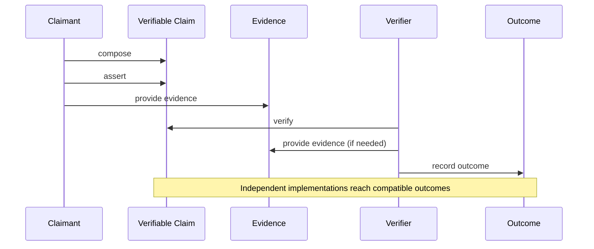

**Pyramid level:** architecture · **Status:** draft · **Version:** 0.1.0

**Constitutional basis:** [DOMAIN_MODEL.md](DOMAIN_MODEL.md) (protocol, domain, truth and trust), [IDENTITY_MODEL.md](IDENTITY_MODEL.md) (semantic identity)

**Related documents:** [DATA_MODEL.md](DATA_MODEL.md), [STATE_MODEL.md](STATE_MODEL.md), [CONFORMANCE_MODEL.md](../03-development/CONFORMANCE_MODEL.md)

---

# VerityPay Behavior Model

> *Identity is what the object is. State is where the object is. Behavior is what is allowed to happen.*

---

## Architecture layer

Part of the VerityPay [documentation pyramid](../README.md#documentation-pyramid).

```
Manifesto → Vision → Principles → Glossary
         ↓
    Architecture
         ↓
    Protocol + Domain  →  Identity  →  Behavior  →  Data Model  →  State Model
         ↓
    Specifications → Implementation
```

**Upstream:** [DOMAIN_MODEL.md](DOMAIN_MODEL.md), [IDENTITY_MODEL.md](IDENTITY_MODEL.md)

**Downstream:** [DATA_MODEL.md](DATA_MODEL.md), [STATE_MODEL.md](STATE_MODEL.md), conformance scenarios

---

## Summary

[IDENTITY_MODEL.md](IDENTITY_MODEL.md) answers: **What is this object?**

State models (forthcoming) answer: **Where is this object in its lifecycle?**

This document answers: **What is allowed to happen?**

VerityPay separates **nouns** (domain model), **identity** (referential stability), **verbs** (this document), **representation** (data model), and **lifecycle states** (state model). Behavior defines canonical protocol actions—who may do what, to which objects, under which invariants—before APIs, wire formats, databases, or state machines exist.

A conforming system MUST preserve behavioral invariants even when transport, storage, and UI differ.

---

## Purpose

[DOMAIN_MODEL.md](DOMAIN_MODEL.md) defines **what exists** and what counts as **protocol truth**.

[IDENTITY_MODEL.md](IDENTITY_MODEL.md) defines **what makes each object itself**.

The behavior model defines **canonical protocol verbs**, **interactions**, **behavioral invariants**, and **protocol events**—the shared choreography independent implementations must reproduce at the semantic level.

Without this layer, data models list fields without meaning, and state machines transition without knowing which actions are legitimate. With it, schemas and state tables become consequences of defined behavior—not inventors of it.

This document does not define APIs, wire formats, JSON schemas, smart contracts, databases, or user-interface workflows.

---

## Normative status

This document is **informative** until incorporated by an accepted RFC or marked `stable` through governance.

Terms and behavioral invariants here are **authoritative for authoring** state models, conformance scenarios, and `DATA_MODEL.md`. RFC 2119 keywords appear only in accepted specifications—not here.

---

## Design principles

### Verbs before endpoints

Behavior is defined as **protocol verbs** with actor, target, and meaning—not as REST paths, RPC names, or contract function selectors.

### Events are conceptual

**Protocol events** name things that *happened* in protocol terms (`ClaimAsserted`, `VerificationOutcomeRecorded`). They are not message-bus topics, webhook names, or blockchain log signatures unless an RFC maps them.

### Behavior respects identity

No verb may violate [IDENTITY_MODEL.md](IDENTITY_MODEL.md) invariants. Supersession changes authority; it does not rewrite identity. Re-verification creates a new verification record; it does not mutate a finalized one.

### Assertion is not verification

Presentation of a claim is a distinct behavior from evaluation of that claim. Collapsing them breaks the truth model ([DOMAIN_MODEL.md](DOMAIN_MODEL.md) Part I).

---

## Canonical protocol verbs

Each verb is defined by **actor role**, **target object**, **meaning**, and **what it does not mean**.

Roles follow [DOMAIN_MODEL.md](DOMAIN_MODEL.md): Claimant, Verifier, Relay, Observer, Integrator.

---

### compose

| Field | Definition |
|-------|------------|
| **Actor** | Claimant (or delegate within integrator boundaries) |
| **Target** | Verifiable claim (pre-assertion) |
| **Meaning** | Prepare claim content and subject binding before the claim enters the protocol as an asserted artifact |
| **Does not mean** | Assert; verify; imply truth; publish to other participants |

Composition is **local preparation**. A composed claim has no protocol presence until **assert**.

---

### assert

| Field | Definition |
|-------|------------|
| **Actor** | Claimant |
| **Target** | Verifiable claim |
| **Meaning** | Present a composed claim into the protocol—establishing semantic identity, provenance, and asserted content at a boundary |
| **Does not mean** | Verify; guarantee outcome; settle payment; authorize funds movement |

Assertion establishes **presence and provenance**, not validity ([DOMAIN_MODEL.md](DOMAIN_MODEL.md) truth model).

---

### reference

| Field | Definition |
|-------|------------|
| **Actor** | Claimant, Verifier, or Integrator (when embedding in claim content or evidence) |
| **Target** | Prior verifiable claim (by stable identity) |
| **Meaning** | Cite an existing claim as context—audit chain, dependency, supersession pointer, or evidence-by-reference |
| **Does not mean** | Supersede (unless reference is explicitly a supersession claim); mutate the referenced claim; re-verify automatically |

References MUST resolve to stable semantic identity ([IDENTITY_MODEL.md](IDENTITY_MODEL.md)).

---

### provide evidence

| Field | Definition |
|-------|------------|
| **Actor** | Claimant, Verifier, Integrator, or attesting participant as rules permit |
| **Target** | Evidence (related to a claim under verification) |
| **Meaning** | Make material available for verification rules to consume—proofs, prior claims, attestations, specified inputs |
| **Does not mean** | Verify; assert a new claim (unless evidence is itself a claim presented as evidence); guarantee authenticity without rule evaluation |

Evidence presentation is **input to verification**, not verification itself.

---

### verify

| Field | Definition |
|-------|------------|
| **Actor** | Verifier |
| **Target** | Verifiable claim (+ declared evidence + specification version) |
| **Meaning** | Evaluate the claim against accepted protocol rules at the stated specification version |
| **Does not mean** | Assert; relay; record outcome (until evaluation completes); determine worldly economic truth |

Verification is **rule evaluation in progress** or **completed evaluation** leading to an outcome—it is not assertion and not implicit approval.

---

### record outcome

| Field | Definition |
|-------|------------|
| **Actor** | Verifier |
| **Target** | Verification record |
| **Meaning** | Finalize an explicit verification outcome—satisfied, not satisfied, or indeterminate—together with evidence declaration and specification version binding |
| **Does not mean** | Change claim identity; overwrite a prior finalized record; emit outcome without evidence/version context |

Recording outcome **fixes** the verification record for audit ([IDENTITY_MODEL.md](IDENTITY_MODEL.md)).

---

<a id="bm-3-7"></a>

### supersede

| Field | Definition |
|-------|------------|
| **Actor** | Claimant (via a new claim that explicitly supersedes) |
| **Target** | Prior verifiable claim + new superseding claim |
| **Meaning** | Establish that a later claim replaces *semantic authority* of an earlier claim for defined purposes—without erasing the earlier claim's identity |
| **Does not mean** | Delete history; mutate the superseded claim; automatically satisfy verification on the new claim |

Supersession is **authority transfer**, not identity rewrite.

---

### retire

| Field | Definition |
|-------|------------|
| **Actor** | Claimant or governed rule (as specified in RFCs) |
| **Target** | Verifiable claim |
| **Meaning** | Mark a claim as inactive for new verification while preserving audit referential stability |
| **Does not mean** | Delete; destroy identity; invalidate prior verification records |

Retired claims remain **the same claim** in history.

---

### relay

| Field | Definition |
|-------|------------|
| **Actor** | Relay |
| **Target** | Verifiable claim, evidence, or verification-related messages (conceptual) |
| **Meaning** | Transport protocol artifacts between participants without altering semantic content |
| **Does not mean** | Assert; verify; modify claim content; substitute evidence; endorse truth |

Relays are **transparent carriers** (trust assumption T6 in [DOMAIN_MODEL.md](DOMAIN_MODEL.md)).

---

### observe

| Field | Definition |
|-------|------------|
| **Actor** | Observer |
| **Target** | Claims, evidence, verification records, outcomes (as visibility rules permit) |
| **Meaning** | Receive protocol information for audit, integration, or monitoring—without asserting, verifying, or altering artifacts |
| **Does not mean** | Consent to all data flows; verify on behalf of others; mutate or supersede |

Observation is **passive receipt** within defined visibility boundaries (privacy architecture forthcoming).

---

## Interaction model

The canonical protocol interaction chain:

```
Participant → Verifiable Claim → Evidence → Verification → Outcome → Interoperability
```

### Phase map

| Phase | Primary verbs | Primary roles | Produces |
|-------|---------------|---------------|----------|
| **Preparation** | compose | Claimant | Composed claim (local) |
| **Expression** | assert | Claimant | Asserted claim (protocol presence) |
| **Linkage** | reference | Claimant, Verifier, Integrator | Referential edges in claim graph |
| **Support** | provide evidence | Claimant, others | Evidence available to verification |
| **Evaluation** | verify → record outcome | Verifier | Verification record + outcome |
| **Governance of authority** | supersede, retire | Claimant | Updated authority or activity status |
| **Transport** | relay | Relay | Delivery without semantic change |
| **Audit / integration** | observe | Observer | Receipt for external systems |



**Interoperability** is not a separate verb—it is the **property** that independent implementations, given the same claim, evidence, and specification version, reach compatible outcomes after `record outcome` ([DOMAIN_MODEL.md](DOMAIN_MODEL.md) Capability IV).

Relays and observers may sit alongside any phase without changing semantic content.

---

## Behavioral invariants

These invariants MUST hold across all conforming behavior unless an accepted RFC explicitly amends them.

| ID | Invariant | Grounding |
|----|-----------|-----------|
| **B1** | **Assertion does not imply verification.** `assert` MUST NOT be treated as `record outcome` with satisfied result | Truth model; domain invariant 2 |
| **B2** | **Verification declares evidence.** `verify` / `record outcome` MUST declare evidence considered—or explicit absence causing indeterminate outcome | Domain invariant 4; trust T1 |
| **B3** | **Verification declares specification version.** No outcome is protocol-meaningful without version context | Domain invariant 5; truth model |
| **B4** | **Outcome must be explicit.** Results MUST be satisfied, not satisfied, or indeterminate—not inferred from transport success or storage writes | Truth model; Capability II |
| **B5** | **Supersession does not rewrite prior identity.** `supersede` MUST NOT mutate the superseded claim's semantic identity | Identity model; B5 cross-cutting |
| **B6** | **Relay must not alter semantic content.** `relay` MUST preserve claim and evidence meaning | Trust T6 |
| **B7** | **Finalized verification records are immutable.** `record outcome` MUST NOT update a finalized record in place | Identity model — Verification Record |
| **B8** | **Re-verification is new behavior.** Running `verify` again after finalization produces a **new** verification record, not an overwrite | Identity model |
| **B9** | **Role attribution.** Every `assert`, `verify`, and `record outcome` MUST be attributable to a participant in the appropriate role | Domain invariant 6 |
| **B10** | **Compatible outcomes.** Two conforming implementations with identical inputs MUST reach the same outcome at `record outcome` | Domain invariant 7; interoperability |

---

<a id="bm-5-1"></a>

## Protocol events

Protocol events name **conceptual occurrences** in the lifecycle. They support state models, sequence diagrams, and conformance scenarios—they are not implementation event types.

| Event | Verb(s) | Meaning |
|-------|---------|---------|
| **ClaimComposed** | compose | Claim prepared locally; not yet protocol-present |
| **ClaimAsserted** | assert | Claim entered protocol with fixed semantic identity |
| **EvidenceProvided** | provide evidence | Material made available for verification |
| **VerificationStarted** | verify | Evaluation begun against rules and declared context |
| **VerificationOutcomeRecorded** | record outcome | Outcome finalized on a verification record |
| **ClaimReferenced** | reference | Prior claim cited without identity change |
| **ClaimSuperseded** | supersede | Later claim assumed authority over earlier for defined scope |
| **ClaimRetired** | retire | Claim marked inactive for new verification |

### Event properties (conceptual)

- Events are ** attributable** to participant roles where applicable.
- Events **reference** stable object identities ([IDENTITY_MODEL.md](IDENTITY_MODEL.md)).
- Events **do not** imply implementation delivery guarantees (at-least-once, exactly-once)—those belong in transport and conformance layers.
- **Relay** and **observe** may generate ancillary events in RFCs (e.g., `ClaimRelayed`, `OutcomeObserved`); they are not core v1 events until specified.

---

## Idempotency and replay expectations

Behavior distinguishes **safe repetition** from **behaviors that create new semantic identity**.

| Behavior | Repeat safely? | Notes |
|----------|----------------|-------|
| **compose** | Yes (local) | Each distinct assertion intent may produce a distinct claim; repeating compose before assert is implementation-local |
| **assert** | No | Each `assert` establishes a **new** claim identity—even if content is identical (see [IDENTITY_MODEL.md](IDENTITY_MODEL.md) open questions) |
| **reference** | Yes | Idempotent citation of the same prior claim |
| **provide evidence** | Conditional | Same evidence artifact may be provided once or re-presented; verification MUST declare what was considered |
| **verify** | Conditional | Re-running on unchanged inputs SHOULD yield the same outcome; **new** verification record if prior record was finalized |
| **record outcome** | No (after finalize) | Finalizing twice for the same evaluation context MUST NOT overwrite; second finalize is either error or new record per RFC |
| **supersede** | No | Each supersession claim is a new assertion with new identity |
| **retire** | Conditional | Retiring an already-retired claim SHOULD be no-op at semantic level |
| **relay** | Yes | Delivery may repeat; semantic content MUST remain unchanged |
| **observe** | Yes | Observation does not mutate protocol artifacts |

**Replay** in audit means: given stored claim, evidence, and version, conforming re-evaluation reaches the same outcome—not that all verbs can be re-executed without consequence.

---

## Behavior vs state

| Layer | Question | Defined in |
|-------|----------|------------|
| **Behavior** | What actions are allowed? What do they mean? | This document |
| **State** | Which lifecycle phase is an object in? | State models (forthcoming) |

Behavior **produces or observes** transitions; state models **name and constrain** those phases formally.

Example mapping (informative):

| Event | Likely state transition |
|-------|-------------------------|
| ClaimComposed | → Composed |
| ClaimAsserted | Composed → Asserted |
| VerificationStarted | Asserted → Under verification |
| VerificationOutcomeRecorded | Under verification → Outcome known |
| ClaimReferenced | Outcome known → Referenced (or parallel) |
| ClaimSuperseded | → Superseded (authority) |
| ClaimRetired | → Retired |

State models MUST NOT introduce transitions that violate behavioral invariants (e.g., a transition that implies verification from assertion alone).

---

## Relationship to downstream documents

| Document | This model provides |
|----------|---------------------|
| **State models** | Allowed transitions triggered by protocol events |
| **`DATA_MODEL.md`** | Representations of verbs and events—not definitions of them |
| **Conformance model** | Scenarios exercising verbs and invariants |
| **Sequence diagrams** | Visual binding to interaction model |
| **RFCs** | Normative MUST/SHOULD for payment-domain and core behavior |
| **[`02-product/`](../02-product/)** | Workflows mapped to verbs—not new verbs without RFC |

**Authoring order:** Protocol + domain → identity → **behavior (this document)** → data model → state model → conformance → RFCs.

---

## Out of scope

This document explicitly excludes:

| Excluded | Belongs in |
|----------|------------|
| HTTP/gRPC/WebSocket APIs | RFCs, implementation guides |
| Wire formats, JSON schemas, protobuf | `DATA_MODEL.md`, RFCs |
| Database tables, ORM mappings, indexes | Implementation |
| Smart contract function signatures | Application or domain RFCs |
| UI workflows, screens, user consent flows | [`02-product/`](../02-product/) |
| Legal acceptance, regulatory filing, compliance sign-off | Outside protocol |
| Message delivery guarantees (at-least-once, ordering) | Transport + conformance architecture |
| Cryptographic algorithm choices | Security architecture, RFCs |

---

## Open questions

- [ ] **Challenge / dispute** — core protocol verb or payment-domain extension?
- [ ] **Attest** — separate verb from `provide evidence`, or a specialization with attestation semantics?
- [ ] **Relay events** — should `ClaimRelayed` (or equivalent) be conformance-tested, or treated as transport-only?
- [ ] **Payment-domain workflows** — how instruction, status, and attestation claim types map to verb sequences (RFC track)
- [ ] **Integrator boundaries** — which verbs may integrators perform on behalf of claimants without new role types?
- [ ] **Partial verification** — can `verify` produce partial outcomes before `record outcome`, or is that state-only?
- [ ] **Observer visibility** — which events are observable by default vs policy-gated?

---

## Changelog

| Version | Date | Summary |
|---------|------|---------|
| 0.1.0 | 2026-06-29 | Initial behavior model; canonical verbs, events, invariants |
