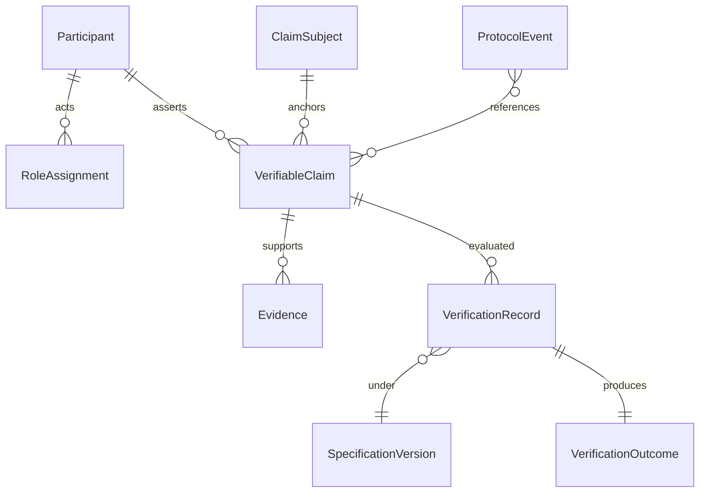

**Pyramid level:** architecture · **Status:** draft · **Version:** 0.2.0 · **Specification maturity:** L2 — Representation

**Constitutional basis:** [DOMAIN_MODEL.md](DOMAIN_MODEL.md), [IDENTITY_MODEL.md](IDENTITY_MODEL.md), [BEHAVIOR_MODEL.md](BEHAVIOR_MODEL.md)

**Related documents:** [CONFORMANCE_MODEL.md](../03-development/CONFORMANCE_MODEL.md), state models (forthcoming), [`../../rfcs/0001-minimal-claim-evidence-semantics.md`](../../rfcs/0001-minimal-claim-evidence-semantics.md) (**VP-RFC-0001**, accepted), [`../../rfcs/0003-multiple-evidence.md`](../../rfcs/0003-multiple-evidence.md) (**VP-RFC-0003**, accepted), [`../../rfcs/0004-evidence-evaluation-policies.md`](../../rfcs/0004-evidence-evaluation-policies.md) (**VP-RFC-0004**, accepted), [`../../rfcs/0005-assertion-types.md`](../../rfcs/0005-assertion-types.md) (**VP-RFC-0005**, draft), [`../../rfcs/0006-assertion-evaluation-dispatch.md`](../../rfcs/0006-assertion-evaluation-dispatch.md) (**VP-RFC-0006**, draft)

---

# VerityPay Data Model

> *Semantics first. Fields last. Representation must not invent protocol meaning.*

---

## Architecture layer

Part of the VerityPay [documentation pyramid](../README.md#documentation-pyramid).

```
Manifesto → Vision → Principles → Glossary
         ↓
    Architecture
         ↓
    Protocol + Domain  →  Identity  →  Behavior  →  Data Model  →  State Model
         ↓
    Specifications → Implementation
```

**Upstream:** [DOMAIN_MODEL.md](DOMAIN_MODEL.md), [IDENTITY_MODEL.md](IDENTITY_MODEL.md), [BEHAVIOR_MODEL.md](BEHAVIOR_MODEL.md)

**Downstream:** [STATE_MODEL.md](STATE_MODEL.md), conformance scenarios, RFC encodings

---

## Summary

[DOMAIN_MODEL.md](DOMAIN_MODEL.md) answers: **What nouns exist?**

[IDENTITY_MODEL.md](IDENTITY_MODEL.md) answers: **What makes each object itself?**

[BEHAVIOR_MODEL.md](BEHAVIOR_MODEL.md) answers: **What is allowed to happen?**

This document answers: **How are protocol concepts represented?**

The data model defines **canonical entities**, **semantic contracts**, **identifiers**, **attributes**, **relationships**, and **representation guarantees**—the declarative shape independent implementations must be able to exchange and persist without agreeing on databases, APIs, or serialization formats yet.

Representation follows meaning. It does not create it.

---

## Specification maturity

VerityPay specifications progress through maturity **levels**, not merely document counts. This helps contributors and reviewers understand *how binding* a layer is—not just where a file lives.

| Level | Name | Meaning | Examples |
|-------|------|---------|----------|
| **L0** | Concept | High-level idea and rationale | Vision, manifesto, research |
| **L1** | Semantic | Concepts, identity, behavior | Domain, identity, behavior models |
| **L2** | Representation | Entities, attributes, guarantees | **This document**, state model (forthcoming) |
| **L3** | Conformance | Testable interoperability requirements | Conformance model, test scenarios |
| **L4** | Reference | SDKs, examples, reference interpreter | Implementation repositories |

**This document is L2.** It is authoritative for entity shape and guarantees; executable verification envelopes for the first protocol slice are normatively defined in [VP-RFC-0001](../../rfcs/0001-minimal-claim-evidence-semantics.md) (accepted). Wire-format MUST/SHOULD for broader entities remains in RFCs (L3+).

---

## Verification envelope model (VP-RFC-0001)

[VP-RFC-0001](../../rfcs/0001-minimal-claim-evidence-semantics.md) defines the first **executable verification profile**—minimal envelopes and **VP-RULE-0001** that reference and conformance implementations exercise today. This section aligns architecture vocabulary with that RFC and with [`vp-reference-model`](https://github.com/VerityPay-Inc/veritypay-reference) field names. It does **not** replace full **Verifiable Claim** or **Evidence** lifecycle semantics in the canonical entities below.

### Composition

```text
Claim
 ├── id (ClaimId)
 ├── subject
 ├── assertion → Assertion
 │                 ├── assertion_type
 │                 └── body
 ├── specification_binding (optional in reference model; specification_version in RFC fixtures)
 └── metadata

Evidence
 ├── id (EvidenceId)
 ├── claim_id (ClaimId)
 ├── content → EvidenceContent
 │               ├── content_type
 │               └── body
 └── metadata
```

**Claims contain Assertions.** A claim envelope binds identity, subject, and specification context around structured assertion content—it is not itself the assertion.

**Evidence contains EvidenceContent.** An evidence envelope binds identity and claim linkage around evaluable payload—the envelope is not the content body.

**Verification evaluates Assertions using EvidenceContent.** Under **VP-RULE-0001**, the reference interpreter compares `claim.assertion.body` to `evidence.content.body`. Rules operate on assertion and content semantics; envelope identifiers (`ClaimId`, `EvidenceId`) establish linkage and audit context but are not substituted for the compared bodies.

The interpreter evaluates the **assertion**—not the envelope alone. Missing, mismatched, or empty content under the rule's preconditions yields `indeterminate` or `not_satisfied` per [VP-RFC-0001](../../rfcs/0001-minimal-claim-evidence-semantics.md); satisfied comparison requires matching bodies when linkage and type preconditions hold.

### Field alignment

| Concept | Architecture role | VP-RFC-0001 / reference model fields |
|---------|-------------------|--------------------------------------|
| **Claim** | Assertion envelope | `ClaimId` (`id`), `subject`, nested **Assertion**, optional **Metadata**, specification pin |
| **Assertion** | Structured claim content under verification | `assertion_type`, `body` |
| **Evidence** | Linked evidence envelope | `EvidenceId` (`id`), `ClaimId` (`claim_id`), nested **EvidenceContent**, optional **Metadata** |
| **EvidenceContent** | Verifiable payload consumed by rules | `content_type`, `body` |

### Assertion Type (VP-RFC-0005)

[VP-RFC-0005](../../rfcs/0005-assertion-types.md) (draft) introduces **Assertion Type** — the protocol identifier that describes how an **Assertion** is interpreted.

```text
Claim
 └── Assertion
      ├── assertion_type  → Assertion Type
      └── body            → protocol data (interpreted per type)
```

| Property | Detail |
|----------|--------|
| **Assertion Type** | Names semantic interpretation — not evaluation procedure |
| **`body`** | Opaque protocol data whose meaning is defined by the declared type and applicable rules |
| **Initial type** | **`body_equality`** — body comparison via **VP-RULE-0001** when preconditions hold |
| **Evaluation** | Out of scope here — defined by rule RFCs (for example **VP-RFC-0001**, **VP-RFC-0002**) and **Evaluation Policy** in **VP-RFC-0004** |

Every **Assertion** **MUST** declare exactly one **Assertion Type** via `assertion_type`. This subsection defines taxonomy only; evaluator selection is defined in [VP-RFC-0006](../../rfcs/0006-assertion-evaluation-dispatch.md) (draft).

### Assertion Evaluator and Evaluation Dispatch (VP-RFC-0006)

[VP-RFC-0006](../../rfcs/0006-assertion-evaluation-dispatch.md) (draft) introduces **Assertion Evaluator** and **Evaluation Dispatch** — the deterministic protocol process that selects exactly one evaluator from **Assertion Type** before type-specific protocol rules execute.

```text
Assertion
      ↓
Assertion Type
      ↓
Assertion Evaluator
      ↓
Evidence Set
      ↓
Evaluation Policy
      ↓
Verification Result
```

| Property | Detail |
|----------|--------|
| **Evaluation Dispatch** | Deterministic, protocol-defined selection based solely on `assertion_type` |
| **Assertion Evaluator** | Names semantic evaluation for one **Assertion Type** — not an implementation class |
| **Initial mapping** | **`body_equality`** → **Body Equality Evaluator** → **VP-RULE-0001** |
| **Unknown types** | `indeterminate` without executing type-specific rules |
| **Scope** | Dispatch is protocol behavior; reference interpreter wiring is out of scope here |

Dispatch **MUST NOT** inspect **Evidence** content or assertion `body`. **Evaluation Policy** aggregation remains defined in **VP-RFC-0004**.

RFC fixture field names (`claim_id`, `evidence_id`, `specification_version`) map to the reference model identifiers above when loaded by `veritypay-conformance`.

Full **Verifiable Claim** and **Evidence** entities in this document retain richer lifecycle, attribution, and domain fields. Implementations claiming **VP-RFC-0001** conformance **MUST** satisfy the minimal profile in the RFC; they **MAY** carry additional metadata without altering **VP-RULE-0001** comparison semantics unless a future RFC says otherwise.

### Evidence Set (VP-RFC-0003)

[VP-RFC-0003](../../rfcs/0003-multiple-evidence.md) (accepted) introduces **Evidence Set** — the **unordered** collection of **Evidence** associated with one **Claim** during evaluation. A claim **MAY** reference zero or more evidence envelopes; each envelope retains the shape defined above and in **VP-RFC-0001**.

This subsection describes **Evidence Set** input composition only. It does **not** define **Evaluation Policy** or aggregated verification outcomes — see [VP-RFC-0004](../../rfcs/0004-evidence-evaluation-policies.md) (accepted).

```text
Claim
 └── Assertion
      └── (evaluated using)
           Evidence Set
            ├── Evidence
            │    └── EvidenceContent
            ├── Evidence
            │    └── EvidenceContent
            └── …
```

| Property | Statement |
|----------|-----------|
| **Ordering** | Evidence ordering **MUST NOT** affect protocol meaning |
| **Independence** | Each **Evidence** **MUST** be treated as an independent envelope with its own `evidence_id` and **EvidenceContent** |
| **Binding** | Each **Evidence** binds to the claim independently per [VP-RFC-0002](../../rfcs/0002-claim-identity-binding.md) when binding rules are in scope |
| **Aggregation** | Out of scope here — see **Evaluation Policy** in [VP-RFC-0004](../../rfcs/0004-evidence-evaluation-policies.md) (accepted) |

Existing single-evidence diagrams and reference model types are unchanged. Multi-evidence support **extends** evaluation inputs without replacing the **Evidence** or **EvidenceContent** envelope definitions.

### Evaluation Policy (VP-RFC-0004)

[VP-RFC-0004](../../rfcs/0004-evidence-evaluation-policies.md) (accepted) defines **Evaluation Policy** — the protocol-defined strategy for deriving one **verification outcome** from an **Evidence Set** ([VP-RFC-0003](../../rfcs/0003-multiple-evidence.md)) and per-envelope rule results.

This subsection describes **protocol composition only**. It does **not** specify reference interpreter implementation.

```text
Claim
 └── Evidence Set
      └── Evaluation Policy
           └── Verification Result
                ├── outcome (satisfied | not_satisfied | indeterminate)
                ├── evaluated claim reference
                └── specification binding / trace (as applicable)
```

| Property | Statement |
|----------|-----------|
| **Initial policy** | **`ALL_REQUIRED`** — every applicable evidence envelope must be `satisfied` for aggregate `satisfied`; see **VP-RFC-0004** |
| **Determinism** | Policies **MUST** be deterministic; evidence ordering **MUST NOT** affect the aggregated outcome |
| **Outcomes** | Aggregated results use existing verification outcome vocabulary only — no new outcome labels |
| **Scope** | Policies aggregate logical rule outcomes only — no trust, weighting, or signatures |

Single-evidence evaluation **MAY** treat **`ALL_REQUIRED`** as the implicit default when one envelope is present, preserving **VP-CS-0001** semantics.

---

## Purpose

Upstream architecture documents establish protocol law: domain language, semantic identity, and behavior.

The data model **translates** those concepts into structured representation:

- Which **entities** exist as first-class data
- What **semantic contract** each entity fulfills
- Which **attributes** are required for interoperability
- How **identifiers** bind to semantic identity without replacing it
- Which **relationships** MUST be expressible between entities
- Which **representation guarantees** conforming implementations MUST uphold

This document does **not** define:

- Behavior (verbs, event semantics) → [BEHAVIOR_MODEL.md](BEHAVIOR_MODEL.md)
- Lifecycle state machines → state models (forthcoming)
- HTTP/gRPC APIs, message buses, or endpoints
- Database schemas, ORMs, indexes, or storage engines
- Smart contract interfaces, UI forms, or legal/compliance field sets

RFCs MAY normatively bind wire formats and encodings to these entities. JSON fragments in the appendix are **illustrative and non-normative**.

---

## Normative status

This document is **informative** until incorporated by an accepted RFC or marked `stable` through governance.

Entity definitions and representation guarantees here are **authoritative for authoring** state models, conformance scenarios, and RFC schemas. RFC 2119 keywords appear only in accepted specifications—not here.

---

<a id="dat-3-1"></a>

## Data modeling principles

| Principle | Meaning |
|-----------|---------|
| **Semantics before fields** | Every attribute exists because upstream architecture requires it—not because a database column was convenient |
| **Identity before identifiers** | Semantic identity is defined in [IDENTITY_MODEL.md](IDENTITY_MODEL.md); this document assigns storage handles |
| **Semantic contract before attributes** | The ontology of an entity is stated before its fields |
| **Guarantees before schema** | Representation guarantees are stated explicitly; schemas MUST NOT violate them |
| **Representation must not create behavior** | Adding a field MUST NOT imply verification, settlement, or authorization unless behavior and RFCs define it |
| **Storage identity must not override semantic identity** | UUIDs, CIDs, and URIs locate artifacts; they do not redefine what the artifact *is* |

### Layer separation

```
Concept (domain)  →  Identity  →  Behavior  →  Representation (this document)  →  State
     nouns              who           verbs              fields                      phases
```

### Entity template

Every canonical entity in this document follows the same structure:

```
Stability Classification
Purpose
Semantic Contract
Ownership
Mutability
Canonical Lifecycle
Dependencies
Required / Optional Attributes
Relationships
Representation Guarantees
Extension Points
Example (human)
Explicit Non-Fields
Conformance Notes
```

---

## Stability classification

Entities are classified by how they evolve as the protocol extends:

| Classification | Meaning |
|----------------|---------|
| **Core** | Required for all domains; stable semantic contract |
| **Payment Domain** | v1 domain specialization; extends core without redefining it |
| **Future Domain** | Reserved pattern (e.g., grant claims); not defined in v1 |

| Entity | Classification |
|--------|----------------|
| Participant | Core |
| Role Assignment | Core |
| Verifiable Claim | Core |
| Payment Claim | Payment Domain |
| Claim Subject | Core |
| Evidence | Core |
| Verification Record | Core |
| Verification Outcome | Core |
| Specification Version | Core |
| Protocol Event | Core |

Future domain entities (e.g., **Grant Claim**) MUST extend **Verifiable Claim** under the same core contract unless an RFC amends the core.

---

<a id="dat-4-1"></a>

## Canonical entities

Entities are **protocol-level data artifacts**, not tables or API resources.

---

### Participant

**Stability:** Core

#### Purpose

Represent an entity that acts in the protocol ([DOMAIN_MODEL.md](DOMAIN_MODEL.md)).

#### Semantic Contract

A **Participant** represents a protocol-scoped actor whose identity persists across claims, verifications, and traces.

It exists independently of:

- organization charts
- databases
- authentication systems
- implementation deployments

Every conforming implementation MUST preserve this meaning, regardless of representation.

#### Ownership

| Owner | Meaning |
|-------|---------|
| **The participant itself** (protocol-scoped) | Owns its protocol identity and role attributions in traces |
| **Not owned by** | Verifiers, relays, or integrators—those reference participants; they do not possess participant identity |

#### Mutability

| Category | Fields / aspects |
|----------|------------------|
| **Immutable after establishment** | `participant_id`, core `identity_binding` |
| **Mutable** | `display_label`, `external_refs` (non-normative integration metadata) |
| **Changed through** | New participant identity (not in-place rewrite of historical traces) |

#### Canonical Lifecycle

```
Introduced → Active in traces → Referenced historically → (Deactivated — state model)
```

Participants do not follow claim lifecycle; they **persist** as actors referenced by claims and verification records.

#### Dependencies

| Depends on | Independent from |
|------------|------------------|
| *(none — foundational entity)* | Payment domain, claim types, verification outcomes |

#### Required attributes

| Attribute | Meaning |
|-----------|---------|
| `participant_id` | Storage identity for this participant within a protocol context |
| `identity_binding` | How this participant is recognized (RFC-defined structure) |

#### Optional attributes

| Attribute | Meaning |
|-----------|---------|
| `display_label` | Human-readable label; non-normative for verification |
| `external_refs` | Out-of-protocol identifiers (org ID, LEI, etc.) |

#### Relationships

| Related entity | Cardinality | Relationship |
|----------------|-------------|--------------|
| Role Assignment | 1..* | Participant acts through roles |
| Verifiable Claim | 0..* | As claimant on assertion |
| Verification Record | 0..* | As verifier on evaluation |
| Protocol Event | 0..* | As attributed actor |

#### Representation Guarantees

A conforming implementation guarantees that:

- `participant_id` never changes for the same protocol-scoped participant
- external refs never substitute for `participant_id` in normative traces without RFC-defined mapping
- historical traces always resolve the same participant identity

#### Extension Points

Future RFCs may define:

- additional `identity_binding` mechanisms (key-based, registry, federated)
- domain-specific external reference schemas
- delegation metadata without new participant identity

…without changing the semantic contract.

#### Example

**Acme Payroll** registers as a participant and receives `participant_id = ptc_acme`.

When Acme asserts a payment claim, every trace attributes assertion to `ptc_acme` as claimant—whether Acme runs its own software or uses an integrator. Years later, auditors resolving `ptc_acme` on old claims reach the same protocol actor.

#### Explicit non-fields

- Organization hierarchy, HR records, KYC status
- Authentication credentials (security architecture)
- Wallet balances or ledger accounts

#### Conformance Notes

Independent implementations are expected to agree on:

- semantic identity of participants across traces
- required attributes for attribution

Independent implementations may differ on:

- how `identity_binding` is stored or verified cryptographically
- serialization and database layout

---

### Role Assignment

**Stability:** Core

#### Purpose

Bind a **participant** to a **role** for a specific protocol action or trace segment.

#### Semantic Contract

A **Role Assignment** represents an explicit binding: *this participant acted in this role in this context*.

It exists independently of:

- product personas (payer, payee, merchant)
- RBAC policy engines
- UI session state

Every conforming implementation MUST preserve this meaning, regardless of representation.

#### Ownership

| Owner | Meaning |
|-------|---------|
| **The trace context** (claim, verification, or relay segment) | Owns the assignment record as part of protocol audit |
| **Attributed participant** | Owns the act attributed—not the assignment object itself |

#### Mutability

| Category | Fields / aspects |
|----------|------------------|
| **Immutable after recording** | `participant_id`, `role`, `context_ref` |
| **Mutable** | None for a fixed assignment |
| **Changed through** | New assignment record for new actions—not in-place edit |

#### Canonical Lifecycle

```
Created at action boundary → Referenced in audit → Archived with trace
```

#### Dependencies

| Depends on | Independent from |
|------------|------------------|
| Participant | Payment domain fields |
| Context entity (claim or verification) | Verification outcome value |

#### Required attributes

| Attribute | Meaning |
|-----------|---------|
| `participant_id` | Who acts |
| `role` | `claimant`, `verifier`, `relay`, `observer`, or `integrator` |
| `context_ref` | Claim, verification, or trace this assignment applies to |

#### Optional attributes

| Attribute | Meaning |
|-----------|---------|
| `delegated_from` | Participant ID if acting on behalf of another |
| `effective_from` | Temporal or sequence bound (representation hint) |

#### Relationships

| Related entity | Cardinality | Relationship |
|----------------|-------------|--------------|
| Participant | 1 | Assignee |
| Verifiable Claim / Verification Record | 1 | Context |

#### Representation Guarantees

A conforming implementation guarantees that:

- assertion and verification records include or reference role assignment for the acting participant
- role is never inferred from `participant_id` alone

#### Extension Points

Future RFCs may define:

- additional roles
- structured delegation chains
- multi-role concurrent assignments in one trace

…without changing the semantic contract.

#### Example

**Bob** (`ptc_bob`) evaluates a claim as verifier. The verification record carries `verifier_ref: { participant_id: ptc_bob, role: verifier }`. No consumer infers "verifier" from Bob's participant record alone—the role is explicit in the trace.

#### Explicit non-fields

- Product personas → [`02-product/`](../02-product/)
- Permission matrices

#### Conformance Notes

Independent implementations are expected to agree on:

- role attribution on assert and verify
- required binding fields

Independent implementations may differ on:

- whether assignment is embedded or normalized in storage

---

### Verifiable Claim

**Stability:** Core

#### Purpose

Represent the central protocol artifact: a structured statement about a subject, evaluable through verification.

#### Semantic Contract

A **Verifiable Claim** represents a **stable assertion** whose meaning does not change after assertion.

It exists independently of:

- databases
- transports
- ledgers
- implementations

Every conforming implementation MUST preserve this meaning, regardless of representation.

#### Ownership

| Owner | Meaning |
|-------|---------|
| **Claimant** | Owns the act of assertion and provenance |
| **Not owned by** | Verifiers (they evaluate); relays (they transport copies) |

#### Mutability

| Category | Fields / aspects |
|----------|------------------|
| **Immutable after assertion** | `claim_id`, `content`, `subject_ref`, `claimant_ref`, `asserted_at`, `spec_version_ref` |
| **Mutable** | None in place |
| **Superseded through** | `ClaimSuperseded` — new claim with `supersedes_ref`; prior claim identity preserved |
| **Retired through** | `ClaimRetired` — activity flag; identity unchanged |

#### Canonical Lifecycle

```
Created (composed locally)
    ↓
Asserted
    ↓
Referenced
    ↓
Verified (via Verification Record — claim itself unchanged)
    ↓
Superseded (optional)
    ↓
Retired (optional)
```

Lifecycle describes **protocol participation**, not database update patterns.

#### Dependencies

| Depends on | Independent from |
|------------|------------------|
| Claim Subject | Verification outcome |
| Participant (claimant) | Payment domain (core claim has no payment fields) |
| Specification Version (authored against) | Specific transport or ledger |

#### Required attributes

| Attribute | Meaning |
|-----------|---------|
| `claim_id` | Storage identity; unique per assertion |
| `claim_type` | Governed type identifier |
| `subject_ref` | Reference to Claim Subject |
| `content` | Semantic payload |
| `asserted_at` | Assertion boundary marker |
| `claimant_ref` | Claimant role assignment or participant reference |
| `spec_version_ref` | Specification version claim was authored against |

#### Optional attributes

| Attribute | Meaning |
|-----------|---------|
| `prior_claim_refs` | Audit chain / dependency references |
| `supersedes_ref` | Prior claim this assertion supersedes |
| `content_commitment` | Content-addressed digest |

#### Relationships

| Related entity | Cardinality | Relationship |
|----------------|-------------|--------------|
| Claim Subject | 1 | Subject anchor |
| Participant | 1 | Claimant |
| Evidence | 0..* | Supporting material |
| Verification Record | 0..* | Evaluations |
| Verifiable Claim | 0..* | Prior / superseding |
| Protocol Event | 1..* | At minimum ClaimAsserted |

#### Representation Guarantees

A conforming implementation guarantees that:

- claim identity never changes after assertion
- assertion content never mutates in place
- assertion never embeds verification outcome
- duplicate content does not silently merge into one identity without RFC rules

#### Extension Points

Future RFCs may define:

- additional claim types
- additional metadata blocks
- domain-specific `content` schemas

…without changing the semantic contract.

#### Example

**Alice** submits a claim stating that payroll for June has been scheduled. The claim receives `claim_id = clm_june_payroll`.

Later, **Bob** verifies the claim using evidence X and Y. The verification record references `clm_june_payroll` without modifying its content. Alice's assertion and Bob's outcome remain separate artifacts.

#### Explicit non-fields

- `verified: true` as implicit default
- Ledger transaction ID as `claim_id`
- Lifecycle state enum (→ state models)

#### Conformance Notes

Independent implementations are expected to agree on:

- semantic identity and immutability after assertion
- required attributes and reference resolution

Independent implementations may differ on:

- serialization format
- storage engine
- transport encoding

---

### Payment Claim

**Stability:** Payment Domain

#### Purpose

Represent a verifiable claim whose subject matter is in the **payment domain**.

#### Semantic Contract

A **Payment Claim** represents a **verifiable claim about payment subject matter**—value movement, instruction, obligation, or related outcome.

It inherits the Verifiable Claim contract in full. Payment worldly events and payment claims remain **distinct identities**.

It exists independently of:

- bank ledgers
- settlement networks
- blockchain transaction hashes as claim identity

Every conforming implementation MUST preserve this meaning, regardless of representation.

#### Ownership

| Owner | Meaning |
|-------|---------|
| **Claimant** | Owns assertion (same as Verifiable Claim) |
| **Not owned by** | Payee, bank, or network—those may appear in descriptors, not as claim owners |

#### Mutability

Same as **Verifiable Claim**, plus:

| Category | Fields / aspects |
|----------|------------------|
| **Immutable after assertion** | `payment_claim_type`, `payment_context` |
| **Mutable** | None in place |
| **Superseded / retired through** | Same verbs as core claim |

#### Canonical Lifecycle

Same as **Verifiable Claim** — payment domain does not alter core participation pattern.

#### Dependencies

| Depends on | Independent from |
|------------|------------------|
| Verifiable Claim (core contract) | Grant domain, procurement domain |
| Claim Subject | Specific bank API |

#### Required attributes

All **Verifiable Claim** required attributes, plus:

| Attribute | Meaning |
|-----------|---------|
| `payment_claim_type` | Domain taxonomy identifier (RFC-defined) |
| `payment_context` | Domain-specific structured context |

#### Optional attributes

| Attribute | Meaning |
|-----------|---------|
| `payment_event_ref` | External worldly payment reference—not claim identity |

#### Relationships

Same as Verifiable Claim. `payment_event_ref` MAY point outside protocol entities.

#### Representation Guarantees

A conforming implementation guarantees that:

- all Verifiable Claim guarantees apply
- `payment_event_ref` never equals `claim_id`
- multiple payment claims may reference the same worldly event with distinct `claim_id` values

#### Extension Points

Future RFCs may define:

- `payment_claim_type` taxonomy (instruction, attestation, status, …)
- `payment_context` field schemas
- domain-specific evidence bindings

…without changing the core Verifiable Claim contract.

#### Example

**Alice** (employer integrator) asserts a payment claim: "Disbursement of $1,000 USD for June payroll instructed." The claim gets `claim_id = clm_disb_001` and optionally `payment_event_ref = bank-batch-8842` pointing to a bank batch—not replacing the claim's identity.

#### Explicit non-fields

- Settlement confirmation as substitute for Verification Outcome
- FX rates, fee schedules

#### Conformance Notes

Independent implementations are expected to agree on:

- payment claim as specialization of verifiable claim
- separation of claim identity and payment event reference

Independent implementations may differ on:

- how `payment_context` is encoded

---

### Claim Subject

**Stability:** Core

#### Purpose

Anchor what a claim is *about*—enabling relation and conflict resolution across claims.

#### Semantic Contract

A **Claim Subject** represents the **stable anchor of meaning** for what claims discuss—distinct from any single claim's identity.

It exists independently of:

- any one assertion
- full subject payload visibility (privacy may use commitments)

Every conforming implementation MUST preserve this meaning, regardless of representation.

#### Ownership

| Owner | Meaning |
|-------|---------|
| **Protocol reference** | Subject is a shared anchor, not owned by a single claimant |
| **Claimants** | Own their claims *about* the subject—not the subject itself |

#### Mutability

| Category | Fields / aspects |
|----------|------------------|
| **Immutable after establishment** | `subject_id`, core `subject_kind` and binding descriptor |
| **Mutable** | None in place for established subjects |
| **Changed through** | Explicit merge/split → new `subject_id` or governed mapping |

#### Canonical Lifecycle

```
Defined → Referenced by claims → Referenced in verification → Archived in audit
```

#### Dependencies

| Depends on | Independent from |
|------------|------------------|
| *(minimal — anchor entity)* | Individual claims, verification outcomes |

#### Required attributes

| Attribute | Meaning |
|-----------|---------|
| `subject_id` | Storage identity for the subject anchor |
| `subject_kind` | Governed classifier |
| `subject_descriptor` | Minimal structured description for cross-participant relation |

#### Optional attributes

| Attribute | Meaning |
|-----------|---------|
| `external_subject_refs` | Out-of-protocol anchors |

#### Relationships

| Related entity | Cardinality | Relationship |
|----------------|-------------|--------------|
| Verifiable Claim | 0..* | Claims about this subject |

#### Representation Guarantees

A conforming implementation guarantees that:

- `subject_id` is stable for the same subject across intended references
- subject merge/split is never silent

#### Extension Points

Future RFCs may define:

- `subject_kind` taxonomy
- commitment-only subject descriptors for privacy

…without changing the semantic contract.

#### Example

Two claims from different employers reference `subject_id = sub_contractor_alex_june`—the June payroll obligation for contractor Alex. Verifiers relate both claims to the same subject without merging claim identities.

#### Explicit non-fields

- Full PII where privacy requires commitment-only forms
- Legal ownership graphs

#### Conformance Notes

Independent implementations are expected to agree on:

- subject reference resolution
- required descriptor fields for relation

Independent implementations may differ on:

- subject registry implementation

---

### Evidence

**Stability:** Core

#### Purpose

Represent material verification rules may consume.

#### Semantic Contract

An **Evidence** artifact represents **evaluable material** presented for verification—proofs, prior claims, attestations, or specified inputs.

It exists independently of:

- file storage paths
- transport URLs
- verification outcome

Every conforming implementation MUST preserve this meaning, regardless of representation.

#### Ownership

| Owner | Meaning |
|-------|---------|
| **Presenter** (`presented_by_ref`) | Owns the act of presentation |
| **Not owned by** | Verifier—the verifier *declares* evidence considered, does not own evidence identity |

#### Mutability

| Category | Fields / aspects |
|----------|------------------|
| **Immutable after presentation** | `evidence_id`, payload binding, presenter attribution |
| **Mutable** | None in place once cited in finalized verification |
| **Changed through** | New evidence artifact—not in-place substitution after finalization |

#### Canonical Lifecycle

```
Composed → Provided → Referenced in verification → Archived
```

#### Dependencies

| Depends on | Independent from |
|------------|------------------|
| Presenter (participant) | Verification outcome |
| Related claim (when applicable) | Payment domain |

#### Required attributes

| Attribute | Meaning |
|-----------|---------|
| `evidence_id` | Storage identity |
| `evidence_kind` | Governed classifier |
| `payload_ref` | Reference to body or embedded payload |
| `presented_by_ref` | Who provided evidence |

#### Optional attributes

| Attribute | Meaning |
|-----------|---------|
| `related_claim_ref` | Claim under evaluation |
| `prior_claim_ref` | When evidence is a prior claim |
| `content_commitment` | Payload digest |
| `spec_version_ref` | Interpretability version |

#### Relationships

| Related entity | Cardinality | Relationship |
|----------------|-------------|--------------|
| Verifiable Claim | 0..1 | Related or prior claim |
| Verification Record | 0..* | Declared as considered |
| Protocol Event | 0..1 | EvidenceProvided |

#### Representation Guarantees

A conforming implementation guarantees that:

- evidence cited in finalized verification remains resolvable via `evidence_id`
- evidence never embeds verification outcome

#### Extension Points

Future RFCs may define:

- `evidence_kind` taxonomy
- attestation-specific payload shapes
- integrity proof formats

…without changing the semantic contract.

#### Example

**Alice** provides bank confirmation and a prior instruction claim as evidence `evd_bank_01` and `evd_prior_clm`. **Bob's** verification record lists both in `evidence_declared`—whether payloads live inline, in object storage, or on another system.

#### Explicit non-fields

- S3 URLs as normative identity
- Cryptographic algorithm identifiers (security RFCs)

#### Conformance Notes

Independent implementations are expected to agree on:

- evidence identity when declared in verification
- required attribution fields

Independent implementations may differ on:

- payload storage and retrieval mechanism

---

### Verification Record

**Stability:** Core

#### Purpose

Represent an evaluation of a claim against rules and evidence at a specification version.

#### Semantic Contract

A **Verification Record** represents a **durable, explicit evaluation**—what was checked, under which rules, with which evidence, yielding which outcome.

It exists independently of:

- transport success
- database transaction completion
- worldly payment confirmation

Every conforming implementation MUST preserve this meaning, regardless of representation.

#### Ownership

| Owner | Meaning |
|-------|---------|
| **Verifier** | Owns the verification act and finalized record |
| **Not owned by** | Claimant—the claim remains claimant-owned and unchanged |

#### Mutability

| Category | Fields / aspects |
|----------|------------------|
| **Immutable after finalization** | `verification_id`, `claim_ref`, `evidence_declared`, `spec_version_ref`, `outcome`, `verifier_ref` |
| **Mutable before finalization** | In-progress evaluation fields only (state model) |
| **Changed through** | New verification record for re-verification—not in-place overwrite |

#### Canonical Lifecycle

```
Started → Evidence declared → Outcome recorded → Finalized → Referenced in audit
```

#### Dependencies

| Depends on | Independent from |
|------------|------------------|
| Verifiable Claim | Payment domain |
| Evidence (declared set) | Transport |
| Specification Version | UI workflow |

#### Required attributes

| Attribute | Meaning |
|-----------|---------|
| `verification_id` | Storage identity |
| `claim_ref` | Target claim |
| `verifier_ref` | Verifier role assignment |
| `spec_version_ref` | Rules version applied |
| `evidence_declared` | Evidence IDs considered, or explicit empty with reason |
| `outcome` | Verification Outcome |
| `finalized` | Finalization marker (representation hint) |

#### Optional attributes

| Attribute | Meaning |
|-----------|---------|
| `started_at` / `finalized_at` | Temporal bounds |
| `rules_applied_ref` | Audit reference to rule set |
| `indeterminate_reason` | Structured reason when indeterminate |

#### Relationships

| Related entity | Cardinality | Relationship |
|----------------|-------------|--------------|
| Verifiable Claim | 1 | Evaluated claim |
| Evidence | 0..* | Declared inputs |
| Specification Version | 1 | Interpretation context |
| Verification Outcome | 1 | Result |
| Protocol Event | 1..2 | VerificationStarted, VerificationOutcomeRecorded |

#### Representation Guarantees

A conforming implementation guarantees that:

- finalized records never mutate outcome-bearing fields in place
- specification version is explicit at finalization
- evidence considered is declared
- re-verification creates a new `verification_id`

#### Extension Points

Future RFCs may define:

- per-rule outcome breakdown structures
- batch verification record shapes

…without changing the semantic contract.

#### Example

**Bob** verifies Alice's payment claim using evidence X and Y under `vp-spec-2026-06`. The record `ver_001` states outcome `satisfied`, lists both evidence IDs, and finalizes. Alice's claim `clm_disb_001` is unchanged; only a new verification artifact exists.

#### Explicit non-fields

- Worldly "payment confirmed" without structured outcome
- Private verifier notes not declared to protocol

#### Conformance Notes

Independent implementations are expected to agree on:

- outcome, evidence declaration, and version on finalized records
- immutability after finalization

Independent implementations may differ on:

- storage layout and API exposure

---

### Verification Outcome

**Stability:** Core

#### Purpose

Represent the explicit result of verification.

#### Semantic Contract

A **Verification Outcome** represents the **protocol truth result** of an evaluation: satisfied, not satisfied, or indeterminate—not worldly fact, not transport status.

It exists independently of:

- HTTP status codes
- legal conclusions
- user-interface labels

Every conforming implementation MUST preserve this meaning, regardless of representation.

#### Ownership

| Owner | Meaning |
|-------|---------|
| **Verifier** (via Verification Record) | Outcome is part of verifier's finalized evaluation |
| **Not owned by** | Claimant |

#### Mutability

| Category | Fields / aspects |
|----------|------------------|
| **Immutable after finalization** | `outcome_value`, binding to verification record |
| **Mutable** | None |
| **Changed through** | New verification record with new outcome—not edit |

#### Canonical Lifecycle

```
Pending (within active verification) → Recorded → Bound to finalized record
```

#### Dependencies

| Depends on | Independent from |
|------------|------------------|
| Verification Record | Payment domain |
| Specification Version (via record) | Serialization |

#### Required attributes

| Attribute | Meaning |
|-----------|---------|
| `outcome_value` | `satisfied`, `not_satisfied`, or `indeterminate` |
| `evaluated_at` | When outcome was fixed |

#### Optional attributes

| Attribute | Meaning |
|-----------|---------|
| `rule_results` | Per-rule breakdown |
| `summary` | Machine-readable summary code |

#### Relationships

| Related entity | Cardinality | Relationship |
|----------------|-------------|--------------|
| Verification Record | 1 | Contained by or bound to record |

#### Representation Guarantees

A conforming implementation guarantees that:

- outcome is always explicit—never inferred from side effects
- exactly one primary `outcome_value` per finalized verification record
- compatible implementations produce the same `outcome_value` for same inputs

#### Extension Points

Future RFCs may define:

- structured `rule_results`
- domain-specific indeterminate reason codes

…without changing the three-value core contract.

#### Example

Given Alice's claim and Bob's evidence, rules yield **satisfied**—meaning the claim meets specification rules, not necessarily that funds moved in the world.

#### Explicit non-fields

- Regulatory pass/fail labels
- Implicit "pending"

#### Conformance Notes

Independent implementations are expected to agree on:

- outcome value for identical claim + evidence + version inputs

Independent implementations may differ on:

- how `rule_results` are encoded

---

### Specification Version

**Stability:** Core

#### Purpose

Identify the governed rule set under which claims are expressed and verified.

#### Semantic Contract

A **Specification Version** represents an **immutable, shared rule interpretation set**—not an implementation release tag.

It exists independently of:

- git commit SHAs of application repos
- npm package versions
- deployment environments

Every conforming implementation MUST preserve this meaning, regardless of representation.

#### Ownership

| Owner | Meaning |
|-------|---------|
| **VerityPay governance** | Publishes and identifies version identities |
| **Implementations** | Declare conformance; they do not own version meaning |

#### Mutability

| Category | Fields / aspects |
|----------|------------------|
| **Immutable after publication** | `version_id`, `document_manifest`, rule interpretation |
| **Mutable** | Deprecation markers (state—not deletion of identity) |
| **Changed through** | New `version_id` for behavioral change |

#### Canonical Lifecycle

```
Draft (governance) → Published → Referenced by claims/verifications → Deprecated (optional)
```

#### Dependencies

| Depends on | Independent from |
|------------|------------------|
| Governance document set | Any single implementation |

#### Required attributes

| Attribute | Meaning |
|-----------|---------|
| `version_id` | Canonical version identifier |
| `version_label` | Human-readable label |
| `document_manifest` | Governing doc set (RFC bundle) |

#### Optional attributes

| Attribute | Meaning |
|-----------|---------|
| `deprecated_at` | Deprecation marker |
| `supersedes_version_ref` | Prior version replaced |

#### Relationships

| Related entity | Cardinality | Relationship |
|----------------|-------------|--------------|
| Verifiable Claim | 0..* | Authored against |
| Verification Record | 0..* | Interpreted under |

#### Representation Guarantees

A conforming implementation guarantees that:

- `version_id` uniquely identifies a fixed rule set
- verification records always reference `version_id` explicitly
- two conforming parties using the same `version_id` share rule interpretation

#### Extension Points

Future RFCs may define:

- manifest hash algorithms
- version resolution protocols

…without changing the semantic contract.

#### Example

Both Alice and Bob declare `vp-spec-2026-06`. When Bob verifies Alice's claim, `spec_version_ref` on the verification record matches the claim's authored version—or verification rules explicitly handle version difference.

#### Explicit non-fields

- Application `package.json` version
- Docker image tags

#### Conformance Notes

Independent implementations are expected to agree on:

- rule interpretation per `version_id`

Independent implementations may differ on:

- how manifests are cached or fetched

---

### Protocol Event

**Stability:** Core

#### Purpose

Represent a recorded occurrence of protocol behavior for audit, lifecycle, and conformance.

#### Semantic Contract

A **Protocol Event** represents an **immutable historical observation** that a protocol behavior occurred—referencing stable object identities without rewriting them.

It exists independently of:

- message buses
- webhook endpoints
- blockchain event logs as sole authority

Every conforming implementation MUST preserve this meaning, regardless of representation.

#### Ownership

| Owner | Meaning |
|-------|---------|
| **Nobody** | Events are observations, not owned objects |
| **Actor** (where applicable) | Attribution only—does not confer ownership of referenced entities |

#### Mutability

| Category | Fields / aspects |
|----------|------------------|
| **Immutable after recording** | All fields |
| **Mutable** | None |
| **Changed through** | Append-only new events—not correction in place |

#### Canonical Lifecycle

```
Emitted at behavior boundary → Stored or derived → Referenced in audit
```

#### Dependencies

| Depends on | Independent from |
|------------|------------------|
| Referenced entity identities (claims, verifications, evidence) | Entity mutability |
| Actor attribution (when applicable) | Payment domain |

#### Required attributes

| Attribute | Meaning |
|-----------|---------|
| `event_id` | Storage identity |
| `event_type` | Core event type (see [BEHAVIOR_MODEL.md](BEHAVIOR_MODEL.md)) |
| `occurred_at` | Temporal or logical sequence marker |
| `actor_ref` | Role assignment or participant (where applicable) |
| `object_refs` | Stable IDs of affected entities |

#### Optional attributes

| Attribute | Meaning |
|-----------|---------|
| `correlation_id` | Trace grouping |
| `payload_summary` | Non-normative summary |

#### Relationships

| Related entity | Cardinality | Relationship |
|----------------|-------------|--------------|
| Verifiable Claim | 0..* | Referenced objects |
| Verification Record | 0..* | Referenced objects |
| Evidence | 0..* | Referenced objects |
| Participant | 0..1 | Actor |

#### Representation Guarantees

A conforming implementation guarantees that:

- `object_refs` resolve to stable semantic identities
- events never rewrite entity attributes—only record occurrence
- event stream is append-only at semantic level

#### Extension Points

Future RFCs may define:

- additional `event_type` values
- relay and observer event types
- correlation conventions

…without changing core event contract.

#### Example

When Alice asserts her payment claim, a `ClaimAsserted` event records `claim_id = clm_disb_001` and `actor_ref = Alice as claimant`. The event does not modify the claim—it witnesses that assertion occurred.

#### Explicit non-fields

- Kafka topic names
- Blockchain log index as sole identity

#### Conformance Notes

Independent implementations are expected to agree on:

- event types and referenced identities for core flows

Independent implementations may differ on:

- whether events are persisted vs derived from entity stores
- event transport and ordering guarantees

---

<a id="dat-8-1"></a>

## Identifier model

Identifiers **represent** protocol meaning; they **do not create** it ([IDENTITY_MODEL.md](IDENTITY_MODEL.md)).

### Semantic identity

The protocol-level fact that an object is *itself*. Not always serialized as a single field—often implied by assertion boundary plus immutable content binding.

### Storage identity

Implementation-facing handles used in references:

| Pattern | Typical use | Notes |
|---------|-------------|-------|
| `claim_id`, `verification_id`, `evidence_id`, `participant_id`, `subject_id`, `event_id` | Primary handles in protocol traces | MUST be unique within defined scope |
| `correlation_id` | Trace grouping | Not a semantic identity |

One semantic object MAY have multiple storage identities across systems if mapping is explicit.

### External references

Out-of-protocol identifiers (`payment_event_ref`, `external_refs`, `external_subject_refs`):

- MAY appear in payloads for integration
- MUST NOT replace protocol storage identities in normative verification inputs unless RFC defines mapping

### Content-addressed identifiers

`content_commitment` (hash, CID, digest):

- MAY support integrity and deduplication
- MUST NOT override assertion-bound `claim_id` semantic identity
- Same content, two assertions → two `claim_id` values unless RFC specifies otherwise

### Version identifiers

`version_id` / `spec_version_ref`:

- Bind claims and verification records to governed rule sets
- Distinct from entity storage identities

### Identifier rules

1. References between entities use storage identity fields (`claim_ref`, `subject_ref`, …).
2. Resolving a reference MUST yield the same semantic object over time.
3. Identifiers MUST NOT encode lifecycle state (e.g., `claim_id_verified` as new ID pattern).

---

## Relationship model

### Claims and subjects

```
Claim Subject (subject_id)
       ↑
       │ subject_ref
Verifiable Claim (claim_id)
```

Every verifiable claim MUST reference exactly one claim subject at assertion.

### Claims and evidence

```
Verifiable Claim ←── related_claim_ref ── Evidence
Verifiable Claim ←── prior_claim_ref ─── Evidence (when claim-as-evidence)
```

Evidence MAY exist without verification; verification MUST declare which evidence was considered.

### Verification records

```
Verifiable Claim (claim_ref)
       ↑
Verification Record (verification_id)
       ├── spec_version_ref → Specification Version
       ├── evidence_declared[] → Evidence
       ├── verifier_ref → Role Assignment → Participant
       └── outcome → Verification Outcome
```

### Events and stable identities

```
Protocol Event
       └── object_refs → { claim_id, verification_id, evidence_id, … }
```

Events reference identities; they do not mutate entity stores in place.

### Supersession and reference (claim graph)

```
Verifiable Claim A
       ↑ prior_claim_refs / supersedes_ref
Verifiable Claim B
```

Reference edges are explicit attributes—not implicit storage collisions.



---

<a id="dat-9-1"></a>

## Global representation guarantees

Cross-entity guarantees all conforming implementations MUST uphold:

| ID | Guarantee | Source |
|----|-----------|--------|
| **G1** | Asserted claim content never mutates in place | Verifiable Claim |
| **G2** | Finalized verification records never mutate outcome-bearing fields in place | Verification Record; Behavior B7 |
| **G3** | Outcome is always explicit (`satisfied` \| `not_satisfied` \| `indeterminate`) | Verification Outcome; Behavior B4 |
| **G4** | Specification version is explicit on finalized verification | Behavior B3 |
| **G5** | Evidence considered is declared on finalized verification | Behavior B2 |
| **G6** | Role attribution is explicit on assertion and verification | Behavior B9 |
| **G7** | Payment event reference never equals claim identity | Payment Claim |
| **G8** | Distinct assertions never silently merge storage identity | Identity model |
| **G9** | Asserted claims never embed verification outcome | Behavior B1 |
| **G10** | Supersession uses explicit references—never in-place overwrite | Identity model |

Per-entity **Representation Guarantees** sections refine these; where they conflict, global guarantees and upstream architecture prevail until resolved by RFC.

---

## Appendix: illustrative encodings

> **Illustrative and non-normative.** Human examples appear in each entity section above. JSON below MAY change in RFCs.

### Verifiable Claim

```json
{
  "claim_id": "clm_01JABC",
  "claim_type": "veritypay.core.verifiable_claim",
  "subject_ref": "sub_01JXYZ",
  "content": { "statement": "Funds instructed per agreed schedule" },
  "asserted_at": "2026-06-29T12:00:00Z",
  "claimant_ref": { "participant_id": "ptc_01JDEF", "role": "claimant" },
  "spec_version_ref": "vp-spec-2026-06"
}
```

### Payment Claim

```json
{
  "claim_id": "clm_01JABD",
  "claim_type": "veritypay.payment.claim",
  "payment_claim_type": "payment.instruction",
  "payment_context": { "amount": { "value": "1000.00", "currency": "USD" } },
  "payment_event_ref": "bank-txn-ext-8842",
  "subject_ref": "sub_01JXYZ",
  "content": { "instruction_kind": "disbursement" },
  "asserted_at": "2026-06-29T12:05:00Z",
  "claimant_ref": { "participant_id": "ptc_01JDEF", "role": "claimant" },
  "spec_version_ref": "vp-spec-2026-06"
}
```

### Verification Record

```json
{
  "verification_id": "ver_01JKLM",
  "claim_ref": "clm_01JABD",
  "verifier_ref": { "participant_id": "ptc_01JGHI", "role": "verifier" },
  "spec_version_ref": "vp-spec-2026-06",
  "evidence_declared": ["evd_01JNOP", "evd_01JNOP2"],
  "outcome": { "outcome_value": "satisfied", "evaluated_at": "2026-06-29T12:10:00Z" },
  "finalized": true
}
```

### Protocol Event

```json
{
  "event_id": "evt_01JQRST",
  "event_type": "ClaimAsserted",
  "occurred_at": "2026-06-29T12:05:00Z",
  "actor_ref": { "participant_id": "ptc_01JDEF", "role": "claimant" },
  "object_refs": { "claim_id": "clm_01JABD" }
}
```

---

## Relationship to downstream documents

| Document | This model provides |
|----------|---------------------|
| **State models (L2)** | Lifecycle phases that MUST NOT violate entity mutability contracts |
| **Conformance model (L3)** | Entity shapes, guarantees, and conformance notes to test |
| **RFCs (L3)** | Normative encodings and MUST/SHOULD binding |
| **Reference implementations (L4)** | SDKs and interpreters demonstrating conformance |
| **[GLOSSARY.md](../00-overview/GLOSSARY.md)** | Terms grounded in representable entities |

**Authoring order:** Protocol + domain → identity → behavior → **data (this document, refined)** → state model → conformance → RFCs.

**Next milestone:** `STATE_MODEL.md` — lifecycle of protocol truth, not application workflow.

---

## Out of scope

| Excluded | Belongs in |
|----------|------------|
| Database schemas, SQL DDL, indexes | Implementation (L4) |
| REST/gRPC endpoints, OpenAPI paths | RFCs |
| Protobuf / Avro / CBOR wire formats | RFCs (L3) |
| Cryptographic algorithms | Security RFCs |
| Smart contract function signatures | Domain RFCs |
| UI form fields | [`02-product/`](../02-product/) |
| Legal / compliance fields | Outside protocol |
| Lifecycle state enums and transition tables | State model (L2) |
| Message delivery semantics | Transport + conformance (L3) |

---

## Open questions

- [ ] **Canonical identifier format** — prefixed strings (`clm_`), UUIDs, ULIDs, or URIs?
- [ ] **Content hashes required?** — MUST every claim include `content_commitment`?
- [ ] **Claim content visibility** — full `content` vs committed form with selective disclosure
- [ ] **Evidence reference formats** — inline payload vs URI vs prior claim only
- [ ] **Participant identity binding** — key-based, registry-based, or federated for v1
- [ ] **Payment claim type taxonomy** — initial `payment_claim_type` values
- [ ] **Verification record granularity** — one record per claim vs per rule bundle
- [ ] **Event persistence** — required audit log vs derived from entity changes
- [ ] **Grant Claim (Future Domain)** — first non-payment specialization pattern

---

## Changelog

| Version | Date | Summary |
|---------|------|---------|
| 0.1.0 | 2026-06-29 | Initial data model; canonical entities, identifiers, representation invariants |
| 0.2.0 | 2026-06-29 | Entity template: semantic contract, ownership, mutability, lifecycle, dependencies, guarantees, extension points, conformance notes; specification maturity levels |
