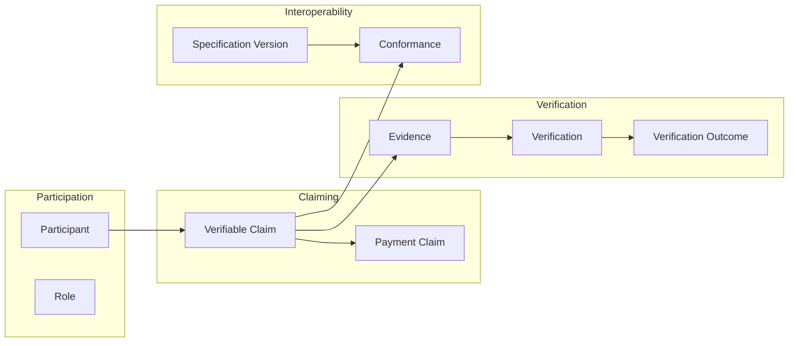

**Pyramid level:** architecture · **Status:** draft · **Version:** 0.3.0

**Constitutional basis:** [VISION.md](../00-overview/VISION.md), [PRINCIPLES.md](../00-overview/PRINCIPLES.md)

**Related documents:** [IDENTITY_MODEL.md](IDENTITY_MODEL.md), [GLOSSARY.md](../00-overview/GLOSSARY.md) (forthcoming), `DATA_MODEL.md` (forthcoming)

---

# VerityPay Protocol and Domain Model

> *First tell someone what the protocol is. Then give them the words to describe it.*

---

## Architecture layer

Part of the VerityPay [documentation pyramid](../README.md#documentation-pyramid).

```
Manifesto → Vision → Principles → Glossary
         ↓
    Architecture   ← this document
         ↓
    Specifications → Implementation
```

**Upstream:** [`00-overview/`](../00-overview/) — especially [VISION.md](../00-overview/VISION.md)

**Downstream:** [IDENTITY_MODEL.md](IDENTITY_MODEL.md) → `DATA_MODEL.md` → state models → [`../../rfcs/`](../../rfcs/)

Documents at this level must align with constitutional documents. Architecture becomes normative when incorporated by an accepted RFC.

---

## Document structure

This document has two parts:

| Part | Answers | Contents |
|------|---------|----------|
| **I — Protocol model** | What is VerityPay? What does it *do*? What counts as *true*? What do we assume? | Definition, capabilities, boundaries, layering, **truth model**, **trust model** |
| **II — Domain model** | What *nouns* does the protocol use? | Bounded contexts, ubiquitous language, concepts, lifecycle, invariants |

Read Part I before Part II. The domain vocabulary exists **because** the protocol capabilities require it—not the other way around.

**Specification path:** Protocol model → Domain model → **Identity model** → Data model → State model → Architecture details → RFCs.

---

## Summary

**VerityPay** is an open protocol for **expressing, verifying, and interoperating verifiable claims** between independent participants.

**Payment** is the **first domain specialization** of that protocol—the initial subject matter VerityPay standardizes. Payroll, grants, procurement, and other use cases may map to payment-domain claims or extend the protocol in future domains; they are not assumed here.

Part I defines the **system**. Part II defines the **shared language**—the ubiquitous vocabulary contributors, implementers, auditors, and RFC authors use so that the same words mean the same things.

This document does not define wire formats, APIs, schemas, state transition tables, or implementation modules. Those follow.

---

# Part I — Protocol model

## What is VerityPay?

**VerityPay is an open protocol for expressing, verifying, and interoperating verifiable claims between independent participants.**

Engineering terms:

- **Expressing** — participants present structured claims in a form governed by specification
- **Verifying** — claims are evaluated against accepted rules and evidence; outcomes are explicit
- **Interoperating** — independent implementations evaluate the same claim and reach compatible outcomes without shared codebases

VerityPay is **not** a payroll product, a wallet, a blockchain, or a bank integration. Those may **use** the protocol. The protocol defines **verifiable claim behavior** that products and infrastructure can rely on.

The name *VerityPay* reflects the **first standardized domain** (payments), not the outermost abstraction. At the protocol core, the reusable pattern is **verifiable claims**; payment is where VerityPay begins standardization.

---

## Why does the protocol exist?

Not: *Why does the institution exist?* — that is [VISION.md](../00-overview/VISION.md).

Not: *Why does payroll exist?* — that is an application concern.

**Why does a verifiable claim protocol need to exist?**

Because payment and payment-adjacent systems today rely on **chains of trust through intermediaries**, not on **shared, testable rules**:

```
Employer → Bank → Processor → Network → Worker
         (each party trusts the next; none share one protocol)
```

Assertions travel as proprietary messages, batch files, or opaque API responses. **Truth is asserted, not verified.** Interoperability is negotiated bilaterally. Auditors reverse-engineer behavior from implementations.

VerityPay exists so that:

- **Claims** are first-class artifacts—not side effects of messaging
- **Verification** is defined—not implied by whoever received the message
- **Outcomes** are interoperable—not "trust our API documentation"
- **Change** is governed—not discovered in production

The protocol does not eliminate trust in all forms. It ** reduces unnecessary trust** by making claim behavior explicit, reviewable, and shared.

---

## What problems does it solve?

| Problem (status quo) | Protocol response |
|------------------------|-------------------|
| Behavior lives in implementations | Specification defines; code demonstrates |
| Integrators read vendor code or PDFs | Conforming implementations share accepted rules |
| Assertions treated as facts | Assertion and verification are separate phases |
| No common outcome vocabulary | Verification outcomes are explicit and comparable |
| Breaking change hides in releases | Behavior versions through governed specification |
| Audit trails are local and inconsistent | Claims, evidence, and outcomes are domain-level audit artifacts |

**Conceptual flow under VerityPay:**

```
Participant → Verifiable Claim → Evidence → Verification → Outcome → Interoperability
```

Compare to the intermediary chain: participants still exist; **what passes between them** is standardized claim semantics—not proprietary assertion formats alone.

---

## Protocol layering

VerityPay is designed in composable layers. Understanding the layers prevents conflating protocol, domain, and application.

```
┌─────────────────────────────────────────┐
│  Applications (payroll, grants, …)      │  Product / integration layer
├─────────────────────────────────────────┤
│  Payment domain (payment claims)        │  First domain specialization
├─────────────────────────────────────────┤
│  Verifiable claim protocol (core)       │  Assertion → Evidence → Verification → Outcome
└─────────────────────────────────────────┘
```

| Layer | What it is | Example |
|-------|------------|---------|
| **Core protocol** | Express, verify, reference, interoperate, version | Generic claim lifecycle |
| **Domain specialization** | Subject matter and rules for a claim family | Payment claims about value movement |
| **Application** | End-user or business workflow using the domain | Cross-border payroll disbursement |

Future domains (grants, procurement, insurance) may extend the core without redefining assertion, evidence, verification, or outcome—unless an RFC explicitly amends the core.

**Naming note:** *VerityPay* names the project and the payment-domain protocol effort. The **core abstraction** is verifiable claims. Renaming is out of scope; **understanding the abstraction** is not.

---

## Protocol capabilities

The protocol enables five fundamental capabilities. Domain concepts in Part II exist to support these capabilities—not the reverse.

### Capability I — Express a claim

A participant in a **claimant** role presents a **verifiable claim**—structured content about a subject—into the protocol.

Expression establishes presence and provenance. It does not establish truth.

### Capability II — Verify a claim

A participant or process in a **verifier** role evaluates a claim against **accepted rules** and **evidence** at a declared **specification version**.

Verification produces an explicit **outcome**—not an implicit side effect.

### Capability III — Reference prior claims

Claims and evidence may **reference** earlier claims—forming chains of reasoning, supersession, or audit without rewriting history.

Semantic identity of an asserted claim is stable; amendments are new claims or governed supersession.

### Capability IV — Interoperate

Independent implementations, given the same claim, evidence, and specification version, reach **compatible verification outcomes** without shared libraries or bilateral agreements for core behavior.

### Capability V — Version behavior

Protocol behavior is tied to **specification versions**. Evolution is visible before it becomes permanent; conforming parties declare which version they implement.

---

## Protocol boundaries

VerityPay deliberately **does not** attempt to be:

| Out of scope | Why |
|--------------|-----|
| A payroll or HR product | Applications sit above the payment domain |
| A ledger, bank, or settlement network | Claims *reference* economic events; they do not replace ledgers |
| A legal contract or compliance engine | Jurisdiction and law vary; protocol supplies verifiable claims |
| A pricing, FX, or treasury system | Commercial logic stays in applications |
| A transport or API standard (alone) | Encoding and messaging follow in data model and RFCs |
| A single vendor's integration playbook | Interoperability is specification-based |

**In scope for the protocol core:** claim expression, verification semantics, outcome vocabulary, reference rules, versioning, and participant roles in those activities.

**In scope for the payment domain (v1):** verifiable **payment claims**—claims whose subject matter is payment or payment-related obligation as defined in Part II.

Applications combine domain claims with local policy. The protocol supplies **shared verifiable language**—not every business rule on Earth.

---

## Truth model

Every protocol has an **epistemology**—a definition of what counts as *true* within the system. HTTP, Git, OAuth, and TLS each define truth on their own terms. VerityPay must be equally explicit.

VerityPay does **not** determine whether a payment occurred in the world.

VerityPay determines whether a **claim satisfies the verification rules** defined by the specification and supported by **available evidence**.

**Protocol truth** is therefore:

| Property | Meaning |
|----------|---------|
| **Specification-relative** | Truth is evaluated against accepted rules at a declared specification version—not against private policy |
| **Evidence-based** | Outcomes depend on material consumed by verification rules; absent evidence may yield *indeterminate*, not silent approval |
| **Version-aware** | The same claim and evidence may be evaluated differently under different spec versions—version MUST be explicit |
| **Explicitly reproducible** | Two conforming implementations with the same inputs MUST reach the same outcome |

**Protocol truth is never inferred from authority alone.** A claimant's assertion, a brand name, a signature from a famous key, or a "trusted" API response does not substitute for defined verification. Authority may *provide* evidence; it does not *be* verification.

| Distinction | Protocol truth | Outside protocol |
|-------------|----------------|------------------|
| Claim satisfies rules + evidence | **Satisfied** (protocol) | May or may not match worldly fact |
| Claim fails rules | **Not satisfied** (protocol) | — |
| Rules cannot run | **Indeterminate** (protocol) | — |
| Bank confirms transfer | Evidence (if specified) | Worldly / ledger truth |

Downstream specifications MUST preserve this epistemology unless an RFC explicitly amends it.

---

## Trust model

The **trust model** states **assumptions** the protocol relies upon—distinct from the **security model** (how we defend against threats).

Security asks: *How do we protect?*

Trust asks: *What must we believe for the protocol to mean anything?*

**Flow under assumptions:**

```
Participant → Claim → Evidence → Verifier → Outcome
     ↑              ↑              ↑
  (assumes)    (assumes)      (assumes)
```

### Protocol assumptions

| ID | Assumption | If violated |
|----|------------|-------------|
| **T1** | **Evidence can be evaluated** — material presented as evidence is interpretable by verification rules at the stated spec version | Outcomes become indeterminate or non-interoperable |
| **T2** | **Specification versions are shared** — participants declare or discover which rule set applies | Same inputs produce incompatible outcomes |
| **T3** | **Roles are correctly attributed** — assertion and verification are attributable to participants in declared roles | Audit and non-repudiation goals fail |
| **T4** | **Implementations are conforming** — software claiming conformance applies rules as specified | Interoperability breaks; "VerityPay" becomes a label, not a protocol |
| **T5** | **Semantic identity is stable** — an asserted claim remains the same claim; amendments are new claims or governed supersession | History becomes un-auditable |
| **T6** | **Relays do not alter semantic content** — transport may delay or duplicate, but must not change claim meaning unless specified | Verification inputs diverge invisibly |

These assumptions are **not** guarantees VerityPay provides—they are **preconditions** integrators and implementers must engineer toward. The security and privacy architecture documents (forthcoming) address how to defend them; [IDENTITY_MODEL.md](IDENTITY_MODEL.md) defines what stable identity means under T5.

### Explicit non-assumptions

VerityPay does **not** assume:

- All participants are honest
- All evidence is authentic (authenticity is evaluated by rules, not assumed)
- All implementations share code, operators, or hardware
- Worldly economic truth matches protocol *satisfied* outcomes
- A single global ledger or identity provider

---

# Part II — Domain model

> *A model is not useful because it is complete. It is useful because it creates a shared language.*

## Purpose (domain)

[VISION.md](../00-overview/VISION.md) defines VerityPay's **role**. Part I defines VerityPay's **capabilities**. Part II defines the **nouns**:

- What is a **verifiable claim**, and what is a **payment claim**?
- Who **participates**, and in what **roles**?
- What does **verification** mean—as distinct from assertion, authorization, or settlement?
- Which distinctions must not be collapsed?

If two engineers use the same term here and mean different things, the specification is not yet ready.

---

## Normative status

This document is **informative** until incorporated by an accepted RFC or marked `stable` through governance.

Terms defined here are **authoritative for authoring** downstream documents. [GLOSSARY.md](../00-overview/GLOSSARY.md) SHALL reflect Part II unless an accepted RFC supersedes.

RFC 2119 keywords appear only in accepted specifications—not here.

---

## Design stance

### Shared language over complete taxonomy

The domain model is intentionally **incomplete at the edges**. RFCs extend language; they do not invent parallel vocabularies.

### Domain before representation

A *claim* is not a JSON object or database row. Encoding belongs in the data model and RFCs.

### Core before specialization

**Verifiable claim** is the core noun. **Payment claim** is the v1 domain specialization. Application workflows are not domain nouns.

---

## Bounded contexts

Four cooperating contexts. Terms MUST NOT cross boundaries without explicit mapping.

| Context | Question | Core concepts |
|---------|----------|---------------|
| **Participation** | Who acts? | Participant, Role, Responsibility |
| **Claiming** | What is stated? | Verifiable Claim, Payment Claim, Claim Content, Claim Subject |
| **Verification** | How is truth established? | Evidence, Verification, Verification Outcome |
| **Interoperability** | How do parties align? | Specification Version, Conformance |



---

## Ubiquitous language rules

| Rule | Meaning |
|------|---------|
| **Verifiable claim before payment claim** | Core protocol speaks of *verifiable claims*; *payment claim* names the payment-domain specialization |
| **Claim, not transaction** | *Transaction* is overloaded industry vocabulary unless an RFC defines a bounded use |
| **Payment ≠ payment claim** | Payment is a real-world event; payment claim is a protocol artifact about it |
| **Assert ≠ verify** | Assertion presents; verification evaluates |
| **Participant ≠ organization** | Roles attach to protocol behavior, not org charts |
| **Evidence ≠ implementation detail** | Evidence is domain material—not a file format or algorithm |
| **Specification defines; code demonstrates** | Conformance is to specification, not to a reference codebase |

---

## Core concepts

### Verifiable Claim

A **verifiable claim** is a structured statement about a **subject**, presented in a form governed by protocol rules, evaluable through **verification** against evidence.

Verifiable claims are the **central artifact of the core protocol**. They are not automatically true. They are **verifiable**.

Payment claims (below) are the first standardized family of verifiable claims in VerityPay.

---

### Payment Claim

A **payment claim** is a **verifiable claim** whose subject matter falls in the **payment domain**—value movement, payment instruction, settlement obligation, or related outcome as specified.

For v1 authoring, *claim* unqualified in payment-context documents means **payment claim** unless an RFC states otherwise.

---

### Payment

A **payment** is the economic or operational event the payment domain discusses—**as referenced by payment claims**, not as fully modeled ledger state.

---

### Claim Content

**Claim content** is the semantic payload of a verifiable claim—what is asserted—as defined by specification for the claim type.

---

### Claim Subject

The **claim subject** is what a claim is *about*—the anchor tying assertion to identity in the domain.

Multiple claims may reference the same subject. Conflicts resolve through verification rules.

---

### Assertion

An **assertion** is presenting a verifiable claim for consideration—typically by a **claimant**.

Assertion establishes presence and provenance, not validity.

---

### Evidence

**Evidence** is material verification rules may consume—proofs, prior claims, attestations, or specified inputs.

How evidence is encoded belongs to lower layers.

---

### Verification

**Verification** is evaluating a verifiable claim and applicable evidence against **accepted protocol rules** at a stated **specification version**.

---

### Verification Outcome

| Outcome | Meaning |
|---------|---------|
| **Satisfied** | Claim meets applicable rules given available evidence |
| **Not satisfied** | Claim fails one or more applicable rules |
| **Indeterminate** | Rules cannot be fully evaluated |

Exact taxonomies are specified in RFCs. Outcomes MUST be **explicit and interoperable**.

---

### Participant

A **participant** is an entity acting in the protocol through one or more **roles**.

---

### Role

| Role | Responsibility |
|------|----------------|
| **Claimant** | Presents verifiable claims |
| **Verifier** | Evaluates claims against rules |
| **Relay** | Transports claims or evidence without altering semantic content |
| **Observer** | Receives information for audit or integration |
| **Integrator** | Connects external systems within defined boundaries |

Product personas (payer, payee, merchant, issuer, acquirer, auditor) **map to** these roles in [`02-product/`](../02-product/)—not substitute for them in normative text.

---

### Responsibility

An obligation or permitted action attached to a role—expressed here before RFCs state MUST/SHOULD.

---

### Specification Version

An identifiable set of accepted documents an implementation targets. Verification is interpreted in version context.

---

### Conformance

Correct application of protocol behavior as defined by a declared specification version—assessed against **specification**, not another implementation.

---

## Aggregates and boundaries (conceptual)

| Aggregate root | Encapsulates | Consistency rule |
|----------------|--------------|------------------|
| **Verifiable Claim** | Content, subject, assertion context | Semantic identity stable after assertion; amendments are new claims or supersession |
| **Verification Record** | Outcome, evidence refs, rules applied | Outcome derivable from claim, evidence, version |
| **Participant Context** | Active roles | Roles explicit in protocol traces |

---

## Claim lifecycle (domain)

```
Composed → Asserted → Under Verification → Outcome Known → (Referenced | Superseded | Retired)
```

| Phase | Meaning |
|-------|---------|
| **Composed** | Prepared, not yet asserted |
| **Asserted** | Presented by claimant |
| **Under verification** | Rules and evidence evaluated |
| **Outcome known** | Outcome determined |
| **Referenced** | Cited by later claims or evidence |
| **Superseded** | Later claim replaces semantic authority |
| **Retired** | Auditable but inactive for new verification |

Formal states belong in state models and RFCs. Identity rules: [IDENTITY_MODEL.md](IDENTITY_MODEL.md).

---

## Domain invariants

1. **Verifiability.** Every governed claim MUST be evaluable under defined verification rules.
2. **Separation of assertion and truth.** Assertion MUST NOT imply outcome.
3. **Subject identity.** Claims about the same subject MUST be relatable; contradictions resolvable by rules.
4. **Evidence linkage.** Verification MUST declare evidence considered or absence causing indeterminate outcome.
5. **Version explicitness.** Verification MUST be interpretable against a specification version.
6. **Role explicitness.** Assertion and verification MUST be attributable to roles.
7. **Interoperability of outcomes.** Two conforming implementations with the same claim, evidence, and version MUST reach the same outcome.

---

## Relationship to downstream documents

| Document | Derives from this model |
|----------|-------------------------|
| [GLOSSARY.md](../00-overview/GLOSSARY.md) | Part II definitions |
| [IDENTITY_MODEL.md](IDENTITY_MODEL.md) | Semantic identity; referential stability |
| `DATA_MODEL.md` | Storage identity, fields, encodings |
| State models | Formal transitions from lifecycle |
| Security model | Defends trust assumptions |
| Privacy model | Information flows among participants |
| [`02-product/`](../02-product/) | Personas mapped to roles and claims |
| [`../../rfcs/`](../../rfcs/) | Normative rules |

**Authoring order:** Protocol + domain (this document) → identity model → data model → state model → RFCs.

---

## Domain glossary (working)

| Term | Definition |
|------|------------|
| Verifiable Claim | Structured, evaluable statement about a subject |
| Payment Claim | Verifiable claim in the payment domain |
| Payment | Real-world value event referenced by payment claims |
| Claim Content | Semantic payload of assertion |
| Claim Subject | What the claim is about |
| Assertion | Presentation of a claim |
| Evidence | Material used in verification |
| Verification | Rule-based evaluation |
| Verification Outcome | Satisfied, not satisfied, or indeterminate |
| Participant | Entity acting in the protocol |
| Role | Named protocol responsibilities |
| Conformance | Alignment with declared specification version |

---

## Open questions

- [ ] v1 **payment claim types** in scope (instruction, attestation, status, …)
- [ ] Minimum **claim subject** identification across participants
- [ ] **Supersession** — always explicit vs rule-derived
- [ ] **Observer** role vs privacy architecture
- [ ] **Indeterminate** outcomes in multi-hop claim chains
- [ ] Criteria for a **future domain** beyond payment (grants, procurement) without renaming the project

---

## Changelog

| Version | Date | Summary |
|---------|------|---------|
| 0.1.0 | 2026-06-29 | Initial domain model |
| 0.2.0 | 2026-06-29 | Part I protocol model; verifiable claim core; payment as first domain |
| 0.3.0 | 2026-06-29 | Truth model and trust model (Part I) |
