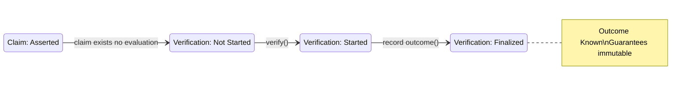

**Pyramid level:** architecture · **Status:** draft · **Version:** 0.1.0 · **Specification maturity:** L2 — Representation

**Constitutional basis:** [DOMAIN_MODEL.md](DOMAIN_MODEL.md), [IDENTITY_MODEL.md](IDENTITY_MODEL.md), [BEHAVIOR_MODEL.md](BEHAVIOR_MODEL.md), [DATA_MODEL.md](DATA_MODEL.md)

**Related documents:** [CONFORMANCE_MODEL.md](../03-development/CONFORMANCE_MODEL.md), [`../../rfcs/`](../../rfcs/)

---

# VerityPay State Model

> *At any point in time, what does the protocol know about this object?*

---

## Architecture layer

Part of the VerityPay [documentation pyramid](../README.md#documentation-pyramid).

```
Manifesto → Vision → Principles → Glossary
         ↓
    Architecture
         ↓
    Protocol + Domain  →  Identity  →  Behavior  →  Data Model  →  State Model
         ↓
    Specifications → Implementation
```

**Upstream:** [DOMAIN_MODEL.md](DOMAIN_MODEL.md), [IDENTITY_MODEL.md](IDENTITY_MODEL.md), [BEHAVIOR_MODEL.md](BEHAVIOR_MODEL.md), [DATA_MODEL.md](DATA_MODEL.md)

**Downstream:** conformance model (L3), RFCs (L3), reference implementations (L4)

---

## Summary

Most systems model **objects**. VerityPay models **knowledge**.

A claim does not become "approved on a dashboard." It progresses through what the protocol **knows** about assertion, evidence, evaluation, and recorded truth.

| Layer | Question |
|-------|----------|
| Identity | What is this object? |
| Behavior | What is allowed to happen? |
| Representation | How is it encoded? |
| **State (this document)** | **What does the protocol know about it now?** |

This document defines **knowledge states**—multiple lifecycle state machines, one per entity class—where every transition is caused by [BEHAVIOR_MODEL.md](BEHAVIOR_MODEL.md) verbs, never by UI or storage side effects.

After this document, the **conceptual design of the protocol is complete**. What follows is conformance (L3), normative encoding (RFCs), and reference implementation (L4).

---

## Why this exists

[DATA_MODEL.md](DATA_MODEL.md) defines entities, attributes, and representation guarantees. It describes canonical lifecycles informally.

This document makes lifecycles **precise**:

- What each phase **means** as protocol knowledge
- How the protocol **enters** and **exits** each phase
- What becomes **permanently true** (guarantees) when a phase is reached
- Which transitions are **forbidden**

Without a state model, implementers infer lifecycle from application workflows, database flags, or screen states. VerityPay refuses that leakage. The protocol knows what it knows—nothing more.

This is not:

- A user-interface flow
- A payment processor status screen
- A blockchain transaction confirmation counter

This is the **lifecycle of protocol truth**.

---

## Relationship to behavior

**Behavior causes state. Never the opposite.**

| Rule | Meaning |
|------|---------|
| **Verbs drive transitions** | Every valid state change corresponds to a [BEHAVIOR_MODEL.md](BEHAVIOR_MODEL.md) verb or protocol event |
| **State does not invent behavior** | A new lifecycle phase MUST NOT imply a verb that behavior model does not define |
| **Events witness transitions** | [Protocol events](BEHAVIOR_MODEL.md#protocol-events) record that knowledge changed; they do not replace behavior |
| **Identity is constant** | State changes describe knowledge and participation; they do not rewrite semantic identity ([IDENTITY_MODEL.md](IDENTITY_MODEL.md)) |

### Transition pattern

Every documented transition follows this form:

```
Source State
    ↓
Allowed because: <verb>() / <protocol event>
    ↓
Target State
```

Example:

```
Asserted
    ↓
Allowed because: verify()
    ↓
(Verification lifecycle: Started — see Verification Lifecycle)
```

Claim lifecycle and verification lifecycle are **separate machines** synchronized through behavior, not merged into one diagram.

---

## Normative status

This document is **informative** until incorporated by an accepted RFC or marked `stable` through governance.

Knowledge states and state invariants here are **authoritative for authoring** conformance scenarios and RFC state requirements. RFC 2119 keywords appear only in accepted specifications—not here.

---

## State design principles

| Principle | Meaning |
|-----------|---------|
| **Knowledge, not UI** | States describe protocol epistemology—what is known—not presentation |
| **One machine per entity class** | Claims, verifications, specifications, and participants each own a lifecycle |
| **Behavior-gated transitions** | No "automatic" state change without a defined verb or governed rule |
| **Guarantees accumulate** | Later states inherit guarantees from earlier states unless supersession explicitly changes authority |
| **Invalid is explicit** | Forbidden transitions are documented, not left to implementer guesswork |
| **Final means final** | Finalized knowledge states are immutable at the protocol level |

---

## State machine philosophy

<a id="sm-2-1"></a>

### Knowledge states

VerityPay tracks how protocol truth **accumulates**:

```
Assertion
    ↓
Evidence Available
    ↓
Evaluation Possible
    ↓
Evaluation Performed
    ↓
Truth Recorded
    ↓
Historical Reference
```

This is a **composite view** across claim and verification lifecycles (see [Cross-entity synchronization](#cross-entity-synchronization)). Individual entities have their own machines below.

### State record template

Every state in this document defines:

| Field | Question answered |
|-------|-------------------|
| **Meaning** | What does the protocol know in this state? |
| **Entry conditions** | How can the protocol arrive here? |
| **Exit conditions** | How can it leave? |
| **Guarantees** | What is now permanently true? |

### Multiple state machines

| Machine | Entity | Scope |
|---------|--------|-------|
| [Claim Lifecycle](#claim-lifecycle) | Verifiable Claim (incl. Payment Claim) | Assertion artifact knowledge |
| [Verification Lifecycle](#verification-lifecycle) | Verification Record | Evaluation knowledge |
| [Specification Lifecycle](#specification-lifecycle) | Specification Version | Rule-set publication knowledge |
| [Participant Lifecycle](#participant-lifecycle) | Participant | Actor availability knowledge |

Evidence does not define a separate machine in v1—it enters protocol knowledge through `provide evidence` and `evidence_declared` on verification records.

---

## Claim lifecycle

**Entity:** Verifiable Claim (Payment Claim inherits this machine)

**Knowledge arc:** From local preparation → protocol presence → reference in audit graph → authority change → retirement.

```
Composed → Asserted → Referenced → Superseded → Retired
              ↑           ↑
              └───────────┘ (Referenced may occur while Asserted)
```

Payment claims do not define a separate state machine—they **inherit** this lifecycle.

---

### Composed

| Field | Definition |
|-------|------------|
| **Meaning** | Claim content and subject binding exist **locally**; the protocol has **no knowledge** of this artifact yet |
| **Entry conditions** | `compose()` by claimant (or integrator within boundaries) |
| **Exit conditions** | `assert()` presents claim to protocol boundary |
| **Guarantees** | None at protocol level—artifact is outside protocol knowledge |

---

### Asserted

| Field | Definition |
|-------|------------|
| **Meaning** | Protocol **knows** a distinct claim exists: identity fixed, content immutable, claimant attributed |
| **Entry conditions** | `assert()` from Composed; or direct assert without separate composed phase (implementation-local compose) |
| **Exit conditions** | `reference()` by another artifact; `supersede()` via new claim; `retire()`; verification lifecycle begins on this claim (parallel knowledge) |
| **Guarantees** | `claim_id` stable; `content`, `subject_ref`, `claimant_ref` immutable; assertion does **not** imply verification outcome ([DOMAIN_MODEL.md](DOMAIN_MODEL.md) truth model) |

**Transition:**

```
Composed
    ↓
Allowed because: assert() / ClaimAsserted
    ↓
Asserted
```

---

### Referenced

| Field | Definition |
|-------|------------|
| **Meaning** | Protocol **knows** this claim is cited by at least one later claim, evidence artifact, or audit trace—historical relevance established |
| **Entry conditions** | `reference()` from another claim or evidence; ClaimReferenced event |
| **Exit conditions** | `supersede()`; `retire()`; additional references (remain Referenced) |
| **Guarantees** | All Asserted guarantees; referential stability for all inbound references |

**Transition:**

```
Asserted
    ↓
Allowed because: reference() / ClaimReferenced
    ↓
Referenced
```

*Note:* Referenced is **additive**—a claim may be both Asserted and Referenced in knowledge terms; in implementation, `referenced: true` or equivalent MAY overlay Asserted without replacing it.

---

### Superseded

| Field | Definition |
|-------|------------|
| **Meaning** | Protocol **knows** a later claim holds superseding authority for defined scope; this claim remains historically valid |
| **Entry conditions** | `supersede()` via new claim with `supersedes_ref`; ClaimSuperseded event |
| **Exit conditions** | `retire()` (optional); remains Superseded indefinitely for audit |
| **Guarantees** | All prior guarantees; identity and content never rewritten; superseded claim remains resolvable and auditable |

**Transition:**

```
Asserted or Referenced
    ↓
Allowed because: supersede() / ClaimSuperseded (via new claim)
    ↓
Superseded
```

---

### Retired

| Field | Definition |
|-------|------------|
| **Meaning** | Protocol **knows** this claim is **inactive for new verification**; historical knowledge preserved |
| **Entry conditions** | `retire()` by claimant or governed rule; ClaimRetired event |
| **Exit conditions** | None—terminal for active protocol use |
| **Guarantees** | All prior identity guarantees; claim never re-enters Asserted or active verification |

**Transition:**

```
Asserted, Referenced, or Superseded
    ↓
Allowed because: retire() / ClaimRetired
    ↓
Retired
```

---

## Verification lifecycle

**Entity:** Verification Record

**Knowledge arc:** From no evaluation → evaluation underway → outcome fixed → permanently known.

```
Not Started → Started → Outcome Recorded → Finalized
```

*Not Started* is the absence of a verification record—protocol knowledge that evaluation has not yet been performed for a given evaluation context.

---

### Not Started

| Field | Definition |
|-------|------------|
| **Meaning** | Protocol has **no verification record** for this evaluation context on the target claim |
| **Entry conditions** | Initial condition when claim is Asserted; or after explicit scope reset (new evaluation context only—never rewind of finalized record) |
| **Exit conditions** | `verify()` begins evaluation |
| **Guarantees** | Claim Asserted guarantees hold; no outcome knowledge exists |

---

### Started

| Field | Definition |
|-------|------------|
| **Meaning** | Protocol **knows** evaluation is in progress—rules and evidence are being applied at declared specification version |
| **Entry conditions** | `verify()` / VerificationStarted |
| **Exit conditions** | `record outcome()` |
| **Guarantees** | Target `claim_ref` unchanged; `spec_version_ref` declared; evaluator attributed |

**Transition:**

```
Not Started
    ↓
Allowed because: verify() / VerificationStarted
    ↓
Started
```

---

### Outcome Recorded

| Field | Definition |
|-------|------------|
| **Meaning** | Protocol **knows** an explicit outcome value exists—satisfied, not satisfied, or indeterminate—with evidence declaration |
| **Entry conditions** | `record outcome()` / VerificationOutcomeRecorded |
| **Exit conditions** | Finalization step (may be immediate in minimal implementations) |
| **Guarantees** | `outcome_value` explicit; `evidence_declared` present; `spec_version_ref` bound |

**Transition:**

```
Started
    ↓
Allowed because: record outcome() / VerificationOutcomeRecorded
    ↓
Outcome Recorded
```

---

### Finalized

| Field | Definition |
|-------|------------|
| **Meaning** | Protocol **knows** this evaluation is **complete and immutable**—protocol truth for this verification record is recorded |
| **Entry conditions** | Finalization after Outcome Recorded (MAY be same atomic step as record outcome) |
| **Exit conditions** | None—in-place rewind forbidden; new evaluation → new verification record (Not Started on new record) |
| **Guarantees** | Outcome immutable; evidence set immutable; specification version immutable; compatible implementations agree on outcome ([BEHAVIOR_MODEL.md](BEHAVIOR_MODEL.md) B10) |

**Transition:**

```
Outcome Recorded
    ↓
Allowed because: finalization (governed completion of record outcome())
    ↓
Finalized
```

---

## Specification lifecycle

**Entity:** Specification Version

**Knowledge arc:** Governance draft → published rule set → deprecated → archived.

```
Draft → Published → Deprecated → Archived
```

---

### Draft

| Field | Definition |
|-------|------------|
| **Meaning** | Rule set under authoring; **not** authoritative for interoperability claims |
| **Entry conditions** | Governance process initiates new version |
| **Exit conditions** | Publication through governance |
| **Guarantees** | None for implementer conformance |

---

### Published

| Field | Definition |
|-------|------------|
| **Meaning** | Protocol **knows** this `version_id` identifies a fixed, shared rule interpretation set |
| **Entry conditions** | Governance publication |
| **Exit conditions** | Deprecation |
| **Guarantees** | `version_id` and `document_manifest` immutable; two conforming parties share rule meaning |

**Transition:**

```
Draft
    ↓
Allowed because: governance publication
    ↓
Published
```

---

### Deprecated

| Field | Definition |
|-------|------------|
| **Meaning** | Protocol **knows** newer version supersedes this for new implementations; existing traces remain valid |
| **Entry conditions** | Governance deprecation of Published version |
| **Exit conditions** | Archive |
| **Guarantees** | Published guarantees for historical verification; no silent rule drift |

---

### Archived

| Field | Definition |
|-------|------------|
| **Meaning** | Protocol **knows** version is historical only—not for new conformance targets |
| **Entry conditions** | Governance archive |
| **Exit conditions** | None |
| **Guarantees** | Identity of archived version preserved for audit resolution |

---

## Participant lifecycle

**Entity:** Participant

**Knowledge arc:** Introduction → active use → historical reference → deactivation.

```
Registered → Active → Referenced → Inactive
```

---

### Registered

| Field | Definition |
|-------|------------|
| **Meaning** | Protocol **knows** a distinct participant identity exists with binding |
| **Entry conditions** | Participant introduction (governed or implementation-local registration) |
| **Exit conditions** | First protocol trace (assert, verify, relay, observe) |
| **Guarantees** | `participant_id` assigned and stable |

---

### Active

| Field | Definition |
|-------|------------|
| **Meaning** | Protocol **knows** participant may currently act in roles |
| **Entry conditions** | First attributed action in protocol trace |
| **Exit conditions** | Deactivation; continued reference without new actions |
| **Guarantees** | Identity stable; role assignments attributable |

**Transition:**

```
Registered
    ↓
Allowed because: first assert(), verify(), relay(), or observe()
    ↓
Active
```

---

### Referenced

| Field | Definition |
|-------|------------|
| **Meaning** | Protocol **knows** participant appears in historical traces; may or may not accept new actions |
| **Entry conditions** | Any historical claim, verification, or event attribution |
| **Exit conditions** | Inactive (if no longer accepting actions) |
| **Guarantees** | Historical traces resolve to same participant identity |

*Note:* Like Referenced claims, this overlays Active—participants remain referentially stable in old traces.

---

### Inactive

| Field | Definition |
|-------|------------|
| **Meaning** | Protocol **knows** participant must not initiate new assertions or verifications |
| **Entry conditions** | Governance or operator deactivation |
| **Exit conditions** | Re-activation (new governance record—not rewrite of history) |
| **Guarantees** | All historical attribution preserved |

---

## State invariants

Timeless rules governing **all** lifecycle machines. Violation indicates non-conformance.

| ID | Invariant |
|----|-----------|
| **S1** | A **Finalized** verification record can never return to **Started** or **Outcome Recorded** in the same record |
| **S2** | A **Retired** claim can never return to **Asserted** |
| **S3** | A **Superseded** claim remains historically valid—identity and content preserved |
| **S4** | State transitions MUST NOT mutate semantic identity ([IDENTITY_MODEL.md](IDENTITY_MODEL.md)) |
| **S5** | **Asserted** never implies verification outcome—claim lifecycle MUST NOT encode satisfied/not satisfied without verification record |
| **S6** | Re-verification creates a **new** verification record—it does not rewind an existing **Finalized** record |
| **S7** | **Published** specification version rule meaning is immutable |
| **S8** | Protocol knowledge states MUST be derivable from behavior events and entity representations—not from UI or transport alone |

---

## Invalid transitions

Explicit **forbidden** transitions. Documenting invalid paths is as important as valid ones.

### Claim lifecycle

| From | To | Verdict | Reason |
|------|-----|---------|--------|
| Composed | Referenced | ❌ Invalid | Protocol must know claim via assert first |
| Composed | Superseded | ❌ Invalid | No protocol identity to supersede |
| Composed | Retired | ❌ Invalid | Nothing to retire at protocol level |
| Retired | Asserted | ❌ Invalid | S2 — terminal for active use |
| Retired | Composed | ❌ Invalid | Identity exists; cannot un-assert |
| Superseded | Asserted | ❌ Invalid | Cannot rewind authority change in place |
| Asserted | Composed | ❌ Invalid | Cannot un-present protocol knowledge |

### Verification lifecycle

| From | To | Verdict | Reason |
|------|-----|---------|--------|
| Finalized | Started | ❌ Invalid | S1 — immutable after finalization |
| Finalized | Outcome Recorded | ❌ Invalid | S1 |
| Finalized | Not Started | ❌ Invalid | Same record cannot reset |
| Outcome Recorded | Not Started | ❌ Invalid | Outcome knowledge cannot be erased in place |
| Not Started | Finalized | ❌ Invalid | Must pass through Started and Outcome Recorded |

### Cross-lifecycle (common mistakes)

| From | To | Verdict | Reason |
|------|-----|---------|--------|
| Outcome Known (on claim view) | Assert (same claim) | ❌ Invalid | Re-assert requires new claim identity |
| Retired claim | verify() (new evaluation) | ❌ Invalid | Retired inactive for new verification |
| Asserted claim | "Verified: true" field update | ❌ Invalid | S5 — outcome only via verification record |

### Specification lifecycle

| From | To | Verdict | Reason |
|------|-----|---------|--------|
| Published | Draft | ❌ Invalid | Cannot un-publish rule meaning |
| Archived | Published | ❌ Invalid | Archive is terminal for active targeting |

---

## Cross-entity synchronization

Individual machines run **in parallel**. Composite **protocol knowledge** about a claim and its evaluation:

| Composite knowledge | Claim state | Verification state | Protocol knows |
|--------------------|-------------|-------------------|----------------|
| **Assertion only** | Asserted | Not Started | Claim exists; no evaluation |
| **Evidence available** | Asserted | Not Started | Evidence artifacts exist; evaluation possible when verifier acts |
| **Evaluation possible** | Asserted | Not Started | Rules + version + claim sufficient to begin verify() |
| **Evaluation in progress** | Asserted | Started | Rules being applied |
| **Truth recorded** | Asserted or Referenced | Finalized | Outcome immutable on record |
| **Historical reference** | Referenced | Finalized (optional) | Claim cited in audit graph with recorded truth |



**Evidence Available** is not a claim state—it is protocol knowledge that evidence entities exist and MAY be declared when verification starts.

Synchronization rules:

1. Verification machines are **scoped to a verification record**, not globally to "the claim."
2. A claim MAY have zero, one, or many verification records over time (S6).
3. Claim **Retired** forbids new verification records; existing **Finalized** records remain valid knowledge.

---

## Examples

### Example 1 — Payroll claim to recorded truth

1. **Alice** composes a payment claim locally → Claim: **Composed** (protocol unaware)
2. Alice `assert()` → Claim: **Asserted**; Verification: **Not Started**
3. Alice `provide evidence()` — bank batch reference → evidence exists; evaluation **possible**
4. **Bob** `verify()` → Verification: **Started**
5. Bob `record outcome()` → Verification: **Outcome Recorded** → **Finalized**
6. Protocol knowledge: **Truth recorded** — outcome satisfied, evidence set fixed, version explicit
7. Later claim cites Alice's claim → Claim: **Referenced** — **Historical reference** in composite view

No UI state required. Any conforming implementation reproduces the same knowledge progression.

### Example 2 — Supersession without erasure

1. Claim A is **Asserted** and **Finalized** as not satisfied under v1 evidence
2. Alice `assert()` Claim B with `supersedes_ref = A` → A: **Superseded**; B: **Asserted**
3. Claim A remains auditable; protocol knows B holds superseding authority
4. Bob verifies B → new verification record; A's finalized record unchanged

### Example 3 — Retired claim

1. Claim C is **Asserted**, verification **Finalized**
2. Alice `retire()` → Claim C: **Retired**
3. Attempt `verify()` on C → ❌ **Invalid** (S2, invalid transitions table)
4. Historical verification record on C remains **Finalized** knowledge

---

## Relationship to downstream documents

| Document | This model provides |
|----------|---------------------|
| **Conformance model (L3)** | Testable state assertions and forbidden transitions |
| **RFCs (L3)** | Normative MUST/SHALL on lifecycle and finalization |
| **Reference implementation (L4)** | State stores derived from protocol knowledge |
| **[GLOSSARY.md](../00-overview/GLOSSARY.md)** | Lifecycle terms |

**Authoring order:** Protocol + domain → identity → behavior → data → **state (this document)** → conformance → RFCs.

### Architectural phase complete

With this document, the **L1 semantic stack** and **L2 representation stack** for VerityPay protocol architecture are conceptually complete:

```
DOMAIN_MODEL     — nouns, truth, trust
IDENTITY_MODEL   — semantic identity
BEHAVIOR_MODEL   — verbs, events
DATA_MODEL       — entities, guarantees
STATE_MODEL      — knowledge states  ← you are here
```

The next phase is **L3 Conformance**—making interoperability testable—not further architectural layering.

---

## Out of scope

| Excluded | Belongs in |
|----------|------------|
| UI wizard steps, button enabled/disabled | [`02-product/`](../02-product/) |
| Database `status` column mappings | Implementation (L4) |
| Payment processor codes (ISO 8583, etc.) | Integrations |
| Workflow engines, BPMN diagrams | Applications |
| Smart contract state enums | Domain RFCs |
| Message queue consumer states | Transport |
| Legal case status | Outside protocol |
| Evidence lifecycle as separate machine | v1—evidence knowledge via verification declaration |

---

## Open questions

- [ ] **Referenced as overlay vs distinct state** — boolean flag on Asserted vs enumerated replacement state
- [ ] **Finalization atomicity** — Outcome Recorded and Finalized as one step vs two observable phases
- [ ] **Participant re-activation** — new Registered identity vs same identity returning to Active
- [ ] **Specification Draft visibility** — public draft versions vs private until Published
- [ ] **Composite knowledge API** — whether conformance tests target composite views or entity machines only
- [ ] **Indeterminate outcome** — additional substates for partial rule evaluation before Outcome Recorded
- [ ] **Relay/observe impact on lifecycle** — whether relay events affect any machine state in v1

---

## Changelog

| Version | Date | Summary |
|---------|------|---------|
| 0.1.0 | 2026-06-29 | Initial state model; knowledge states; four lifecycles; invariants and invalid transitions |
