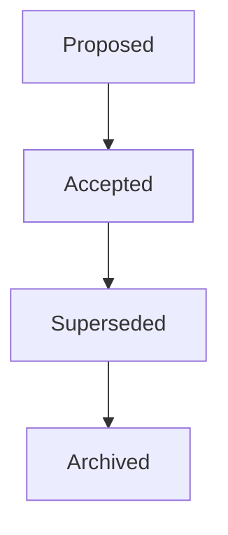
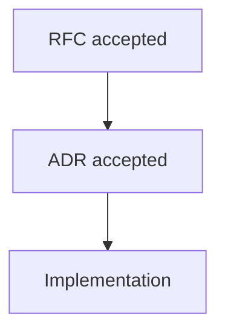

**Document:** ADR Guide · **Version:** 1.0.0 · **Status:** canonical

**Related:** [GOVERNANCE.md](GOVERNANCE.md) (authority and roles) · [VP-RFC-0000](../../rfcs/0000-rfc-process.md) (RFC vs ADR boundary)

**Template:** [`DECISION_RECORD_TEMPLATE.md`](../templates/DECISION_RECORD_TEMPLATE.md) · **RFC authoring:** [`RFC_TEMPLATE.md`](../../rfcs/templates/RFC_TEMPLATE.md)

---

# ADR Guide

Specifications preserve **protocol knowledge**—what the ecosystem must agree on for interoperability.

Architecture Decision Records preserve **engineering knowledge**—why a team built, organized, or operated a particular way inside that ecosystem.

One answers: *What should the protocol do?*

The other answers: *Why did we build it this way?*

Both are necessary. Confusing them creates either **specification evasion** (normative behavior hiding in implementation notes) or **documentation bloat** (every tooling choice becoming an RFC). This guide draws the line for VerityPay.

ADRs are **not** protocol documents. They do not bind independent implementers. They are **institutional memory** for maintainers, contributors, and future you.

---

## When to write an ADR

Write an ADR when a decision affects **how engineering work is done** and future maintainers will ask *why*—not *what the protocol requires*.

| Category | Example decisions |
|----------|-------------------|
| **Language and runtime** | Choosing Rust for the reference interpreter; choosing TypeScript for documentation tooling |
| **Repository structure** | Splitting `veritypay-spec` from `veritypay-core`; creating a conformance test repository |
| **CI and quality** | CI strategy; required checks before merge; GPG signing policy for maintainers |
| **Testing** | Testing framework selection; where conformance scenarios execute |
| **Directory layout** | Cargo workspaces; pnpm for monorepo tooling; `spec/terminology/registry.yaml` as machine-readable glossary |
| **Tooling** | Documentation generation pipeline; RFC registry validation (future); link checking |
| **Deployment** | How reference environments are hosted; release artifact layout |
| **Process (engineering)** | Decision to freeze Architecture Alpha documentation; archive obsolete tooling |
| **Maintainership** | Stewardship of a repository; rotation of security contact responsibilities (process record) |

An ADR should be written **at decision time**—not reconstructed months later when the original authors have moved on.

---

## When NOT to write an ADR

Do **not** use an ADR when the decision requires **ecosystem agreement** or changes **what conforming implementations must do**.

| Use an RFC instead | Examples |
|--------------------|----------|
| **Protocol behavior** | New verification rules; claim lifecycle changes |
| **Terminology** | New **VP-TERM-*** definitions; deprecating *transaction* for *claim* |
| **Architecture semantics** | Changing what *identity* or *verification outcome* means in models |
| **Claim types** | Payment claim extensions; reserved domain claim definitions |
| **Verification** | Outcome vocabulary; evidence requirements |
| **Conformance** | New VP-CS scenarios; conformance pyramid changes |
| **Governance law** | Who may accept RFCs; amendment of constitutional documents |

**Rule of thumb:** If two independent organizations implementing VerityPay from specification alone would need the same answer, it belongs in an **RFC**—not an ADR.

When an ADR discussion discovers protocol impact, **stop** and open an RFC. The ADR may record the engineering fallout *after* the RFC is accepted.

See [RFC vs ADR](#rfc-vs-adr) and [VP-RFC-0000 §14](../../rfcs/0000-rfc-process.md#14-relationship-to-adrs).

---

## ADR lifecycle

ADRs move through a smaller lifecycle than RFCs. There is no **Implemented** or **Verified** state—engineering outcomes are tracked in repositories, not in the ADR file.



| State | Meaning |
|-------|---------|
| **Proposed** | Draft under discussion; not yet team or maintainer consensus |
| **Accepted** | Decision recorded; engineering work may proceed on this basis |
| **Superseded** | A later ADR replaces this decision for new work; historical text preserved |
| **Archived** | Terminal housekeeping state; decision no longer active |

**Accepted ADRs are historical records.** Like accepted RFCs, they should not be silently rewritten to change the decision—only clarified for typos, broken links, or formatting (see [VP-RFC-0000 §12](../../rfcs/0000-rfc-process.md#12-amending-an-accepted-rfc) for the parallel norm on RFC immutability). If the decision was wrong, write a **superseding ADR**—do not edit history.

Rejected proposals may remain as Proposed with rejection note, or move to Archived with rationale—team preference; do not reuse the ADR number.

---

## ADR principles

Every accepted ADR should answer **Why?**

| Principle | Practice |
|-----------|----------|
| **Capture context** | Constraints, deadlines, team skills, and external forces at decision time |
| **Record alternatives** | Roads not taken—with reasons, not strawmen |
| **Explain trade-offs** | What you gained and what you paid |
| **Optimize for future maintainers** | A stranger in five years has only this file |
| **Prefer evidence over preference** | Benchmarks, incident postmortems, prior art—not "we like X" |
| **Do not rewrite history** | Supersede; do not silently edit accepted decisions |

ADRs are **honest**, not **persuasive**. The goal is reproducible reasoning, not winning a debate.

---

## ADR structure

Each section below includes teaching parts and a Markdown skeleton. Align with [`DECISION_RECORD_TEMPLATE.md`](../templates/DECISION_RECORD_TEMPLATE.md); this guide explains *how* to fill it well.

---

### Title

**Question answered:** *What decision is recorded, in plain language?*

**Why it exists:** Indexing and search; first line of institutional memory.

**Reviewer expectations:** Specific verb + object ("Use Rust for reference interpreter"), not vague ("Language choice").

**Author checklist:**

- [ ] Unique among ADRs in the registry
- [ ] Describes the decision, not the problem alone
- [ ] Filename slug will match: `NNNN-short-title.md`

```markdown
# ADR-NNNN: {Title}
```

---

### Status

**Question answered:** *Where is this decision in its lifecycle?*

**Why it exists:** Readers must know whether to follow this ADR for new work.

**Reviewer expectations:** `proposed` | `accepted` | `superseded` | `archived`; `superseded_by` when applicable.

**Author checklist:**

- [ ] Front matter `status` matches body
- [ ] Date fields set on acceptance

```markdown
**Status:** proposed | accepted | superseded | archived
**Date:** YYYY-MM-DD
```

---

### Context

**Question answered:** *What situation forced a decision?*

**Why it exists:** Without context, the decision looks arbitrary years later.

**Reviewer expectations:** Constraints named (time, people, dependencies, incidents); links to issues or RFCs that motivated—but did not replace—this ADR.

**Author checklist:**

- [ ] Reader understands pressure without attending the meeting
- [ ] Protocol vs engineering boundary clear
- [ ] No normative MUST/SHOULD for the ecosystem

```markdown
## Context

<!-- Forces, constraints, incidents, and background. Not the decision itself. -->
```

---

### Decision

**Question answered:** *What did we decide?*

**Why it exists:** Unambiguous record of the outcome.

**Reviewer expectations:** Short, declarative statements; scoped to repositories or tooling affected.

**Author checklist:**

- [ ] One primary decision (split ADRs if multiple unrelated choices)
- [ ] Does not change protocol requirements
- [ ] Names repositories or systems affected

```markdown
## Decision

We will ...
```

---

### Alternatives considered

**Question answered:** *What else could we have done?*

**Why it exists:** Prevents reopening settled debates without new evidence.

**Reviewer expectations:** At least one real alternative with rejection rationale.

**Author checklist:**

- [ ] "Do nothing" included if realistic
- [ ] Trade-offs per alternative, not winner-only prose

```markdown
## Alternatives considered

### Alternative A

**Description:**

**Why not chosen:**

### Alternative B

...
```

---

### Consequences

**Question answered:** *What follows from this decision?*

**Why it exists:** Maintainers need positive and negative outcomes—not only the happy path.

**Reviewer expectations:** Split positive and negative; obligations on future contributors stated.

**Author checklist:**

- [ ] New maintenance burdens listed
- [ ] Follow-up work identified (issues, not hidden RFC needs)
- [ ] If RFC may be needed later, say so explicitly

```markdown
## Consequences

### Positive

- 

### Negative

- 
```

---

### Future reconsideration

**Question answered:** *When should someone revisit this decision?*

**Why it exists:** Prevents both premature churn and indefinite lock-in.

**Reviewer expectations:** Triggers are concrete (scale, new RFC, dependency EOL)—not "whenever."

**Author checklist:**

- [ ] Conditions for superseding ADR stated
- [ ] No fake certainty that the decision is forever

```markdown
## Future reconsideration

Revisit this ADR when:

- 
```

---

### References

**Question answered:** *What documents and artifacts ground this decision?*

**Why it exists:** Traceability to RFCs, issues, specs, and external prior art.

**Reviewer expectations:** **VP-RFC-*** cited when RFC motivated engineering; no fake normative linkage.

**Author checklist:**

- [ ] Related RFCs listed as context, not as substitutes
- [ ] Links stable within `veritypay-spec` and sibling repos

```markdown
## References

- 
```

---

## RFC vs ADR

This is the canonical boundary explanation for VerityPay. When uncertain, use this table.

| Dimension | **RFC** | **ADR** |
|-----------|---------|---------|
| **Primary question** | What should the protocol do? | Why did we build it this way? |
| **Audience** | Entire ecosystem | Maintainers and implementers of specific repos |
| **Changes** | Shared protocol meaning | Engineering approach and repository reality |
| **Normative?** | Yes, when accepted | No |
| **Historical?** | Yes—immutable except editorial fixes | Yes—supersede, do not rewrite |
| **Typical home** | `rfcs/` | `docs/05-governance/adrs/` (per repository) |
| **Protocol impact** | Direct | None alone |
| **Implementation impact** | Indirect (defines what to build) | Direct (how a team builds) |
| **Review process** | Public RFC lifecycle per [VP-RFC-0000](../../rfcs/0000-rfc-process.md) | Team / maintainer consensus per [GOVERNANCE.md](GOVERNANCE.md) |
| **Conformance impact** | May require VP-CS updates | None |
| **Architecture impact** | May amend **DM-***, **IM-***, etc. | May reference models; does not amend semantics |
| **Registry** | [`spec/rfcs/registry.yaml`](../../spec/rfcs/registry.yaml) | `registry.yaml` (future) under `adrs/` |
| **Example** | "Reference interpreter MUST evaluate claims per VP-CS scenarios" | "Reference interpreter implemented in Rust in `veritypay-reference`" |

**RFCs change protocol. ADRs change engineering.**

RFCs may **cause** ADRs. ADRs never **change** protocol.

---

## Characteristics of good ADRs

| Dimension | Poor ADR | Good ADR | Excellent ADR |
|-----------|----------|----------|---------------|
| **Context** | "We needed to decide" | Names constraints and forces | Reader feels the pressure of the moment |
| **Alternatives** | None listed | One or two with reasons | Serious options with trade-off table |
| **Evidence** | Opinion | Prior art or metrics cited | Reproducible reasoning |
| **Trade-offs** | Only benefits | Positive and negative | Future maintainer knows costs |
| **Future usefulness** | Cryptic title | Clear decision | Triggers for reconsideration stated |

Excellent ADRs save weeks of debate when the original authors are gone.

---

## Common ADR mistakes

| Mistake | Why it happens | Why it hurts | How to fix |
|---------|----------------|--------------|------------|
| **Conclusions without context** | Rush to record the answer | Future readers cannot judge if decision still applies | Write Context first |
| **No alternatives** | Winner's narrative | Debates reopen without new evidence | List at least one real alternative |
| **No trade-offs** | Optimism | Hidden maintenance cost | Consequences negative section |
| **No future trigger** | False permanence | Stale decisions treated as law | Future reconsideration section |
| **Implementation = protocol** | Familiar codebase | Ecosystem divergence | Split: RFC for MUST, ADR for how |
| **Rewriting history** | Embarrassment about old choice | Trust in records lost | Supersede with new ADR |
| **ADR to bypass RFC** | RFC process feels heavy | Normative behavior without review | Escalate to RFC; ADR follows |

---

## ADR self-review

Before setting status to **accepted**:

### Understanding

- [ ] Will a new maintainer understand this in five years?
- [ ] Does it explain **Why?**, not only **What?**
- [ ] Could someone reproduce the reasoning with the same constraints?

### Boundaries

- [ ] Does this belong in an RFC instead? (protocol, terminology, conformance)
- [ ] No normative MUST/SHOULD for independent implementers
- [ ] Related **VP-RFC-*** cited only as motivation, not as substitute

### Quality

- [ ] Alternatives documented with honest rejection reasons
- [ ] Consequences include negative trade-offs
- [ ] Future reconsideration triggers stated
- [ ] References link to issues, RFCs, and repos

### Process

- [ ] ADR number not reused
- [ ] Filename `NNNN-kebab-title.md` matches registry entry (when registry exists)
- [ ] Accepted ADR will not be silently edited later

---

## ADR registry

ADRs for the specification repository live under:

```
docs/05-governance/
├── ADR_GUIDE.md          ← this document
├── GOVERNANCE.md
└── adrs/
    ├── README.md         ← index of decisions
    ├── 0001-....md
    ├── 0002-....md
    └── registry.yaml     ← future machine-readable index
```

Implementation repositories MAY maintain their own `adrs/` directory with the same conventions.

### Numbering rules

| Rule | Rationale |
|------|-----------|
| **Numbers are permanent** | Citations in PRs and postmortems depend on stable IDs |
| **Never reuse IDs** | A superseded ADR's number remains its historical identity |
| **Zero-padded four digits** | `0001`, not `1` |
| **Kebab-case slug** | `0001-rust-reference-interpreter.md` |
| **One decision per file** | Split unrelated choices |

A future `registry.yaml` may mirror [`spec/rfcs/registry.yaml`](../../spec/rfcs/registry.yaml) for tooling—status, `supersedes`, repository scope—without prescribing implementation here.

---

## Relationship to RFCs

RFCs and ADRs often appear in sequence:



**Realistic example:**

| Step | Artifact | Content |
|------|----------|---------|
| 1 | **VP-RFC-00XX** (RFC) | Reference interpreter required; conformance scenarios VP-CS-000N apply |
| 2 | **ADR-0001** (ADR) | Reference interpreter implemented in Rust; repository `veritypay-reference`; Cargo workspace layout |
| 3 | Implementation | Code demonstrates RFC; ADR explains stack choice |

The RFC binds **what** interpreters must do. The ADR records **why Rust** was chosen for the reference codebase—not what Python integrators must use.

Multiple ADRs may follow one RFC. One ADR must not smuggle in protocol requirements that belong in the RFC.

---

## Copy-paste starter

Copy into `docs/05-governance/adrs/NNNN-short-title.md`. Remove comments before acceptance.

```markdown
---
id: NNNN
title: 
status: proposed
version: 1.0.0
authors: []
reviewers: []
decision_date: 
superseded_by: null
related_docs: []
repository_scope: veritypay-spec
---

# ADR-NNNN: {Title}

**Status:** proposed · **Date:** YYYY-MM-DD

## Context


## Decision


## Alternatives considered

### Alternative A

**Description:**

**Why not chosen:**

## Consequences

### Positive

- 

### Negative

- 

## Future reconsideration

Revisit when:

- 

## References

- 
```

---

## Closing

The best engineering decisions are not the ones everyone remembers.

They are the ones **no one has to rediscover**.

Write ADRs for the maintainer who inherits your repository at midnight, years from now, with no access to your memory. Give them context, alternatives, trade-offs, and permission to supersede you when the world changes.

For protocol evolution, return to **[VP-RFC-0000](../../rfcs/0000-rfc-process.md)**. For authority and roles, return to **[GOVERNANCE.md](GOVERNANCE.md)**.
