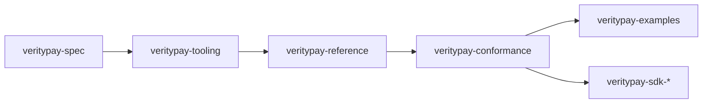

**Document:** Phase II Platform Plan · **Version:** 1.0.0 · **Status:** canonical (strategic; not normative)

**Related:** [GOVERNANCE.md](GOVERNANCE.md) · [SPECIFICATION_STATUS.md](../../SPECIFICATION_STATUS.md) · [SPECIFICATION_RELEASE_PROCESS.md](SPECIFICATION_RELEASE_PROCESS.md) · [CONFORMANCE_MODEL.md](../03-development/CONFORMANCE_MODEL.md) · [VP-RFC-0000](../../rfcs/0000-rfc-process.md)

---

# Phase II Platform Plan

**How does VerityPay move from written specification to a living, verifiable platform?**

Phase I established the **specification corpus**: constitutional layer, Architecture Alpha, governance process, terminology and RFC registries, and conformance model in prose. That work answers *what VerityPay is* and *how it may change*.

**Phase II** builds the **Specification Platform**—the repository ecosystem, tooling, and executable artifacts that let the specification be **validated, executed, and tested** without collapsing specification and implementation into one codebase.

This document is **strategic**. It is not an implementation guide, does not define protocol behavior, and does not replace accepted RFCs or published Editions. It explains **which repositories should exist**, **why they exist**, **how they depend on each other**, and **what must exist before contributors are invited into implementation work**.

For current maturity, see [SPECIFICATION_STATUS.md](../../SPECIFICATION_STATUS.md).

---

## Phase II goal

Phase II turns the VerityPay specification from a **document set** into a **platform**:

| Capability | Phase I | Phase II |
|------------|---------|----------|
| Normative text | Authored and reviewed | Edition-ready; registries machine-readable |
| Traceability | Manual cross-reference | Automated validation of links, IDs, and metadata |
| Semantics | Described in architecture models | Executable in a reference interpreter |
| Conformance | Scenarios defined in prose (VP-CS) | At least one scenario runnable end-to-end |
| Contributor entry | Specification and RFC process | Labeled, scoped implementation issues in dedicated repos |

**Success is not feature velocity.** Success is **institutional readiness**: a funder, auditor, or new contributor can verify that the specification is internally consistent, partially executable, and open to plural implementation—without private coordination.

Phase II completes when the platform can support **Genesis Edition publication** and **contributor-ready implementation work**, not when a production product ships.

---

## Repository ecosystem

Each repository has a single primary responsibility. Overlap is intentional at interfaces (e.g. conformance vectors consumed by reference and suite); duplication of normative text is not.

### `veritypay-spec`

| Field | Definition |
|-------|------------|
| **Purpose** | Canonical home of the VerityPay protocol: constitutional layer, architecture, governance, RFCs, and machine-readable registries |
| **Responsibility** | Normative and informative specification text; accepted RFCs; VP-TERM, VP-RFC, and (future) VP-CS, VP-EDITION registries; Edition manifests when published |
| **Non-responsibilities** | Executable code; reference interpreter; CI for implementation repos; SDKs; deployment; product applications |
| **Depends on** | Nothing upstream (source of truth) |
| **Outputs** | Reviewed documents; registry YAML; Edition Manifest; audit trail via git history and RFC acceptance |

### `veritypay-tooling`

| Field | Definition |
|-------|------------|
| **Purpose** | Specification hygiene automation: validate registries, cross-references, RFC metadata, and Edition manifest structure |
| **Responsibility** | CLI and library tools run in CI against `veritypay-spec`; link checkers; registry schema validation; optional generators (registry sync, manifest drafts) |
| **Non-responsibilities** | Protocol semantics; claim evaluation; conformance pass/fail for implementations; normative spec edits |
| **Depends on** | `veritypay-spec` (paths, schemas, registry formats defined or documented there) |
| **Outputs** | Validated spec PRs; CI reports; reusable validators consumable by other repos |

### `veritypay-reference`

| Field | Definition |
|-------|------------|
| **Purpose** | Reference interpreter that evaluates VerityPay claims and state transitions according to the accepted specification |
| **Responsibility** | Minimal, readable execution of normative semantics; test vectors for internal development; API surface for conformance runners |
| **Non-responsibilities** | Production performance; full product features; payroll UI; blockchain adapters; replacing independent implementations |
| **Depends on** | `veritypay-spec` (Edition / document pins); `veritypay-tooling` (shared types, validation helpers where appropriate) |
| **Outputs** | Executable semantics; minimal claim verification; hooks for VP-CS scenarios |

### `veritypay-conformance`

| Field | Definition |
|-------|------------|
| **Purpose** | Executable conformance suite for VP-CS scenarios and future certification prep |
| **Responsibility** | Scenario definitions (or imports from spec); runners that invoke reference or adapter interfaces; pass/fail reporting tied to Edition and Protocol Version |
| **Non-responsibilities** | Authoring normative scenario text (authoritative prose remains in spec); product QA; vendor-specific test harnesses |
| **Depends on** | `veritypay-spec` (VP-CS definitions); `veritypay-reference` (default oracle for expected outcomes) |
| **Outputs** | Runnable VP-CS suite; CI badge inputs; evidence for self-declared conformance |

### `veritypay-examples`

| Field | Definition |
|-------|------------|
| **Purpose** | Educational and integrator-facing examples that demonstrate correct usage without being normative |
| **Responsibility** | Small, documented flows (claim creation, verification, state transitions); README-driven walkthroughs; links to Edition and Protocol Version |
| **Non-responsibilities** | Defining protocol rules; replacing conformance tests; production deployment patterns |
| **Depends on** | `veritypay-spec`; `veritypay-reference` and/or future SDKs |
| **Outputs** | Copy-paste-friendly samples; onboarding material for implementers |

### Future SDK repositories (`veritypay-sdk-*`)

| Field | Definition |
|-------|------------|
| **Purpose** | Language-specific libraries for integrators (e.g. TypeScript, Rust, Python) |
| **Responsibility** | Ergonomic APIs aligned with architecture models; conformance declaration in README; version pins to Edition |
| **Non-responsibilities** | Normative specification; being the only allowed implementation; protocol invention |
| **Depends on** | Published Protocol Version; `veritypay-spec`; `veritypay-conformance` (recommended CI dependency) |
| **Outputs** | Published packages; integration 'matrix vs Edition |

*SDK repositories are explicitly **deferred** until Phase II milestones through F are substantially complete.*

### `.github` (organization repository)

| Field | Definition |
|-------|------------|
| **Purpose** | Organization-wide defaults: issue templates, PR templates, security policy, community health files, reusable workflows |
| **Responsibility** | Consistent contributor experience across repos; org-level SECURITY.md and profile README; shared workflow snippets (spec validation, conformance smoke) |
| **Non-responsibilities** | Application code; specification text; per-repo release mechanics |
| **Depends on** | Mature enough repo list to know which templates apply (after tooling scaffold) |
| **Outputs** | Templates; org profile; optional reusable GitHub Actions |

---

## Dependency order

Repositories must be stood up in dependency order. Building a reference interpreter before registry validation invites drift between documents and code.



**Linear spine:**

```
veritypay-spec
    → veritypay-tooling
        → veritypay-reference
            → veritypay-conformance
                → veritypay-examples / SDKs
```

### Why tooling comes before the reference interpreter

| Reason | Explanation |
|--------|-------------|
| **Specification is upstream** | The interpreter must implement *accepted* text. Tooling ensures IDs, links, and registry entries in that text are consistent before semantics are coded. |
| **Fail fast on structural errors** | Broken VP-TERM references, invalid RFC metadata, and orphan cross-links are cheaper to fix in CI than to debug as "interpreter bugs." |
| **Edition readiness** | [SPECIFICATION_RELEASE_PROCESS.md](SPECIFICATION_RELEASE_PROCESS.md) requires reproducible bundles. Tooling validates manifest and registry shape before an Edition is declared publishable. |
| **Contributor signal** | When tooling is green, implementation contributors work against a verified corpus—not a moving wiki. |
| **Audit trail** | Grant reviewers and auditors can separate *specification defects* (caught by tooling) from *implementation defects* (caught by conformance). |

The reference interpreter interprets **validated** specification material. It does not substitute for specification review.

---

## Phase II milestones

Milestones are **capability-based**, not calendar-based. Each milestone produces auditable outputs.

| ID | Milestone | Description | Primary repo |
|----|-----------|-------------|--------------|
| **A** | Tooling scaffold | Repository created; CI skeleton; documents which validators will exist; runs noop or stub checks on `veritypay-spec` | `veritypay-tooling` |
| **B** | Registry validation | VP-TERM and VP-RFC registries validate against schema; glossary sync rules documented or automated | `veritypay-tooling` |
| **C** | Cross-reference validation | Broken internal links, unknown VP-TERM / VP-RFC IDs, and RFC front-matter rules fail CI | `veritypay-tooling` |
| **D** | Reference interpreter scaffold | Repository layout, Edition pin, ADR for language/runtime, stub entrypoint | `veritypay-reference` |
| **E** | First executable claim verification | Reference interpreter evaluates one minimal claim (happy path) aligned with Architecture Alpha | `veritypay-reference` |
| **F** | Conformance scenario runner | At least VP-CS-0001 (or agreed minimal scenario) runs against reference | `veritypay-conformance` |
| **G** | Contributor-ready implementation issues | Labeled issues in reference, conformance, examples, and tooling repos with scope, Edition target, and definition of done | All implementation repos |

**Milestone G** is the gate for **broad implementation contributor invitation**. Until G, contributions are welcome on tooling, tests, docs, and examples—but not unscoped protocol or architecture changes.

---

## What not to build yet

The following are **explicitly deferred** past Phase II core milestones. Mentioning them in grants as future phases is appropriate; building them now risks inverting specification-first order.

| Deferred item | Rationale |
|---------------|-----------|
| **SDKs** | Require stable Protocol Version and runnable conformance baseline |
| **Production payroll application** | Product layer; not specification platform |
| **Blockchain integration** | Integration concern; normative payment semantics must be Edition-pinned first |
| **Stellar / Trustless Work adapter** | External system adapter; belongs after reference + conformance exist |
| **ZK layer** | Research and specialized trust assumptions; not Phase II platform scope |
| **Public specification website** | Valuable after Edition and registries stabilize; tooling can serve CI first |
| **Certification program** | Policy and economics undefined; requires mature VP-CS automation and multiple implementations |

Deferred work may continue in [`../04-research/`](../04-research/) as **non-normative** exploration. Promotion requires RFC.

---

## Grant readiness

Phase II strengthens positioning for funders (including **GrantFox**, **Stellar Development Foundation**, and similar public-good programs) by making deliverables **inspectable** rather than narrative.

| Theme | What Phase II demonstrates |
|-------|---------------------------|
| **Specification-first** | Normative behavior lives in `veritypay-spec`; code demonstrates, does not define |
| **Traceability** | VP-TERM, VP-RFC, and document cross-links are machine-validated |
| **Conformance** | VP-CS scenarios move from prose to executable checks |
| **Executable spec** | Reference interpreter proves semantics are operational, not aspirational |
| **Contributor onboarding** | Org templates, scoped issues, and examples lower barrier without compromising governance |
| **Public-good infrastructure** | Repositories are separable, forkable, and auditable—aligned with open protocol stewardship |

Grant narratives should cite **milestone outputs** (green CI on registries, runnable VP-CS-0001, Edition manifest draft) rather than headcount or lines of code.

---

## Contributor policy during Phase II

Phase II invites **platform contributors** while **protocol architecture remains frozen** unless changed through RFC.

### Encouraged contribution areas

| Area | Examples |
|------|----------|
| **Tooling** | Registry validators, link checkers, manifest helpers |
| **Reference interpreter** | Semantics aligned with Architecture Alpha and accepted RFCs |
| **Conformance** | Scenario runners, fixtures, reporting |
| **Examples** | Walkthroughs, sample claims, integration sketches |
| **Documentation** | Clarifications, diagrams, SPECIFICATION_STATUS updates |
| **Tests** | Vectors that encode accepted spec behavior |

### Restricted without RFC

| Area | Rule |
|------|------|
| **Architecture Alpha models** | Structural changes require RFC per [GOVERNANCE.md](GOVERNANCE.md) |
| **Normative protocol behavior** | RFC per [VP-RFC-0000](../../rfcs/0000-rfc-process.md) |
| **Constitutional layer** | Same public process as specifications |
| **Implementation-driven protocol invention** | Rejected; propose RFC first |

**Principle:** Contributors may help **validate and execute** the specification. They may not **silently redefine** it in implementation repositories.

Maintainers label issues **good first issue**, **help wanted**, and **Edition: Genesis** (or successor) so scope is visible before assignment.

---

## Success criteria

Phase II **succeeds** when all of the following are true:

| # | Criterion | Evidence |
|---|-----------|----------|
| 1 | **Registries can be validated** | CI in `veritypay-tooling` validates VP-TERM and VP-RFC registries on every spec PR |
| 2 | **Broken links are detected** | Cross-reference validation fails CI on orphan IDs or broken internal links |
| 3 | **RFC metadata is validated** | RFC front matter and registry entries conform to agreed schema |
| 4 | **Reference interpreter evaluates a minimal claim** | Documented happy-path claim verification in `veritypay-reference` |
| 5 | **At least one conformance scenario runs** | VP-CS (minimum agreed set) executable via `veritypay-conformance` |
| 6 | **Implementation issues are contributor-ready** | Milestone G issues published with scope, Edition target, and definition of done |

When these criteria are met, the project may:

- Advance Genesis Edition toward publication candidate
- Invite broader implementation contributors
- Reference Phase II outcomes in grant reporting

Phase II does **not** require SDKs, production applications, or independent vendor implementations—that is subsequent ecosystem growth.

---

## Relationship to other documents

| Document | Relationship |
|----------|--------------|
| [SPECIFICATION_STATUS.md](../../SPECIFICATION_STATUS.md) | Public dashboard; update when Phase II milestones complete |
| [SPECIFICATION_RELEASE_PROCESS.md](SPECIFICATION_RELEASE_PROCESS.md) | Edition publication after platform validation |
| [SPECIFICATION_VERSIONING.md](SPECIFICATION_VERSIONING.md) | Edition and Protocol Version pins for all implementation repos |
| [CONFORMANCE_MODEL.md](../03-development/CONFORMANCE_MODEL.md) | Authoritative VP-CS prose; conformance repo executes |
| [GOVERNANCE.md](GOVERNANCE.md) | RFC and Architecture Alpha freeze during Phase II |
| [CONTRIBUTING.md](../../CONTRIBUTING.md) | Contributor handbook; operational detail |

---

## Change log

| Version | Date | Summary |
|---------|------|---------|
| 1.0.0 | 2026-06-29 | Initial Phase II platform plan |

---

*Phase II builds the infrastructure of trust around the specification. Implementation products come after the platform can prove what "conforming" means.*
