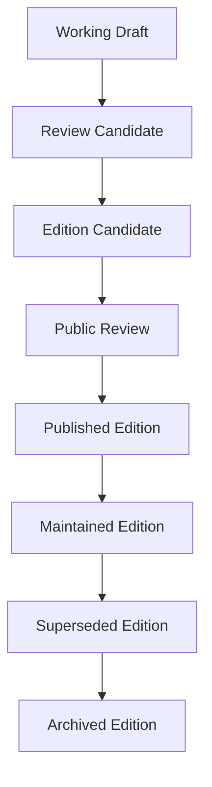
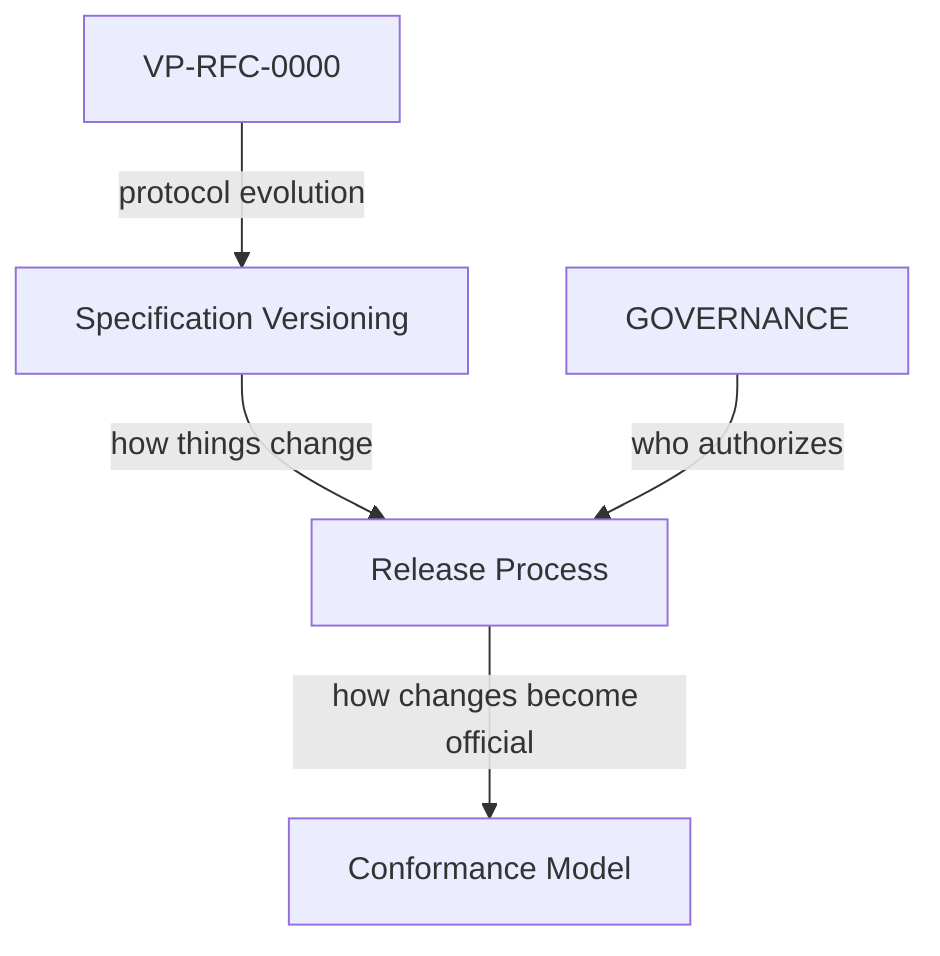

**Document:** Specification Release Process · **Version:** 1.0.0 · **Status:** canonical

**Related:** [SPECIFICATION_VERSIONING.md](SPECIFICATION_VERSIONING.md) · [GOVERNANCE.md](GOVERNANCE.md) · [VP-RFC-0000](../../rfcs/0000-rfc-process.md) · [CONFORMANCE_MODEL.md](../03-development/CONFORMANCE_MODEL.md)

---

# Specification Release Process

**How does a collection of specification work become an official VerityPay Edition?**

Writing specifications and **publishing** specifications are different activities.

Authors iterate documents continuously. Reviewers debate RFCs. Registries grow. That work is essential—but it is not yet an **institutional commitment** to the ecosystem.

**Publication** is the moment VerityPay declares: *this reviewed snapshot is a stable reference*. An Edition is not a software release. It is a **named, reproducible bundle** of shared understanding that implementers, auditors, and partners may cite for years.

This document defines the **release process**—how reviewed work becomes a published Edition. [SPECIFICATION_VERSIONING.md](SPECIFICATION_VERSIONING.md) defines **what** is versioned; this document defines **how** a versioned collection is published.

---

## Release philosophy

| Principle | Meaning |
|-----------|---------|
| **Editions are deliberate** | Publication is a decision, not an accident of calendar time |
| **Stability over speed** | The ecosystem needs references that outlive sprint cycles |
| **Long-lived reference** | A published Edition remains citable after authors move on |
| **Drafts continue independently** | Documents may evolve toward the next Edition without erasing the last |

Publication is **intentionally slower** than authoring because:

- Integrators plan multi-year roadmaps against published baselines
- Auditors require frozen pins, not moving targets
- Conformance claims must bind to identifiable rule sets
- Trust accrues when history is preserved, not rewritten

An Edition does not end specification work—it **anchors** it.

---

## Release lifecycle

An Edition moves through institutional states distinct from individual RFC or document status.



### States

| State | Meaning |
|-------|---------|
| **Working Draft** | Edition scope forming; documents and RFCs in flux; no publication promise |
| **Review Candidate** | Intended document set identified; internal coherence review underway |
| **Edition Candidate** | Release readiness checklist satisfied; manifest draft exists |
| **Public Review** | Community comment on the bundle as a whole—not only individual RFCs |
| **Published Edition** | Institutional commitment; Edition Manifest issued; Protocol Version declared |
| **Maintained Edition** | Published Edition receives editorial fixes only (typos, links); no normative change |
| **Superseded Edition** | A later Edition replaces normative authority; prior Edition remains accessible |
| **Archived Edition** | Terminal historical state; no longer active for new conformance declarations |

### Responsibility and transitions

| Transition | Typical actor | Purpose |
|------------|---------------|---------|
| Working Draft → Review Candidate | Principal Architect or Release steward | Freeze intended scope; begin bundle review |
| Review Candidate → Edition Candidate | Release steward + Maintainers | Confirm readiness checklist |
| Edition Candidate → Public Review | Maintainers | Seek ecosystem comment on the whole snapshot |
| Public Review → Published Edition | Maintainer(s) per [GOVERNANCE.md](GOVERNANCE.md) | Issue manifest; declare Protocol Version |
| Published → Maintained | Maintainer | Editorial maintenance window |
| Maintained → Superseded | Maintainer when successor publishes | Preserve history; redirect normative authority |
| Superseded → Archived | Maintainer | Housekeeping |

No single contributor may **publish** an Edition without Maintainer authorization recorded in the Edition Manifest and governance record.

---

## Release readiness

An Edition is ready for **Edition Candidate** only when every item below is satisfied. Each exists because publication without it fractures traceability or interoperability.

| Readiness item | Why it exists |
|----------------|---------------|
| **All required RFCs accepted** | No draft normative behavior in a published bundle |
| **Terminology synchronized** | Glossary and [`spec/terminology/registry.yaml`](../../spec/terminology/registry.yaml) align; no orphan **VP-TERM-*** |
| **Architecture references valid** | Section IDs (**DM-***, **IM-***, etc.) resolve; models internally coherent |
| **VP-TERM registry synchronized** | Machine-readable terms match human glossary |
| **RFC registry synchronized** | [`spec/rfcs/registry.yaml`](../../spec/rfcs/registry.yaml) lists accepted **VP-RFC-*** through cutoff |
| **Cross-document references valid** | No broken internal links in pinned document set |
| **Conformance scenarios aligned** | VP-CS baseline matches Protocol Version semantics |
| **Document versions pinned** | Each included spec has explicit `version` in manifest |
| **Protocol Version declared** | Implementer-facing rule label assigned per [SPECIFICATION_VERSIONING.md](SPECIFICATION_VERSIONING.md) |
| **Internal coherence agreed** | Principal Architect + Maintainers attest bundle is consistent |

Failure on any item returns the Edition to **Review Candidate** until resolved. Partial publication is not permitted.

---

## Edition Manifest

Every **published Edition MUST** include an **Edition Manifest**—a single machine-readable description of exactly what was published.

### Purpose

- Give implementers one artifact to cite
- Enable reproducibility and audit
- Anchor registry snapshots to a publication event
- Support future automation without parsing prose documents

### Illustrative fields (intent only)

| Field | Intent |
|-------|--------|
| `edition` | Human name (e.g. `Genesis`) |
| `edition_id` | Stable identifier (e.g. `vp-edition-genesis-1`) |
| `protocol_version` | Declared Protocol Version (e.g. `vp-protocol-1.0`) |
| `publication_date` | ISO date of publication |
| `status` | `published` \| `maintained` \| `superseded` \| `archived` |
| `specification_documents` | Map of document path → pinned version |
| `accepted_rfcs` | List of **VP-RFC-*** through cutoff |
| `registry_snapshots` | References to terminology and RFC registry revisions at publication |
| `conformance_baseline` | VP-CS scenario set included |
| `supersedes` | Prior edition_id, if any |
| `integrity` | Reserved for future checksums or signatures |

Exact schema, location, and tooling are **not** defined here. The manifest is an institutional artifact; its format may evolve by Meta RFC.

### Illustrative YAML example

```yaml
# Illustrative only — not normative schema
edition: Genesis
edition_id: vp-edition-genesis-1
protocol_version: vp-protocol-1.0
publication_date: 2026-12-01
status: published

specification_documents:
  docs/00-overview/MANIFESTO.md: "0.1.0"
  docs/00-overview/VISION.md: "0.1.0"
  docs/00-overview/PRINCIPLES.md: "0.1.0"
  docs/00-overview/GLOSSARY.md: "1.8.0"
  docs/01-architecture/DOMAIN_MODEL.md: "0.3.0"
  # ... additional pinned documents

accepted_rfcs:
  - VP-RFC-0000

registry_snapshots:
  terminology: spec/terminology/registry.yaml@rev-2026-12-01
  rfcs: spec/rfcs/registry.yaml@rev-2026-12-01

conformance_baseline:
  - VP-CS-0001
  # ... scenarios at publication

supersedes: null
integrity: reserved
```

---

## Publication principles

| Principle | Why it matters |
|-----------|----------------|
| **No unpublished normative behavior** | Everything binding in an Edition was accepted through public RFC process |
| **No hidden specification** | The manifest is the complete normative closure for the Protocol Version |
| **Every Edition is reproducible** | Pins + registry snapshots reconstruct what was published |
| **Traceability preserved** | RFC → term → section → scenario chain documented |
| **History never rewritten** | Superseded Editions remain accessible; manifests immutable except editorial metadata |
| **Superseded Editions remain accessible** | Auditors compare eras; integrators migrate deliberately |

Publication is an act of **trust**. These principles protect that trust across organizational change.

---

## Compatibility and migration

Publishing a new Edition does **not** invalidate previous Editions.

| Party | Choice |
|-------|--------|
| **Implementers** | MAY remain on an earlier Edition and Protocol Version until ready to migrate |
| **New work** | SHOULD target the latest Published Edition unless contractually bound otherwise |
| **Migration** | Governed by accepted RFCs documented in release notes and manifest delta |

Editions provide **stable migration targets**: move from `vp-edition-genesis-1` to a successor when RFC migration paths and conformance baselines are understood—not when a repository tags a build.

---

## Publication outputs

| Artifact | Purpose |
|----------|---------|
| **Edition Manifest** | Authoritative machine-readable record of what was published |
| **Protocol Version declaration** | Implementer-facing rule label ([VP-TERM-028](../00-overview/GLOSSARY.md#specification-version) binding) |
| **Pinned document versions** | Human-readable specification at exact revisions |
| **Accepted RFC registry snapshot** | Frozen **VP-RFC-*** set for the Edition |
| **Terminology registry snapshot** | Frozen **VP-TERM-*** set for the Edition |
| **Release notes** | Human summary: themes, breaking changes, migration highlights |
| **Conformance baseline** | VP-CS scenarios required for the Edition's Protocol Version |
| **Publication announcement** | Public notice that an Edition is citeable (channel not prescribed here) |

Together these outputs transform reviewed work into **infrastructure** the ecosystem can reference without contacting authors.

---

## Future automation

Vision for publication tooling (no implementation prescribed):

| Capability | Intent |
|------------|--------|
| **Edition builder** | Assemble candidate bundle from pins and registries |
| **Manifest generator** | Produce manifest from validated inputs |
| **Registry validation** | Terminology and RFC registries complete and consistent |
| **Cross-reference validation** | Internal links and section IDs resolve in pinned set |
| **Release verification** | Readiness checklist enforced before Public Review |
| **Publication site generation** | Human-readable Edition pages from manifest |
| **Dependency graph generation** | RFC → term → section → scenario for the Edition |

Automation supports stewards; **Maintainer authorization** remains required to publish.

---

## Worked example: Genesis Edition

A realistic path to the first published Edition.

### 1. Working Draft

Constitutional documents, Architecture Alpha, conformance model, governance canon, **VP-RFC-0000**, and registries mature in public review. Individual document versions increment (`GLOSSARY` `1.7` → `1.8`, etc.). No Edition promise yet.

### 2. Review Candidate

Release steward proposes scope: Genesis Edition includes constitutional layer, five architecture models, conformance model, governance set (including versioning and this release process), and **VP-RFC-0000** only. RFC cutoff date set. Principal Architect reviews cross-model coherence.

### 3. Edition Candidate

Readiness checklist run:

- **VP-RFC-0000** accepted; no other RFCs required for Genesis scope
- Registries synchronized; VP-CS-0001–0005 aligned with draft Protocol semantics
- Manifest draft: `vp-edition-genesis-1`, `vp-protocol-1.0`, pins recorded

### 4. Public Review

Thirty-day public comment on the **bundle**. Issues address manifest pins or editorial gaps—not new normative behavior (which would require new RFCs and delay publication).

### 5. Publication

Maintainers authorize publication. Edition Manifest issued. **Protocol Version `vp-protocol-1.0`** declared. Genesis Edition status: **Published**.

### 6. Maintained and beyond

Typos fixed under **Maintained** policy; document versions may bump editorially without new Edition. Work on Edition Two begins in Working Draft: new RFCs accumulate; `GLOSSARY` continues toward `1.9` without invalidating Genesis pins.

When Edition Two publishes, Genesis becomes **Superseded**—manifest and documents remain accessible forever.

---

## Relationship to other documents



| Document | Role |
|----------|------|
| [VP-RFC-0000](../../rfcs/0000-rfc-process.md) | How normative protocol change is proposed and accepted |
| [SPECIFICATION_VERSIONING.md](SPECIFICATION_VERSIONING.md) | Editions, Protocol Versions, document versions |
| **This document** | How reviewed work becomes a published Edition |
| [CONFORMANCE_MODEL.md](../03-development/CONFORMANCE_MODEL.md) | How implementations demonstrate alignment with an Edition |
| [GOVERNANCE.md](GOVERNANCE.md) | Roles, authority, and Maintainer publication approval |

---

## Closing

A specification becomes infrastructure not when it is written,

but when it is **published**,

**referenced**,

**implemented**,

and **preserved**.

Publication is the handshake between authors and the ecosystem: *this is the agreement we stand behind until the next Edition.*

---

## Changelog

| Version | Date | Summary |
|---------|------|---------|
| 1.0.0 | 2026-06-29 | Initial canonical release process |
