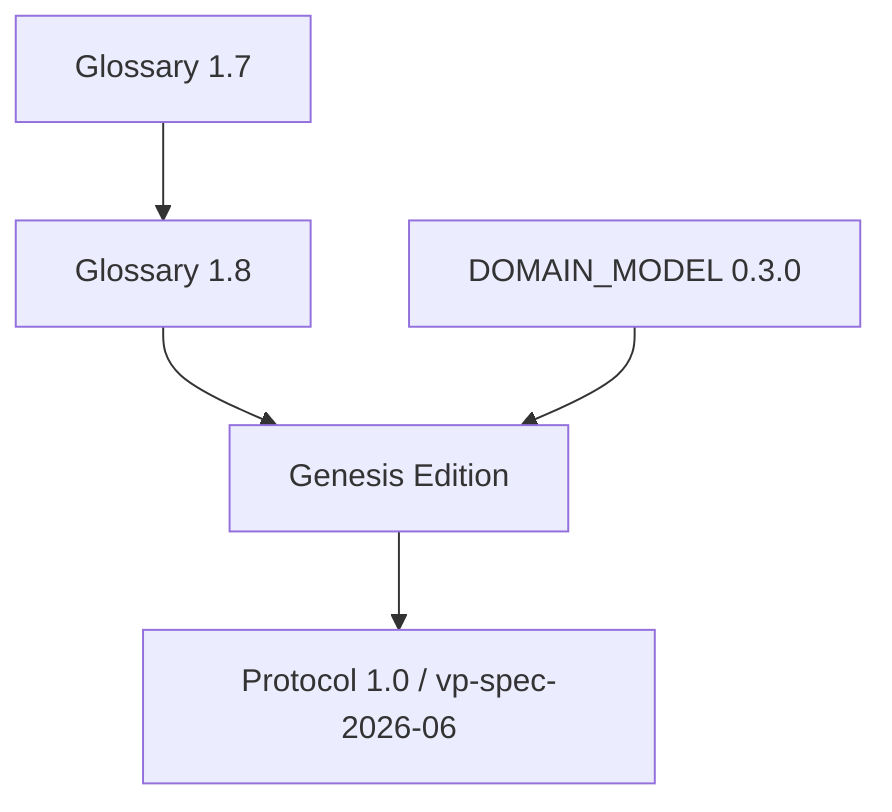
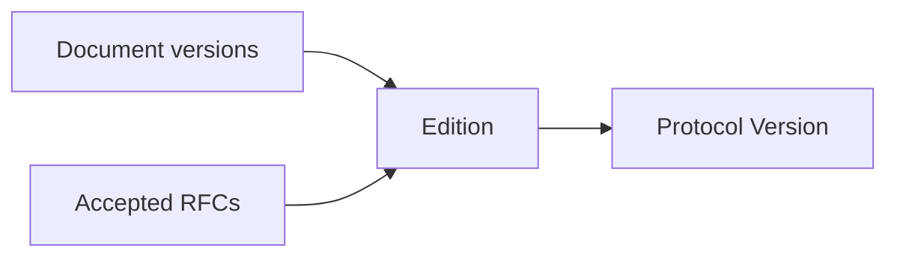
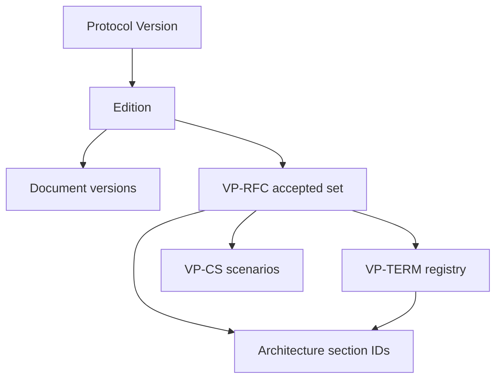

**Document:** Specification Versioning · **Version:** 1.0.0 · **Status:** canonical

**Related:** [GOVERNANCE.md](GOVERNANCE.md) · [VP-RFC-0000](../../rfcs/0000-rfc-process.md) · [CONFORMANCE_MODEL.md](../03-development/CONFORMANCE_MODEL.md) · [GLOSSARY.md](../00-overview/GLOSSARY.md) (**VP-TERM-028**)

---

# Specification Versioning

When someone says they **implement VerityPay**, what exactly are they implementing?

They are not implementing a repository tag, a Docker image, or a marketing release name. They are implementing a **declared slice of shared understanding**: a set of definitions, rules, and behaviors that other parties can rely on without bilateral negotiation.

Software versions **binaries**. Specifications version **understanding**. Protocols version **agreement**.

This document defines how VerityPay versions that agreement—without reference to source-control tags, package semver, or implementation release trains. Those are engineering concerns. This is **protocol evolution**.

---

## Three independent version axes

VerityPay separates versioning into three axes that MUST NOT be conflated:

| Axis | What it versions | Who cares most | Example |
|------|------------------|----------------|---------|
| **Edition** | A published, reviewed **collection** of specifications | Publishers, auditors, grant milestones | *Genesis Edition* |
| **Protocol Version** | **Normative protocol behavior** the ecosystem must share | Implementers, integrators, conformance | `vp-protocol-1.0` |
| **Document version** | A single specification **document** as it drafts and matures | Authors, reviewers, editors | Glossary `1.8.0`, DOMAIN_MODEL `0.3.0` |

### Edition

An **Edition** is a coherent snapshot: a named bundle of specification documents and accepted RFCs that were **reviewed together** for internal consistency before publication.

Editions are **published events**—not continuous streams. They answer: *Which bookshelf of VerityPay specification did we freeze for the world?*

### Protocol Version

A **Protocol Version** is the implementer-facing identifier for **normative behavior**: which rules govern claims, verification, outcomes, and interoperability at a point in time.

In protocol prose and on artifacts, this is what [VP-TERM-028](../00-overview/GLOSSARY.md#specification-version) calls **specification version**—the rule bundle under which verification is interpreted (e.g. `vp-spec-2026-06`). **This governance document uses *Protocol Version* for that concept** to distinguish it from per-document versions below.

Protocol Versions change when **shared meaning** changes—not when prose is copy-edited.

### Document version

Every specification **document** carries its own `version` in front matter. Documents evolve continuously through draft, review, and RFC incorporation **before** an Edition freezes them.

| Document | Illustrative document version |
|----------|------------------------------|
| [MANIFESTO.md](../00-overview/MANIFESTO.md) | `0.1.0` |
| [GLOSSARY.md](../00-overview/GLOSSARY.md) | `1.8.0` |
| [DOMAIN_MODEL.md](../01-architecture/DOMAIN_MODEL.md) | `0.3.0` |
| [CONFORMANCE_MODEL.md](../03-development/CONFORMANCE_MODEL.md) | `0.1.0` |
| [GOVERNANCE.md](GOVERNANCE.md) | `0.1.0` |

An Edition **pins** one document version of each included spec. After publication, documents may continue iterating toward the **next** Edition without invalidating the prior Edition's pin.

---

## Edition

### Genesis Edition

**Genesis Edition** is the first published, reviewed collection establishing VerityPay's constitutional layer, Architecture Alpha, conformance model, governance, and initial RFC process (**VP-RFC-0000**).

Until Genesis Edition is formally published, documents remain draft or informative per their front matter—valuable for authors, not yet the published agreement integrators should cite in production conformance declarations.

### Future editions

Future Editions (e.g. a second major publication) bundle:

- Updated document versions
- A declared **Protocol Version**
- The set of **accepted RFCs** through a cutoff date
- Registry snapshots ([terminology](../../spec/terminology/registry.yaml), [RFCs](../../spec/rfcs/registry.yaml)) as applicable

### What belongs in an Edition

| Included | Excluded |
|----------|----------|
| Constitutional documents (as adopted) | Draft RFCs |
| Architecture models (as incorporated) | Rejected RFCs |
| Accepted RFCs through cutoff | Implementation repository versions |
| Conformance model and published VP-CS scenarios | Product roadmaps |
| Governance and versioning policy (this document) | ADRs (engineering memory) |

**Implementers SHOULD reference an Edition and Protocol Version** in conformance declarations whenever possible—not individual document versions in isolation. See [SPECIFICATION_RELEASE_PROCESS.md](SPECIFICATION_RELEASE_PROCESS.md) for how Editions are published.

---

## Protocol Version

### What changes Protocol Version

A new **Protocol Version** is required when conforming implementations would **need to change behavior** or **declare different rules** to remain interoperable:

| Change | Protocol Version |
|--------|:----------------:|
| New protocol behavior (accepted Protocol RFC) | Yes |
| New or amended normative terminology (**VP-TERM-***) | Yes |
| New or amended conformance rules (VP-CS) | Yes |
| Architecture **semantic** change (models or section IDs with normative effect) | Yes |
| New claim types or verification rules | Yes |
| Deprecation with migration that affects evaluation | Yes |

### What does NOT change Protocol Version

| Change | Protocol Version |
|--------|:----------------:|
| Typos and broken links | No |
| Examples and pedagogical prose | No |
| Clarifications with **no** normative meaning change | No |
| Formatting and structure | No |
| Editorial improvements explicitly classified as non-normative | No |

When in doubt, ask: *Would two independent implementers, both acting in good faith, produce different verification outcomes for the same inputs?* If yes, Protocol Version moves. If no, document version may suffice.

Protocol Version identifiers SHOULD be **stable strings** chosen at publication (e.g. `vp-protocol-1.0`, `vp-spec-2026-06`) and recorded in Edition manifests and conformance declarations.

---

## Document version

Each specification document versions **independently** while drafting:

- **Constitutional** — Manifesto, Vision, Principles, Glossary
- **Architecture** — Domain, Identity, Behavior, Data, State models
- **Development** — Conformance model
- **Governance** — Governance, ADR guide, this document
- **RFCs** — per-file `version` in RFC front matter

Documents MAY iterate many times before an Edition pins them. Multiple document revisions often roll up into **one** Protocol Version bump at Edition publication.

**RFC acceptance** typically bumps affected document versions and may bump Protocol Version when behavior changes—see [What requires version changes](#what-requires-version-changes).

---

## Version relationships

Multiple document revisions can belong to one Protocol Version. One Edition bundles one Protocol Version and many pinned document versions.

**Reading the diagram:** Glossary may move `1.7` → `1.8` while drafting; Genesis Edition **pins** `1.8` together with other documents; the Edition **declares** Protocol `1.0`. Later document edits toward Edition 2 do not retroactively change what Genesis Edition pinned.

---

## Compatibility

| Term | Meaning | Example |
|------|---------|---------|
| **Editorially compatible** | Same normative meaning; prose improved | Typo fix in Glossary; document version bumps |
| **Backward compatible** | New rules accept all behaviors old rules accepted | Additive optional claim field with unchanged evaluation for existing claims |
| **Forward compatible** | Old implementations safely ignore unknown extensions | New claim type ignored by older verifier with explicit `indeterminate` or specified rule |
| **Protocol incompatible** | Same inputs may yield different required outcomes | Changed verification outcome rules; requires new Protocol Version and migration |

Compatibility is **not** automatic. Authors MUST state compatibility class in RFCs. Implementers MUST NOT assume forward compatibility without specification text.

---

## What requires version changes

| Change | Document version? | Protocol Version? | Edition? |
|--------|:-----------------:|:-----------------:|:--------:|
| Typo in Glossary | Yes | No | No |
| Editorial clarification (no normative change) | Yes | No | No |
| New **VP-TERM-*** (Terminology RFC) | Yes | Often yes | Next publication |
| New protocol behavior (Protocol RFC) | Yes | Yes | Next publication |
| RFC accepted (normative) | Yes (affected docs) | If behavior changes | Next publication |
| New VP-CS conformance scenario | Yes (conformance doc) | If behavior tested is new | Next publication |
| Architecture **semantics** change | Yes | Yes | Next publication |
| Genesis / major publication freeze | Pins all | Declares | **Yes** |

**Edition** is not required for every RFC—only when the project **publishes** a new reviewed bundle. **Protocol Version** MUST move when interoperability semantics move.

---

## Release philosophy

| Mechanism | Nature | Purpose |
|-----------|--------|---------|
| **Document versions** | Continuous | Authors iterate; reviewers track draft maturity |
| **Protocol Versions** | Declared | Implementers bind conformance claims to shared rules |
| **Editions** | Published | Ecosystem receives a named, audited snapshot |

These are **intentionally separate**:

- Continuous document iteration keeps authoring agile without forcing integrators to chase every commit.
- Declared Protocol Versions give verifiers and auditors a **stable rule label** for claims and outcomes.
- Published Editions mark **milestones**—funding, certification, and public commitment—without freezing day-to-day editing between editions.

Software release trains remain in implementation repositories. They do not substitute for Protocol Version declaration.

---

## Traceability

VerityPay aims for a single traceability chain from public agreement down to testable artifacts:

Future tooling (vision only—no implementation prescribed here) SHOULD answer:

- *Which Edition includes this Protocol Version?*
- *Which document versions and RFCs constitute that Protocol Version?*
- *Which **VP-TERM-*** and section IDs changed between Protocol Versions?*
- *Which VP-CS scenarios must pass for conformance at that version?*

Implementations conform to a **composed specification** at a declared Protocol Version—not to isolated RFCs or documents ([VP-RFC-0000 §16](../../rfcs/0000-rfc-process.md#16-specification-law)).

---

## Future automation

Vision for specification versioning tooling:

| Capability | Intent |
|------------|--------|
| **Specification registry** | Index of all documents, versions, and status |
| **Edition manifests** | Machine-readable bundle: documents, RFCs, Protocol Version |
| **Protocol manifests** | Normative closure of RFCs + pins for a Protocol Version |
| **Version validation** | Detect undeclared normative drift between pins |
| **Dependency graphs** | RFC → term → section → scenario impact between versions |

Automation assists publishers and reviewers; **human judgment** remains required to classify editorial vs protocol change.

---

## Examples

### Example A — Typo in Glossary

**Change:** Fix spelling; no definition change.

| Axis | Moves? |
|------|--------|
| Glossary document version | Yes (`1.8.0` → `1.8.1`) |
| Protocol Version | No |
| Edition | No |

**Why:** Interoperability semantics unchanged. Existing conformance declarations remain valid.

---

### Example B — Accepted RFC changes verification semantics

**Change:** Protocol RFC amends **DM-4.8** and **VP-TERM-009**; two implementations would previously diverge on edge case; now MUST converge.

| Axis | Moves? |
|------|--------|
| Affected document versions | Yes (DOMAIN_MODEL, GLOSSARY, etc.) |
| Protocol Version | Yes (e.g. `vp-protocol-1.0` → `vp-protocol-1.1`) |
| Edition | Next published Edition incorporates the bump |

**Why:** Shared evaluation rules changed. Integrators MUST declare the new Protocol Version or remain on the old one with explicit migration.

---

### Example C — New VP-CS scenario only

**Change:** Conformance RFC adds VP-CS-0005; behavior under test already required by existing Protocol Version.

| Axis | Moves? |
|------|--------|
| CONFORMANCE_MODEL document version | Yes |
| Protocol Version | No (if no new normative behavior) |
| Edition | Optional at next publication |

**Why:** Testing surface expanded; law unchanged. If the scenario **introduces** new requirements, Protocol Version moves per RFC analysis.

---

### Example D — Genesis Edition publication

**Change:** Project publishes first reviewed bundle.

| Axis | Moves? |
|------|--------|
| Document versions | Pinned in Edition manifest |
| Protocol Version | Declared (e.g. `vp-protocol-1.0`) |
| Edition | **Genesis Edition** published |

**Why:** The ecosystem receives a named snapshot; implementers cite Edition + Protocol Version together.

---

## Closing

Software versions code.

Specifications version understanding.

Protocols version agreement.

Declare which agreement you implement. Publish when the bookshelf is ready. Iterate documents in the open—but move Protocol Version only when shared meaning moves.

For RFC-driven change, see [VP-RFC-0000](../../rfcs/0000-rfc-process.md). For conformance binding, see [CONFORMANCE_MODEL.md](../03-development/CONFORMANCE_MODEL.md). For the protocol term **specification version** on artifacts, see **VP-TERM-028** in [GLOSSARY.md](../00-overview/GLOSSARY.md).
