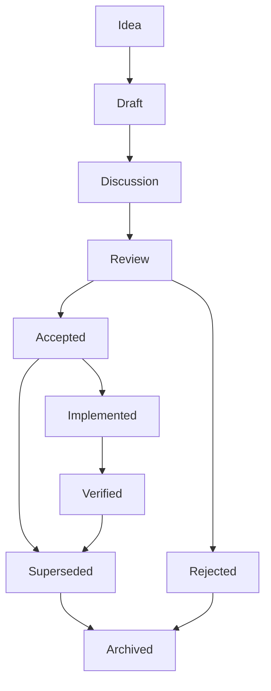
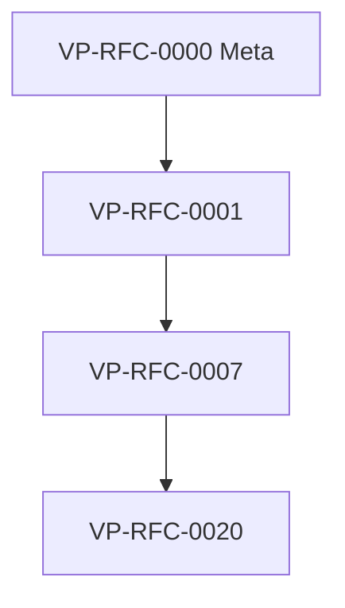

**Pyramid level:** specification (meta) · **Status:** accepted · **Version:** 1.1.0 · **Concept ID:** VP-RFC-0000

**Constitutional basis:** [PRINCIPLES.md](../docs/00-overview/PRINCIPLES.md), [GLOSSARY.md](../docs/00-overview/GLOSSARY.md)

**Related documents:** [GOVERNANCE.md](../docs/05-governance/GOVERNANCE.md) (roles and merge authority), [rfcs/README.md](README.md) (registry and index), [`spec/rfcs/registry.yaml`](../spec/rfcs/registry.yaml) (machine-readable index)

---

# RFC-0000: RFC Process

> *Protocols do not evolve because code changes.*
> *They evolve because shared understanding changes.*

---

## 1. Purpose

The VerityPay specification must evolve. Payment systems, regulatory context, and integrator needs change; a protocol that cannot change becomes irrelevant. Evolution must nevertheless be **deliberate**—not accidental, not driven by whichever implementation shipped first, and not negotiated in private between two vendors.

Every normative change requires **public reasoning**: a durable record of what problem was addressed, what was considered, what was chosen, and what implementers must do. Without that record, interoperability decays into folklore.

**Request for Comments (RFCs)** are the primary vehicle for normative evolution in VerityPay. They exist to preserve **institutional memory**—so that contributors who arrive years later can understand not only *what* the protocol requires, but *why* it requires it.

RFC-0000 (**VP-RFC-0000**) is **not** a protocol proposal. It does not define claims, verification, or conformance behavior. It defines the **process** every future RFC must follow. Think of it as the constitution of protocol evolution: the rules by which all other rules may change.

Operational roles, merge authority, and escalation paths are specified in [GOVERNANCE.md](../docs/05-governance/GOVERNANCE.md). This document defines the **intellectual and documentary contract** of the RFC system itself.

---

## 2. Goals

RFCs exist so that protocol evolution:

| Goal | Meaning |
|------|---------|
| **Encourages thoughtful design** | Authors must articulate problems and trade-offs before behavior binds implementers |
| **Documents reasoning** | Decisions survive personnel turnover and repository churn |
| **Records alternatives** | Rejected paths remain visible so debates are not endlessly reopened |
| **Improves interoperability** | Shared rules are explicit, versioned, and reviewable across independent codebases |
| **Avoids accidental protocol drift** | Behavior cannot become normative through implementation alone |
| **Preserves long-term clarity** | Future readers inherit vocabulary, architecture context, and migration paths |

An accepted RFC is a promise to the ecosystem: *if you implement this specification version, this is what the words mean.*

---

## 3. RFC principles

Every RFC should strive to:

- **Solve one problem well** — scope is narrow enough to review; impact is deep enough to matter
- **Minimize unintended consequences** — second-order effects on terminology, architecture, and conformance are named
- **Preserve interoperability** — independent implementations can still converge on outcomes
- **Preserve conceptual integrity** — new behavior fits existing models or amends them explicitly
- **Prefer explicit trade-offs over hidden assumptions** — costs and rejected paths belong in the document
- **Be understandable years after its authors have moved on** — a stranger can reconstruct intent from text alone
- **Improve the specification more than it increases its complexity** — every normative line earns its place

These principles guide **authors** during proposal design and **reviewers** during evaluation. They are the philosophy behind every RFC—not a substitute for the acceptance criteria in [§10](#10-acceptance-criteria), but the mindset those criteria enforce.

---

## 4. Non-Goals

RFCs are a specification instrument. They are **not** a substitute for every other form of project communication.

| RFCs are NOT | Use instead |
|--------------|-------------|
| **Bug reports** | Issue tracker entry with reproduction; RFC only if fixing the bug changes normative behavior |
| **Informal discussion threads** | Public comment on the RFC document during Draft and Discussion |
| **Implementation notes** | Implementation repositories; ADRs for local engineering history |
| **Project management** | Milestones, roadmaps, grant reporting |
| **Release notes** | Per-repository changelogs and version tags |
| **Architecture Decision Records (ADRs)** | ADRs record *how we chose to build*; RFCs record *what the protocol requires* (see [§14](#14-relationship-to-adrs)) |

Confusing these channels creates two failures: **specification bloat** (every idea becomes an RFC) and **specification evasion** (normative behavior hides in code comments). RFC-0000 draws the line clearly.

**RFCs change shared protocol meaning. ADRs change local implementation or process history.** Both may exist for one initiative; they answer different questions.

---

## 5. RFC lifecycle

An RFC moves through defined states. States are recorded in RFC front matter (`status`) and in the [machine-readable registry](../spec/rfcs/registry.yaml). Transitions are **documented**, not inferred from silence.



### States

| State | Meaning |
|-------|---------|
| **Idea** | A problem or opportunity is recognized; no normative text yet. May exist only as an issue or research note. |
| **Draft** | A numbered RFC document exists; author is shaping proposal text. Not binding. |
| **Discussion** | The draft is published for community comment. Scope, terminology, and trade-offs are actively debated. |
| **Review** | Author believes the document is complete; maintainers evaluate for acceptance. |
| **Accepted** | Merged as normative specification text. Implementations targeting this specification version **must** conform. |
| **Implemented** | At least one independent implementation is known to target the accepted text (informational tracking). |
| **Verified** | Conformance evidence exists—scenarios, audit, or equivalent (informational tracking). |
| **Superseded** | A later RFC replaces this one's normative authority; document retained for history. |
| **Archived** | Terminal historical state; no longer active for new work. |
| **Rejected** | Will not be adopted; rationale preserved to prevent repeated debate without new evidence. |

**Accepted** is the normative gate. **Implemented** and **Verified** describe ecosystem maturity—they do not create requirements by themselves.

### Who moves an RFC between states

| Transition | Typical actor |
|------------|----------------|
| Idea → Draft | Contributor or RFC Author (opens numbered RFC document) |
| Draft → Discussion | RFC Author (publishes for comment) |
| Discussion → Review | RFC Author (declares document ready) |
| Review → Accepted | Maintainer(s) per [GOVERNANCE.md](../docs/05-governance/GOVERNANCE.md) |
| Review → Rejected | Maintainer(s) with recorded rationale |
| Accepted → Implemented | RFC Author or Maintainer (updates `implementation_status`; informational) |
| Implemented → Verified | Maintainer or conformance steward (records evidence; informational) |
| Accepted / Verified → Superseded | Maintainer when successor RFC is accepted |
| Superseded / Rejected → Archived | Maintainer (housekeeping; document preserved) |

No individual may move an RFC to **Accepted** without the review outcome described in governance. Authors do not self-accept.

---

## 6. RFC types

RFCs are classified by **type** (declared in front matter as `type`) so reviewers know which lenses apply. Types are not mutually exclusive in impact—a Protocol RFC may still amend terminology—but primary type guides review staffing and approval bar.

| Type | Purpose | Typical scope | Approval requirements |
|------|---------|---------------|------------------------|
| **Protocol RFC** | Changes observable protocol behavior | Claim types, verification rules, lifecycles, interoperability requirements | Principal Architect + Maintainer(s); conformance impact required |
| **Terminology RFC** | Amends canonical vocabulary | [GLOSSARY.md](../docs/00-overview/GLOSSARY.md), **VP-TERM-*** IDs, deprecated terms | Maintainer(s); glossary and architecture alignment |
| **Architecture RFC** | Amends structural models | Domain, identity, behavior, data, or state models; **DM-***, **IM-***, etc. section IDs | Principal Architect mandatory; structural coherence review |
| **Governance RFC** | Amends how decisions are made | [GOVERNANCE.md](../docs/05-governance/GOVERNANCE.md), contributor policy, acceptance rules | Extended review; Maintainer(s) |
| **Conformance RFC** | Amends how compliance is assessed | [CONFORMANCE_MODEL.md](../docs/03-development/CONFORMANCE_MODEL.md), VP-CS scenarios | Maintainer(s) + conformance steward |
| **Documentation RFC** | Normative documentation not captured elsewhere | Stable spec documents, required cross-links | Reviewer + Maintainer |
| **Meta RFC** | Defines or amends the RFC process itself | This document and successors | Maintainer(s); broad comment period |

**Meta RFCs** are rare. **VP-RFC-0000** is the foundation; later meta RFCs must explicitly supersede or amend it.

When type is uncertain, classify by **what would break interoperability if implemented differently**.

---

## 7. Required metadata

Every RFC document MUST include the following front matter fields. Future tooling will validate them automatically; incomplete metadata blocks registry sync and cross-reference checks.

| Field | Required | Purpose |
|-------|----------|---------|
| `rfc` / `id` | Yes | Permanent numeric identifier (`0000`, `0001`, …) |
| `concept_id` | Yes when assigned | Globally unique **VP-RFC-*** identifier (see [§17](#17-rfc-registry)) |
| `title` | Yes | Human-readable name |
| `status` | Yes | Lifecycle state (see [§5](#5-rfc-lifecycle)) |
| `version` | Yes | Document revision semver |
| `type` | Yes | Primary RFC type (see [§6](#6-rfc-types)) |
| `authors` | Yes | Responsible authors |
| `reviewers` | Yes (may be empty `[]`) | Named reviewers; updated during review |
| `created` | Yes | ISO date first published |
| `updated` | Yes | ISO date last material edit |
| `depends_on` | Yes (may be `[]`) | **VP-RFC-*** or RFC numbers this RFC requires |
| `supersedes` | Yes (may be `[]`) | **VP-RFC-*** IDs this RFC replaces normatively |
| `superseded_by` | When applicable | Successor **VP-RFC-*** ID; `null` when active |
| `related_terms` | Yes (may be `[]`) | **VP-TERM-*** IDs touched |
| `related_architecture` | Yes (may be `[]`) | Section IDs touched (e.g. `DM-4.8`) |
| `related_conformance` | Yes (may be `[]`) | **VP-CS-*** scenario IDs touched |

Additional fields (`constitutional_refs`, `implementation_status`, etc.) SHOULD be present per [`templates/RFC_TEMPLATE.md`](templates/RFC_TEMPLATE.md).

The canonical machine-readable copy of registry fields lives in [`spec/rfcs/registry.yaml`](../spec/rfcs/registry.yaml), synchronized when RFC status changes.

---

## 8. Required RFC structure

Every RFC MUST contain the sections below (or a clearly labeled merge of sections with equivalent coverage). Section names may vary slightly; **obligations may not**.

Each entry explains **why** the section exists—not only what to write.

| Section | Why it exists |
|---------|----------------|
| **Summary** | Busy readers and future indexers need one paragraph of impact without reading fifty pages. |
| **Motivation** | Without stated pressure, reviewers cannot judge proportionality or urgency. |
| **Problem Statement** | Separates symptoms from the actual specification gap; prevents solution-first proposals. |
| **Goals** | Declares what success looks like so scope creep is visible early. |
| **Non-Goals** | Explicit boundaries prevent reviewers from attacking omissions that were intentional. |
| **Proposal** | The normative heart: what changes, using RFC 2119 keywords where requirements are stated. |
| **Architecture Impact** | Protocol behavior lives inside models; authors must name which models and section IDs move. |
| **Terminology Impact** | Words are protocol infrastructure; new or amended terms need **VP-TERM-*** IDs and glossary entries. |
| **Conformance Impact** | Interoperability requires testable expectations; cite VP-CS scenarios or new ones required. |
| **Security Impact** | Payment-adjacent protocols must surface trust boundaries and abuse cases. |
| **Backwards Compatibility** | Implementers need to know whether existing deployments remain conforming. |
| **Migration Strategy** | Breaking changes without migration paths fracture the ecosystem. |
| **Alternatives Considered** | Institutional memory requires visible roads not taken. |
| **Open Questions** | Honest unknowns belong in the document, not in private threads. |
| **Acceptance Criteria** | Authors state what must be true before maintainers should accept—reviewers hold them to it. |
| **References** | Citations to architecture sections, prior RFCs, external standards, and research. |

Sections with no impact SHOULD state **None** explicitly—not omit the heading. Silence is misread as oversight.

**Proposal** is normative when it uses MUST, SHOULD, or MAY. **Migration Strategy**, **Alternatives**, and **Open Questions** are typically informative unless explicitly marked otherwise.

---

## 9. Review philosophy

The objective of review is **not** approval. It is **improvement**—of the idea, the text, and the ecosystem's shared understanding.

Reviewers and authors adhere to the following norms:

| Norm | Practice |
|------|----------|
| **Critique ideas, not people** | Disagreement targets text, trade-offs, and evidence |
| **Evidence over authority** | "We have always done it this way" is not sufficient; show interoperability or failure modes |
| **Architecture over preference** | Personal taste yields to model coherence and [PRINCIPLES.md](../docs/00-overview/PRINCIPLES.md) |
| **Protocol before implementation** | Existing code demonstrates; it does not define—unless already accepted in specification |

Review comments that identify ambiguity, missing migration, or terminology collision are gifts. Authors respond in the document, not only in threads, so the RFC remains the single source of truth.

Maintainers may return an RFC to **Discussion** if acceptance criteria are not met. That is not failure; it is the process working.

---

## 10. Acceptance criteria

An RFC may move to **Accepted** only when all of the following are satisfied:

1. **Terminology is consistent** — Canonical terms align with [GLOSSARY.md](../docs/00-overview/GLOSSARY.md); amendments cite **VP-TERM-*** IDs; deprecated synonyms are explicit.
2. **Architecture remains coherent** — Models fit the Architecture Alpha stack or amend it with stated rationale; **section IDs** (e.g. **DM-4.8**, **IM-6.1**) are cited where definitions move.
3. **Principles are respected** — Proposal passes the spirit of [PRINCIPLES.md](../docs/00-overview/PRINCIPLES.md) and [RFC principles](#3-rfc-principles); conflicts are argued, not ignored.
4. **Conformance implications are understood** — Impact on [CONFORMANCE_MODEL.md](../docs/03-development/CONFORMANCE_MODEL.md) is stated; new or amended VP-CS scenarios are identified.
5. **Migration is documented** — Breaking changes include a plausible path for existing implementations and integrators.
6. **Trade-offs are explicit** — Reviewers agree that costs, risks, and rejected alternatives are visible in the document.
7. **[RFC invariants](#11-rfc-invariants) are satisfied** — Content-independent gates hold regardless of subject matter.

Acceptance is recorded by Maintainer action with updated `status: accepted` and merge of the RFC text. Lack of objection is not acceptance.

**Acceptance** answers: *May this become specification law?* It is not the same as [success](#13-rfc-success-criteria).

---

## 11. RFC invariants

Regardless of subject, every **accepted** RFC must preserve:

| Invariant | Meaning |
|-----------|---------|
| **Terminology consistency** | Canonical vocabulary is not silently contradicted; **VP-TERM-*** amendments are explicit |
| **Architectural coherence** | Models remain composable; section IDs identify where depth lives |
| **Conformance traceability** | Interoperability impact is stated or explicitly None; VP-CS links exist when behavior changes |
| **Specification version traceability** | Authors declare which specification version bundle the RFC belongs to |
| **Public reviewability** | Rationale, alternatives, and dissent are in the document—not only in private channels |
| **Institutional memory** | Supersession, rejection rationale, and dependencies are recorded in metadata and prose |

If an RFC cannot satisfy these invariants, it is **not ready for acceptance**—regardless of how desirable the feature may be.

Reviewers MAY use this table as a checklist independent of domain expertise on the proposal itself.

---

## 12. Amending an accepted RFC

Accepted RFCs are **historical records** of what the ecosystem agreed was law at acceptance time.

| Change kind | Permitted on accepted RFC file? |
|-------------|----------------------------------|
| **Typo and clarity** (no normative meaning change) | Yes — editorial PR with reviewer sign-off |
| **Broken links and formatting** | Yes |
| **Normative behavior change** | **No** — requires a **new RFC** that supersedes or amends via successor text |
| **Silent rewrite of requirements** | **Never** |

Corrections may clarify wording. They must **never silently change normative meaning**. Normative evolution occurs through **successor RFCs** recorded in `supersedes` / `superseded_by` metadata and [`registry.yaml`](../spec/rfcs/registry.yaml).

Historical RFCs remain **immutable** except for the editorial classes above. This is how standards stay trustworthy: auditors can read acceptance-era text and understand what was binding then, while implementers follow the **composed specification** at their declared version (see [§16](#16-specification-law)).

---

## 13. RFC success criteria

**Acceptance** is a governance gate. **Success** is an ecosystem outcome—measured months or years later.

An RFC is **successful** when:

- **Multiple independent implementations converge** on the same behavior without shared proprietary libraries
- **Reviewers no longer debate terminology** introduced by the RFC—it has become shared language
- **Conformance scenarios become executable** and pass across implementations
- **Future RFCs build upon it** instead of immediately replacing it
- **The specification becomes easier to understand** because the RFC clarified rather than obscured

Success is informational. A merged RFC that never ships in two implementations has **accepted** text but has not yet **succeeded**. Conversely, a successful RFC may still be **superseded** when better design emerges—that is healthy evolution, not failure.

Authors SHOULD state success signals in the RFC body so the ecosystem knows what to measure after acceptance.

---

## 14. Relationship to ADRs

Architecture Decision Records and RFCs are complementary. Neither replaces the other.

| | **RFC** | **ADR** |
|---|---------|---------|
| **Primary effect** | Changes **protocol** meaning | Records **implementation or process** decision |
| **Audience** | Entire ecosystem | Repository and team history |
| **Visibility** | Public specification repository | Public ADR trail; may be narrower in scope |
| **Normative force** | Binds conforming implementations when accepted | Does not alone bind implementers |
| **Typical home** | `rfcs/` | `docs/` decision record paths |
| **Lifecycle** | Draft → Accepted → Superseded | Proposed → Accepted → Deprecated |

```
RFC
  ↓
Changes what implementations MUST do
  ↓
Public · Normative · Ecosystem-wide

ADR
  ↓
Records how or why a team chose an approach
  ↓
Repository · Historical · Local unless promoted by RFC
```

**Why both exist:** Protocol evolution must be public and binding. Engineering teams also need fast, durable memory for choices that do not rise to protocol law—repository layout, test harness placement, tooling. ADRs prevent re-debating those choices without forcing them into normative text.

When an ADR discovers protocol impact, **stop** and split: ADR for local reasoning, RFC for normative requirements.

---

## 15. Specification integration

Accepted RFCs integrate into the specification corpus in predictable layers. Authors SHOULD name companion updates in the RFC body.

| Layer | Frequency of RFC amendment | Integration mechanism |
|-------|--------------------------|---------------------|
| [MANIFESTO.md](../docs/00-overview/MANIFESTO.md) | Rare | Constitutional RFC + governance review |
| [VISION.md](../docs/00-overview/VISION.md) | Rare | Constitutional RFC |
| [PRINCIPLES.md](../docs/00-overview/PRINCIPLES.md) | Rare | Constitutional RFC |
| [GLOSSARY.md](../docs/00-overview/GLOSSARY.md) | Occasional | Terminology RFC; update [`spec/terminology/registry.yaml`](../spec/terminology/registry.yaml) |
| Architecture models | Occasional | Architecture or Protocol RFC; section ID anchors |
| [CONFORMANCE_MODEL.md](../docs/03-development/CONFORMANCE_MODEL.md) | Occasional | Conformance RFC; VP-CS scenarios |
| Versioning / releases | As needed | Declared specification version bundles accepted RFC set |

### Traceability identifiers

RFCs SHOULD reference stable identifiers where applicable:

| Identifier | Use |
|------------|-----|
| **VP-RFC-*** | RFC Concept ID (e.g. **VP-RFC-0000**); globally unique across the ecosystem |
| **VP-TERM-*** | Glossary Concept IDs (e.g. **VP-TERM-009** Verification) |
| **Architecture section IDs** | Normative definition anchors (e.g. **DM-4.8**, **CM-6.1**) |
| **VP-CS-*** | Conformance scenario IDs |

Example amendment block:

```
Changes
  VP-RFC-0023  — (this RFC)
  DM-4.8       — Verification (normative definition)
  VP-TERM-009  — Verification (terminology)
  VP-CS-0002   — New scenario (conformance)
```

Filenames may remain `0023-short-title.md` while prose and registries cite **VP-RFC-0023**—the same pattern as **VP-TERM-*** in the glossary.

---

## 16. Specification law

Accepted RFCs do **not** replace the specification. They **become part of** the specification.

The specification at any version is the **composition** of:

- **Constitutional documents** — Manifesto, Vision, Principles
- **Accepted architecture** — domain, identity, behavior, data, state models
- **Accepted RFCs** — normative deltas indexed by **VP-RFC-***
- **Accepted terminology** — glossary and [`registry.yaml`](../spec/terminology/registry.yaml)
- **Accepted conformance rules** — conformance model and scenarios

Implementations conform to the **specification at a declared version**, not to individual RFCs in isolation. An integrator who implements **VP-RFC-0007** without the architecture and terminology it depends on is not conforming—they are cherry-picking.

This distinction is subtle. Most protocol projects never state it explicitly. VerityPay does: **RFCs are how the law changes; the composed specification is what the law is.**

---

## 17. RFC registry

All RFCs live in the public **`rfcs/`** directory. Metadata is mirrored in [`spec/rfcs/registry.yaml`](../spec/rfcs/registry.yaml) for tooling.

```
rfcs/
├── 0000-rfc-process.md    ← VP-RFC-0000 (Meta; Accepted)
├── 0001-....md
├── 0002-....md
├── README.md
├── templates/
└── archive/               ← optional terminal layout

spec/rfcs/
├── registry.yaml          ← machine-readable index
└── README.md
```

### Numbering rules (current)

| Rule | Rationale |
|------|-----------|
| **Numbers are permanent** | Citations in issues, audits, and implementations depend on stable IDs |
| **Never reuse numbers** | A retired RFC's number remains associated with its historical text |
| **Zero-padded four digits** | `0001`, not `1`—lexical sort matches numeric order |
| **Kebab-case slug in filename** | `0001-short-title.md`—human-readable alongside number |
| **One RFC per file** | Forking normative text across files breaks traceability |

**VP-RFC-0000** is reserved for this process document. Numbers **0001** onward are assigned sequentially.

### RFC families (future)

If the RFC corpus grows large, numbering **may evolve into namespaces** without reusing existing numbers:

| Range | Family | Example |
|-------|--------|---------|
| `0000` | Meta | VP-RFC-0000 (this document) |
| `1000`–`1999` | Protocol | Core behavior changes |
| `2000`–`2999` | Architecture | Structural model amendments |
| `3000`–`3999` | Conformance | Scenarios, assessment rules |
| `4000`–`4999` | Governance | Process and policy |

This allocation is **not in effect** today. Sequential `0001`, `0002`, … assignment continues until a Meta RFC adopts family ranges.

### RFC dependency graph

RFCs form a directed graph through `depends_on`, `supersedes`, and `superseded_by`. Example (illustrative):



Future tooling may render this graph from [`registry.yaml`](../spec/rfcs/registry.yaml) for impact analysis: *if we amend VP-RFC-0007, which successors and dependencies are affected?*

Rejected and superseded RFCs **remain in the registry** with status and rationale. Deletion erases institutional memory.

---

## 18. Future automation

VerityPay intends—without committing to a particular toolchain—that specification evolution becomes **machine-verifiable** over time.

| Capability | Intent |
|------------|--------|
| **RFC validation** | Required sections and metadata present; status transitions legal |
| **Registry validation** | [`spec/rfcs/registry.yaml`](../spec/rfcs/registry.yaml) unique IDs; no reuse; fields complete |
| **Cross-reference validation** | **VP-RFC-***, **VP-TERM-***, section IDs, and VP-CS references resolve |
| **Dependency graph validation** | `depends_on` acyclic or explicitly justified; supersession chain coherent |
| **Broken-link validation** | Internal specification links remain valid across moves |
| **Conformance impact validation** | Accepted Protocol RFCs declare conformance section or explicit None |
| **Terminology registry sync** | Glossary amendments reflected in terminology `registry.yaml` |
| **Publication** | Website, changelog, and release notes generated from registries |

Automation should **assist** reviewers, not replace them. Acceptance remains a human judgment that trade-offs are explicit and [invariants](#11-rfc-invariants) hold.

---

## 19. Closing

A protocol is not defined by how quickly it changes.

It is defined by how carefully it decides to change.

---

## Changelog

| Version | Date | Summary |
|---------|------|---------|
| 1.1.0 | 2026-06-29 | RFC principles, metadata registry, VP-RFC IDs, invariants, amendment rules, success criteria, specification law, dependency graph |
| 1.0.0 | 2026-06-29 | Initial accepted RFC process (RFC-0000) |
